# アーキテクチャ語彙マップ（試験的）

> **注意**: このページは試験的な語彙整理であり、`overview.md` のような確定仕様ではありません。
> Bounded context の切り方や Aggregate / Value Object の対応付けは PoC 進行に合わせて変更される可能性があります。
> 実装上の真実は各章（`protocol/`, `zkvm/`, `verification/`）および現行コードを優先してください。

この図は、`STARK Ballot Simulator` の bounded context を 1 枚の context map にまとめた語彙地図です。中心には「必要な証拠が揃い、required checks が成功するまで `Verified` と表示しない」という中核の約束があります。

```mermaid
%%{init: {"flowchart": {"nodeSpacing": 36, "rankSpacing": 58, "curve": "basis"}}}%%
flowchart TB
  Promise["中核の約束<br/>必要な証拠が揃い、required checks が成功するまで<br/>Verified と表示しない"]

  subgraph VOTE["Bounded Context: 投票セッション"]
    direction TB
    VoteLang["Ubiquitous Language<br/>Election Session / Voter / Vote Choice<br/>Opening / Commitment / Vote Receipt"]
    VoteAggregate["Aggregate Root<br/>Session<br/>(electionId, electionConfigHash, logId,<br/>phase, contractGeneration)"]
    VoteVO["Value Objects<br/>Capability / Opening<br/>Commitment / Vote Receipt"]
    VoteEvent["Conceptual Domain Events<br/>SessionOpened / VoteCast / SessionFinalized"]
    VoteInvariant["Invariants<br/>opening から commitment が再計算可能<br/>private opening は公開 bundle に含めない"]

    VoteLang --> VoteAggregate
    VoteAggregate --> VoteVO
    VoteVO --> VoteEvent
    VoteEvent --> VoteInvariant
  end

  subgraph BOARD["Bounded Context: 公開掲示板"]
    direction TB
    BoardLang["Ubiquitous Language<br/>Append-only Log / Leaf / Tree Size<br/>Root / Inclusion Proof / Consistency Proof / STH"]
    BoardAggregate["Aggregate Root<br/>BulletinLog<br/>(logId, treeSize, root)"]
    BoardVO["Value Objects<br/>VoteEntry / InclusionProof<br/>ConsistencyProof / STH Digest"]
    BoardEvent["Conceptual Domain Events<br/>EntryAppended / LogClosed"]
    BoardInvariant["Invariants<br/>Log は append-only<br/>検証成功条件として<br/>rootAtCast → finalRoot の consistency proof が必須<br/>（欠落時は fail-closed）"]

    BoardLang --> BoardAggregate
    BoardAggregate --> BoardVO
    BoardVO --> BoardEvent
    BoardEvent --> BoardInvariant
  end

  subgraph PROOF["Bounded Context: 集計証明"]
    direction TB
    ProofLang["Ubiquitous Language<br/>ZkVM Input / Witness / Journal<br/>Receipt / Image ID / Input Commitment / Method Version"]
    ProofAggregate["Aggregate Root<br/>ProofRun<br/>(methodVersion, imageId)"]
    ProofVO["Value Objects<br/>ZkVMInput / Journal<br/>RISC Zero Receipt / Input Commitment"]
    ProofEvent["Conceptual Domain Events<br/>ProofRequested / ProofGenerated"]
    ProofInvariant["Invariants<br/>Receipt は expected Image ID で verify 成功<br/>RISC0_DEV_MODE=1 は production proof ではない"]

    ProofLang --> ProofAggregate
    ProofAggregate --> ProofVO
    ProofVO --> ProofEvent
    ProofEvent --> ProofInvariant
  end

  subgraph AUDIT["Bounded Context: 検証監査"]
    direction TB
    AuditLang["Ubiquitous Language<br/>Evidence / Check / Stage / Report<br/>Bundle / Verdict / Fail-closed"]
    AuditAggregate["Aggregate Root<br/>VerificationRun<br/>(sessionId, executionId)"]
    AuditVO["Value Objects<br/>Public Bundle / Verification Report<br/>Check / Stage / Verdict"]
    AuditEvent["Conceptual Domain Events<br/>VerificationCompleted"]
    AuditInvariant["Invariants<br/>Verified only when effective required checks all succeed,<br/>no unresolved required checks remain (not_run / pending / running),<br/>configured STH consensus is not violated,<br/>and no fail-closed exclusion signal remains<br/>private artifacts は公開 bundle に入らない"]

    AuditLang --> AuditAggregate
    AuditAggregate --> AuditVO
    AuditVO --> AuditEvent
    AuditEvent --> AuditInvariant
  end

  subgraph POLICY["Domain Policy: 教育的シナリオ"]
    direction TB
    Scenario["Scenario<br/>S0 normal<br/>S1/S3 exclusion<br/>S2/S4 claimed tally tamper<br/>S5 combined educational case"]
    ClaimedTally["Claimed Tally<br/>UI に見せる主張値"]
    VerifiedTally["Verified Tally<br/>journal が束縛する集計値"]
    Scenario --> ClaimedTally
    Scenario --> VerifiedTally
  end

  subgraph ADAPTERS["Adapters / delivery mechanisms"]
    direction TB
    Browser["Browser UI<br/>/ /vote /aggregate /result /verify"]
    SharedApi["Shared API<br/>Next route wrappers と Hono route registry"]
    VoteStore["VoteStore implementations<br/>Mock / FileMock / Amplify"]
    SyncProver["Sync finalize<br/>local zkVM executor + ProofBundleService"]
    AsyncAws["Async AWS<br/>SQS / Step Functions / ECS / S3 / callback runners"]
    ReportDelivery["Bundle and report delivery<br/>public bundle.zip<br/>protected verification.json"]

    Browser --> SharedApi
    SharedApi --> VoteStore
    SharedApi --> SyncProver
    SharedApi --> AsyncAws
    SharedApi --> ReportDelivery
  end

  Promise --> VOTE
  Promise --> BOARD
  Promise --> PROOF
  Promise --> AUDIT

  VOTE -- "Published Language<br/>commitment + vote receipt" --> BOARD
  VOTE -- "Private witness<br/>opening data for proving" --> PROOF
  BOARD -- "Published Language<br/>logId + timestamp + closed root + inclusion paths" --> PROOF
  PROOF -- "Published Language<br/>journal + RISC Zero receipt + inputCommitment" --> AUDIT
  VOTE -- "Private knowledge<br/>opening recomputes commitment" --> AUDIT
  BOARD -- "Evidence<br/>inclusion + consistency + optional STH" --> AUDIT
  POLICY -- "Demo policy<br/>exclusion scenarios affect proof input" --> PROOF
  POLICY -- "Mismatch becomes audit evidence" --> AUDIT

  ADAPTERS -. "drives use cases" .-> VOTE
  ADAPTERS -. "persists log and session state" .-> BOARD
  ADAPTERS -. "runs or queues prover work" .-> PROOF
  ADAPTERS -. "serves bundles and reports" .-> AUDIT

  AUDIT --> Promise
```

## DDD としての読み方

- Bounded Context は 4 つ（投票セッション / 公開掲示板 / 集計証明 / 検証監査）。
- 各 context の内側は Ubiquitous Language を頭に、Aggregate Root / Value Objects / Conceptual Domain Events / Invariants の 4 段で表す。
- **Published Language** ラベル付きの太矢印は公開契約を示し、同じ単語でも context が違えば意味を分ける（例：「投票レシート」は VOTE の語彙、「RISC Zero receipt」は PROOF の語彙）。
- 教育的シナリオ S0–S5 は bounded context ではなく **Domain Policy** として外側に置き、claimed tally と verified tally の不一致を AUDIT へ伝える。
- UI / API / Store / AWS は別ドメインの言語ではなくアダプタなので、`Adapters / delivery mechanisms` として図の下部に分離する。

`Verified` を表示してよい厳密な条件は [ゲーティングロジック](verification/gating-logic.md) を参照してください。

<!-- source: README.md, public-book docs, src/server/api/routes/*, src/server/api/handlers/*, src/lib/finalize/*, src/lib/verification/*, src/lib/zkvm/types.ts, zkvm/*, verifier-service/*, amplify/*, docker/entrypoint.sh -->
