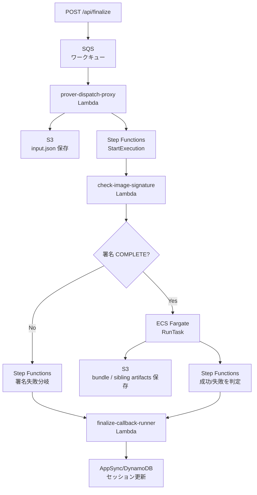
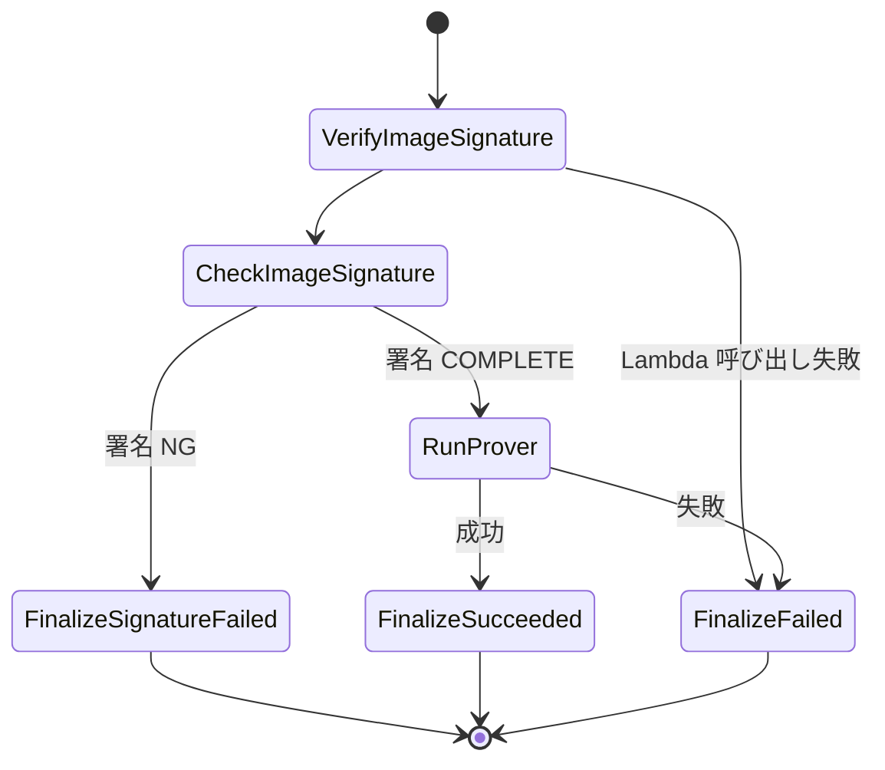
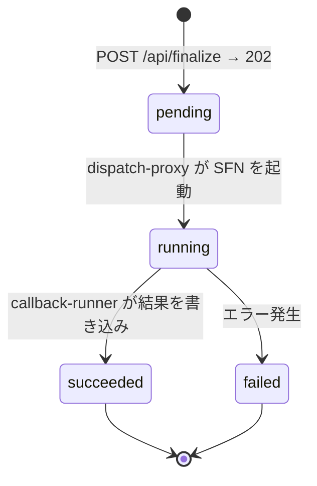
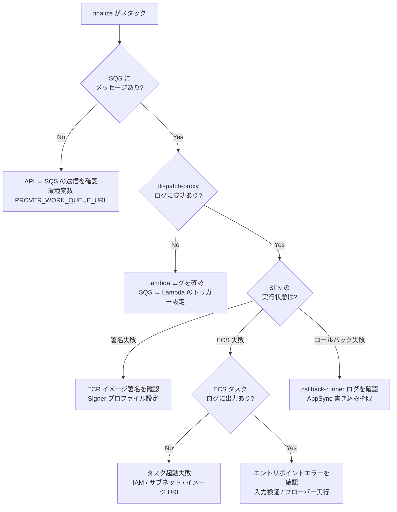

# 非同期プローバー

SQS → Step Functions → ECS Fargate で証明を非同期生成する経路と、各段階の責務を扱う章です。

STARK 証明の生成は 64 票で約 6 分を要するため、同期的な HTTP リクエスト内では完了できません。非同期パイプラインにより、Web リクエストのタイムアウトを回避しつつ、高負荷な証明生成を安全に実行します。

この章は `FINALIZE_ASYNC_MODE=true` で動作する非同期経路を対象としています。

## パイプライン全体像

詳細な失敗分岐（署名検証 NG、プローバー実行失敗）は、後続のステートマシン図で示します。

## 各フェーズの詳細

### フェーズ 1: リクエスト受付

クライアントが `POST /api/finalize` を呼び出すと、API ハンドラーは以下の処理を行います。

以下は `FINALIZE_ASYNC_MODE=true` の場合です。

1. セッションの状態を検証（全投票が完了していること）
2. zkVM 入力を構築（入力ビルダーが投票データ + Merkle パスを組み立て）
3. セッションの `finalizationState` を「pending」に更新
4. SQS キューにメッセージを送信
5. クライアントに 202 Accepted を返却

クライアントはその後、`GET /api/sessions/:id/status` を `X-Session-Capability` 付きでポーリングして進捗を確認します。

### フェーズ 2: ディスパッチ

`prover-dispatch-proxy` Lambda が SQS メッセージを受信し、以下を実行します。

1. SQS メッセージと現在のセッション状態を検証
2. zkVM 入力 JSON を S3 にアップロード（`sessions/{sessionId}/{executionId}/input.json`）
3. Step Functions のステートマシンを `StartExecution` で起動
4. セッションの `finalizationState` を「running」に更新し、`executionId` と Step Functions execution ARN を記録

dispatch 前に、プロキシは以下の前提条件を確認します。

- セッションが存在する
- `finalizationState.status` が `pending`
- `finalizationState.executionId` が SQS メッセージの `executionId` と一致する

これらが揃わない場合は高コストな証明実行に進まず中断します。セッション作成直後の伝播遅延など再試行で回復し得る状態は、SQS の受信回数に応じて retry / DLQ に委ねます。

加えて、SQS メッセージに付いている contract generation が、保存済みの finalization contract と互換であることもチェックします。互換でない場合は、再試行ではなく `unsupported_current_artifact` として既存の session state を fail-closed に確定させます（再試行非対象）。

Amplify 側の SQS trigger は `batchSize=1` で、`PROVER_LAMBDA_CONCURRENCY` により予約同時実行数を制御します（既定は `2`）。Step Functions 起動時の throttle 系エラーは Lambda が例外として返し、SQS retry の対象にします。

注: S3 パスプレフィックスは Terraform 変数 `s3_proof_prefix` で変更可能です。ただし Amplify 側には以下のように `sessions/*` を前提として実装された箇所があり、変更時は同時に更新する必要があります。

- `verifier-service-runner` Lambda の S3 アクセスポリシー（`sessions/*` のみに `Get/Put/List` を許可）
- CLI / verifier-service の管理ポリシー（同様に `sessions/*` 限定）
- 関連 Amplify 環境変数

### フェーズ 3: 証明生成

Step Functions ステートマシンが 3 つのステップを順次実行します。

#### VerifyImageSignature

`check-image-signature` Lambda を呼び出し、ECR イメージのダイジェストに対する AWS Signer 署名のステータスを確認します。詳細は [イメージ署名](image-signing.md) を参照してください。

#### CheckImageSignature

Choice ステートで署名ステータスを判定します。`COMPLETE` であれば `RunProver` に進み、それ以外は `FinalizeSignatureFailed` に遷移してコールバック Lambda に失敗を通知します。

#### RunProver

ECS Fargate タスクを `ecs:runTask.sync`（同期モード）で起動します。Step Functions はタスクの完了を待機し、成功/失敗に応じて対応するコールバックステートに遷移します。

Step Functions の終端は `FinalizeSucceeded` / `FinalizeFailed` / `FinalizeSignatureFailed` の 3 つで、callback Lambda は `TIMED_OUT` も受理できますが現行 State Machine からは送出されません。

ECS タスクのコンテナには、Step Functions の入力からセッション固有の環境変数が注入されます。

| 環境変数           | 値の由来            | 説明                                          |
| ------------------ | ------------------- | --------------------------------------------- |
| `ENV_NAME`         | Terraform 変数      | 環境名（develop / main）                      |
| `S3_PROOF_BUCKET`  | Terraform 変数      | 証明バンドルバケット名                        |
| `S3_PROOF_PREFIX`  | Terraform 変数      | S3 artifact prefix（既定 `sessions/`）        |
| `INPUT_S3_BUCKET`  | Terraform 変数      | 入力ファイルのバケット（同上）                |
| `INPUT_S3_KEY`     | Step Functions 入力 | セッション固有の入力パス                      |
| `OUTPUT_S3_BUCKET` | Terraform 変数      | 出力先バケット（同上）                        |
| `OUTPUT_S3_PREFIX` | Step Functions 入力 | `${S3_PROOF_PREFIX}{sessionId}/{executionId}` |

### フェーズ 4: 結果通知

Step Functions が `finalize-callback-runner` Lambda を呼び出し、以下の情報をセッションに書き戻します。

- 成功時: bundle メタデータ（`s3BundleKey`、`s3UploadedAt`）と、`bundle.zip` / bitmap artifact から復元した `finalizationResult`
- 失敗時: 失敗状態とエラー情報（イメージ署名失敗、プローバーエラーなど）

bundle / report の配信時は、capability で保護された download endpoint が現在許可されている `verificationExecutionId` と S3 key を照合したうえで、短命な presigned URL をその場で発行します。

## ECS タスクの実行フロー

ECS Fargate タスク内のコンテナは、エントリポイントスクリプトにより以下の処理を順次実行します。

1. S3 から入力 JSON をダウンロード
2. 入力の構造を検証（必須フィールド確認）
3. zkVM ホストバイナリを実行（タイムアウト: 900 秒）
4. ジャーナルを JSON に変換
5. `public-input.json`、`election-manifest.json`、`close-statement.json` を構築
6. `journal.json` と公開監査アーティファクトの整合性を検証
7. `bundle.zip` を作成（`receipt.json` + `journal.json` + `public-input.json` + `election-manifest.json` + `close-statement.json`）
8. 生成物と private sibling artifacts を S3 にアップロード（リトライ付き）

### 入力の検証

エントリポイントは、zkVM 入力 JSON に必要なフィールドが存在することを確認します。欠落があればタスクは即座に失敗し、Step Functions が失敗コールバックを実行します。

### zkVM ホストバイナリの実行

コンテナ内の `/opt/zkvm/bin/host` がプローバーとして起動されます。タイムアウトは 900 秒（15 分）です。本番モード（`RISC0_DEV_MODE` 未設定）では実際の STARK 証明が生成され、64 票で約 370 秒を要します。

### S3 アップロード

生成されたアーティファクトは、指数バックオフ付きのリトライ（最大 3 回、基底 2 秒）で S3 にアップロードされます。主にアップロードされるファイルは以下です。

| ファイル                 | 説明                                                                                           |
| ------------------------ | ---------------------------------------------------------------------------------------------- |
| `*-receipt.json`         | zkVM host の生出力（レシート）                                                                 |
| `*-output.json`          | zkVM host の生出力（集計結果）                                                                 |
| `*-journal.json`         | zkVM host が出力した場合のみ残る生の journal artifact                                          |
| `public-input.json`      | エントリポイントが構築する、秘密データを含まない検証用レコード                                 |
| `election-manifest.json` | 選挙設定の公開監査用スナップショット                                                           |
| `close-statement.json`   | 集計締切時点のログ境界を表す公開監査レコード                                                   |
| `included-bitmap.json`   | 厳密な counted bitmap。`bundle.zip` には含めず、隣接オブジェクト（sibling object）として保持   |
| `seen-bitmap.json`       | 厳密な presented bitmap。`bundle.zip` には含めず、隣接オブジェクト（sibling object）として保持 |
| `bundle.zip`             | 配布対象アーカイブ。同梱物は [バンドル構造](../verification/bundle-structure.md) を参照        |

配布と callback 復元の主経路は `bundle.zip` 内の `receipt.json` / `journal.json` / 公開監査アーティファクトです。bitmap artifact は利用可能な場合に sibling object として callback から追加復元されます。配布経路の詳細は [バンドル構造](../verification/bundle-structure.md) を参照してください。

## SQS キュー設計

### ワークキュー

| 項目               | 設定               | 理由                                      |
| ------------------ | ------------------ | ----------------------------------------- |
| 可視性タイムアウト | 1000 秒            | zkVM 実行タイムアウト（900 秒）+ バッファ |
| メッセージ保持期間 | 4 日               | 一時的な障害からの回復猶予                |
| ロングポーリング   | 20 秒              | Lambda のポーリングコスト最適化           |
| 暗号化             | SQS マネージド SSE | デフォルト暗号化                          |

### デッドレターキュー（DLQ）

3 回の受信失敗後、メッセージは DLQ に移動されます。DLQ のメッセージ保持期間は 14 日で、手動での障害調査と再処理に使用されます。

## ECS Fargate タスク仕様

| 項目               | 設定                                      |
| ------------------ | ----------------------------------------- |
| CPU                | 16 vCPU（16384 ユニット）                 |
| メモリ             | 32 GB（32768 MiB）                        |
| アーキテクチャ     | ARM64（Graviton）                         |
| ネットワークモード | awsvpc                                    |
| 起動モデル         | RunTask（サービスなし、1 回限りのタスク） |
| イメージ指定       | ダイジェスト固定（`@sha256:...`）         |
| ログドライバー     | CloudWatch Logs（awslogs）                |

ARM64 アーキテクチャの選択は、RISC Zero の STARK 証明生成における Graviton プロセッサのコスト効率に基づいています。非 GPU 前提のこの構成は PoC の意図的な制約です。詳細は [PoC の意図的な制約 > 非 GPU 前提の証明実行](../decisions/poc-relaxations.md#3-非-gpu-前提の証明実行ecs-fargate) を参照してください。

## クライアント側のポーリング

非同期証明の進捗は、クライアントが `GET /api/sessions/:id/status` を `X-Session-Capability` 付きでポーリングして確認します。

| ステータス  | 説明                                                                                                |
| ----------- | --------------------------------------------------------------------------------------------------- |
| `pending`   | ファイナライズ要求を受理済み（実装上は `pending` 更新後に SQS 送信）                                |
| `running`   | Step Functions が実行中                                                                             |
| `succeeded` | 証明生成と結果の書き戻しが完了                                                                      |
| `failed`    | コールバック経由で失敗が書き戻された状態（署名検証失敗、プローバーエラー等）                        |
| `timeout`   | `finalize-callback-runner` が `TIMED_OUT` を受理した場合の状態（現行 State Machine では通常未使用） |

注: `prover-dispatch-proxy` が Step Functions 起動前に失敗した場合、コールバックが走らないため `pending` のまま再試行/DLQ 待ちになることがあります。dispatch 前提条件や contract generation の互換チェックで非再試行扱いになる条件は[フェーズ 2](#フェーズ-2-ディスパッチ)を参照してください。

## 障害時の調査導線

非同期証明がスタックした場合の最小調査パスです。

<!-- source: docker/entrypoint.sh, terraform/step_functions.tf, terraform/ecs.tf, terraform/sqs.tf, amplify/functions/ -->
