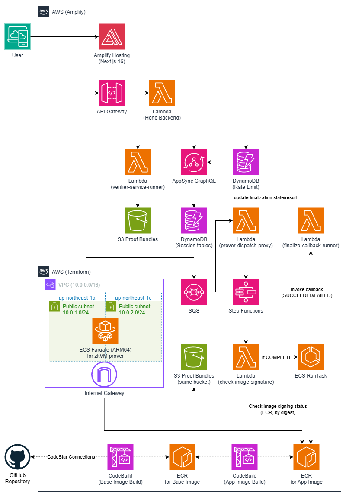
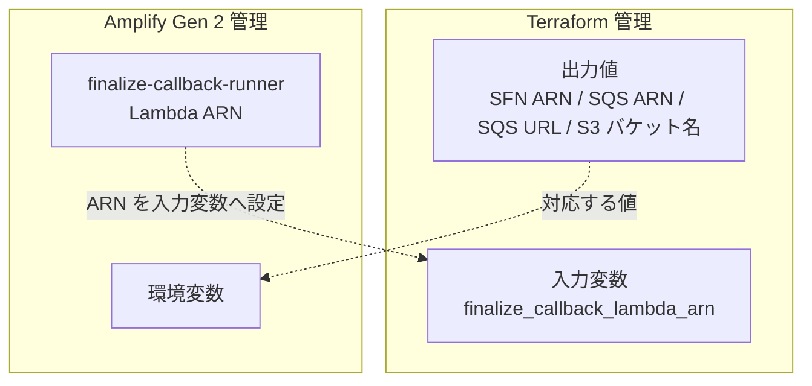

# 設計思想とサービス一覧

ハイブリッド構成を採用した動機、環境分離方針、利用サービスの全景を並べる章です。

## 設計思想

### なぜハイブリッド構成か

STARK 証明の生成には 16 vCPU / 32 GB メモリで約 6 分を要します。この特性は、`hono-api` Lambda の 60 秒タイムアウトや通常の Web リクエストの処理パターンに合わず、同期的な API 応答には載せられません。

そこで本システムでは、責務に応じてインフラ管理を分離しています。

| 管理ツール    | 責務                                                                                     | 理由                                                                           |
| ------------- | ---------------------------------------------------------------------------------------- | ------------------------------------------------------------------------------ |
| Amplify Gen 2 | Web ホスティング、API（Lambda）、データ（AppSync + DynamoDB）、認証基盤（Cognito + IAM） | フロントエンド + API のデプロイサイクルが速い                                  |
| Terraform     | ECS Fargate、Step Functions、SQS、S3、ECR、CodeBuild、VPC、IAM                           | 計算リソースの精密な制御と、イメージ署名のようなセキュリティゲートの定義が必要 |

### 環境分離

`develop` と `main` の 2 環境を運用し、主要なアプリケーション実行系リソースは Terraform ワークスペースと Amplify ブランチデプロイで分離しています。

| 項目              | develop                           | main                              |
| ----------------- | --------------------------------- | --------------------------------- |
| 証明モード        | 実 STARK 証明（64 票で約 370 秒） | 実 STARK 証明（64 票で約 370 秒） |
| S3 ライフサイクル | 7 日                              | 30 日                             |
| ログ保持期間      | 7 日                              | 14 日                             |
| CloudTrail        | 無効                              | 有効（90 日保持）                 |

ただし、全リソースが環境ごとに二重化されているわけではありません。RISC Zero ツールチェーン用の ECR リポジトリと CodeBuild プロジェクトは `aws.shared` provider で共有され、環境別に分かれるのは prover 用 ECR、S3、SQS、Step Functions、ECS、CloudTrail などの実行系リソースです。

注: `RISC0_DEV_MODE=1` / `USE_MOCK_ZKVM=true` は主にローカル同期実行向けの設定です。Terraform 管理の非同期プローバーパス（SQS → Step Functions → ECS）では、実 STARK 証明を前提にしています。

## 全体構成図

_図: STARK Ballot Simulator の AWS 全体構成。Amplify 管理領域（上）と Terraform 管理領域（下）のハイブリッド構成。_

## サービス一覧

本システムで使用する主要な AWS サービスと、その役割の概要です。

### Amplify 管理

| サービス               | リソース                            | 役割                                                     |
| ---------------------- | ----------------------------------- | -------------------------------------------------------- |
| Amplify Hosting        | Web アプリ                          | Next.js のビルド・ホスティング                           |
| API Gateway (HTTP API) | `stark-ballot-simulator-hono-api`   | `/api/*` ルートのプロキシ                                |
| Lambda                 | `hono-api`                          | Hono フレームワークによる API 処理                       |
| Lambda                 | `prover-dispatch-proxy`             | SQS 受信 → `input.json` を S3 保存 → Step Functions 起動 |
| Lambda                 | `finalize-callback-runner`          | Step Functions コールバック → セッション更新             |
| Lambda                 | `verifier-service-runner`           | STARK レシート検証の実行                                 |
| AppSync + DynamoDB     | データモデル                        | セッション・投票・集計結果の永続化                       |
| DynamoDB               | RateLimitEvents / RateLimitCounters | `hono-api` の API レート制限状態                         |
| Cognito                | Identity Pool / User Pool           | 認証基盤（未認証 ID 無効）                               |

### Terraform 管理

| サービス       | リソース                                  | 役割                                                        |
| -------------- | ----------------------------------------- | ----------------------------------------------------------- |
| ECS Fargate    | プローバータスク                          | zkVM ホストバイナリによる STARK 証明生成                    |
| Step Functions | プローバーディスパッチャー                | イメージ署名検証 → ECS 実行 → コールバック                  |
| SQS            | ワークキュー + DLQ                        | 非同期証明リクエストのバッファリング                        |
| S3             | 証明バンドルバケット                      | 入力・実行成果物・検証用バンドル（`bundle.zip` など）の保存 |
| ECR            | イメージリポジトリ                        | プローバーコンテナイメージの管理                            |
| CodeBuild      | 環境別プローバー + 共有 toolchain builder | Docker イメージのビルド（署名は ECR 設定に依存）            |
| Lambda         | `check-image-signature`                   | ECR イメージ署名の実行前検証                                |
| VPC            | パブリックサブネット                      | ECS タスクのネットワーク                                    |
| CloudWatch     | ログ群                                    | ECS / Step Functions / CodeBuild などのログ                 |
| CloudTrail     | 監査証跡（main のみ）                     | API 呼び出しの監査ログ                                      |

これらのサービスに紐づく IAM ロール / ポリシーも同じ Terraform 管理下にあります。詳細は [Terraform > IAM 設計](terraform.md#iam-設計) を参照してください。

## Amplify と Terraform の境界

2 つのインフラ管理ツール間の連携は、ARN と環境変数によって行われます。

Terraform の出力値（Step Functions ARN、SQS ARN、SQS URL、S3 バケット名など）は、Amplify の環境変数（app-level / branch override）に手動で反映し、Lambda 関数から参照します。自動同期はされないため、Terraform 出力の変更時は Amplify 側も合わせて更新が必要です。

注: `PROVER_STATE_MACHINE_ARN` と `PROVER_WORK_QUEUE_ARN` は Amplify backend のデプロイ時にも必須で、未設定の場合は fail-closed します。

関連する詳細:

- 実行時フロー: [トポロジー](topology.md)、[非同期プローバー](async-prover.md)
- 連携ポイント（ARN / 変数名）: [Terraform](terraform.md#amplify-との連携ポイント)

<!-- source: terraform/, amplify/backend.ts, docker/ -->
