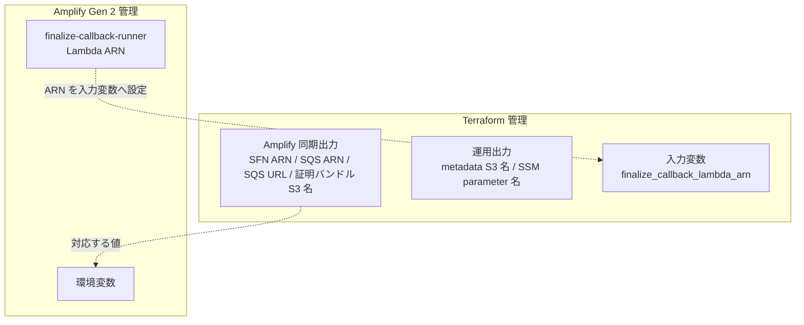

# 現行構成とサービス一覧

現行の AWS 構成（管理境界・環境分離・利用サービス）を整理する章です。ハイブリッド構成に至った経緯と改善候補は [設計ふりかえり § 6](../decisions/design-retrospective.md#6-amplify-単独構成からハイブリッド構成への移行) を参照してください。

## 現行の管理境界

Amplify Gen 2 がアプリ層、Terraform が非同期プローバー基盤を担う 2 系統管理になっています。

| 管理系        | 現行の役割                                                                               | 残る制約                                                                         |
| ------------- | ---------------------------------------------------------------------------------------- | -------------------------------------------------------------------------------- |
| Amplify Gen 2 | Web ホスティング、API（Lambda）、データ（AppSync + DynamoDB）、認証基盤（Cognito + IAM） | branch override、環境変数同期、Amplify 管理リソース名への依存が残る              |
| Terraform     | ECS Fargate、Step Functions、SQS、S3、ECR、CodeBuild、SSM Parameter Store、VPC、IAM      | Amplify 側リソース ARN を入力として受け取るため、完全な単独 IaC にはなっていない |

## 環境分離

`develop` と `main` の 2 環境を運用し、主要なアプリケーション実行系リソースは Terraform ワークスペースと Amplify ブランチデプロイで分離しています。両環境とも証明モードは実 STARK 証明（代表実測は[ECS Fargate タスク仕様](async-prover.md#ecs-fargate-タスク仕様)参照）で、`RISC0_DEV_MODE=1` / `USE_MOCK_ZKVM=true` はローカル同期実行用の設定です。

| 項目              | develop | main              |
| ----------------- | ------- | ----------------- |
| S3 ライフサイクル | 7 日    | 30 日             |
| ログ保持期間      | 7 日    | 14 日             |
| CloudTrail        | 無効    | 有効（90 日保持） |

ただし全リソースが環境ごとに二重化されているわけではなく、RISC Zero ツールチェーン用の ECR リポジトリと CodeBuild プロジェクトは `aws.shared` provider で共有されます。環境別に分かれるのは prover 用 ECR、証明バンドル S3、prover image metadata S3、SSM current metadata parameter、SQS、Step Functions、ECS、CloudTrail などの実行系リソースです。

## 全体構成図

_図: STARK Ballot Simulator の AWS 全体構成。現行では Amplify 管理領域（上）と Terraform 管理領域（下）に分かれている。_

## サービス一覧

本システムで使用する主要な AWS サービスと、その役割の概要です。

### Amplify 管理

| サービス               | リソース                            | 役割                                                     |
| ---------------------- | ----------------------------------- | -------------------------------------------------------- |
| Amplify Hosting        | Web アプリ                          | Next.js のビルド・ホスティング                           |
| API Gateway (HTTP API) | `stark-ballot-simulator-hono-api`   | `/api/*` ルートのプロキシ                                |
| Lambda                 | `hono-api`                          | Hono フレームワークによる API 処理                       |
| Lambda                 | `prover-dispatch-proxy`             | SQS 受信 → `input.json` を S3 保存 → Step Functions 起動 |
| Lambda                 | `finalize-callback-runner`          | Step Functions コールバック → セッション更新             |
| Lambda                 | `verifier-service-runner`           | STARK レシート検証の実行                                 |
| AppSync + DynamoDB     | データモデル                        | セッション・投票・集計結果の永続化                       |
| DynamoDB               | RateLimitEvents / RateLimitCounters | `hono-api` の API レート制限状態                         |
| Cognito                | Identity Pool / User Pool           | 認証基盤（未認証 ID 無効）                               |

### Terraform 管理

| サービス            | リソース                                  | 役割                                                                         |
| ------------------- | ----------------------------------------- | ---------------------------------------------------------------------------- |
| ECS Fargate         | プローバータスク                          | zkVM ホストバイナリによる STARK 証明生成                                     |
| Step Functions      | プローバーディスパッチャー                | イメージ署名検証 → ECS 実行 → コールバック                                   |
| SQS                 | ワークキュー + DLQ                        | 非同期証明リクエストのバッファリング                                         |
| S3                  | 証明バンドルバケット / prover metadata    | 入力・実行成果物・検証用バンドル、prover image metadata の保存               |
| ECR                 | イメージリポジトリ                        | プローバーコンテナイメージの管理                                             |
| CodeBuild           | 環境別プローバー + 共有 toolchain builder | Docker イメージのビルド、ARM64 ImageID / methodVersion metadata の抽出と公開 |
| SSM Parameter Store | current metadata pointer                  | 現行 prover image metadata candidate JSON の保持                             |
| Lambda              | `check-image-signature`                   | ECR イメージ署名の実行前検証                                                 |
| VPC                 | パブリックサブネット                      | ECS タスクのネットワーク                                                     |
| CloudWatch          | ログ群                                    | ECS / Step Functions / CodeBuild などのログ                                  |
| CloudTrail          | 監査証跡（main のみ）                     | API 呼び出しの監査ログ                                                       |

これらのサービスに紐づく IAM ロール / ポリシーも同じ Terraform 管理下にあります。詳細は [Terraform > IAM 設計](terraform.md#iam-設計) を参照してください。

## Amplify と Terraform の境界

2 つのインフラ管理ツール間の連携は、ARN と環境変数によって行われます。

Terraform の出力値（Step Functions ARN、SQS ARN、SQS URL、S3 バケット名など）は Amplify の環境変数に手動で反映する運用で、`PROVER_STATE_MACHINE_ARN` と `PROVER_WORK_QUEUE_ARN` は Amplify backend のデプロイ時にも必須（未設定で fail-closed）です。同期手順と一覧は [Terraform > Amplify との連携ポイント](terraform.md#amplify-との連携ポイント) を参照してください。

なお、prover image metadata bucket 名と current metadata SSM parameter 名は CodeBuild / 運用確認向けの Terraform 出力であり、Amplify 環境変数へ同期する実行時契約ではありません。

## 関連する章

- [トポロジー](topology.md) — リクエスト経路とコンポーネント間の通信フロー
- [非同期プローバー](async-prover.md) — SQS → Step Functions → ECS の実行時フロー
- [Terraform](terraform.md#amplify-との連携ポイント) — Amplify との連携ポイント（ARN / 環境変数名）
- [設計ふりかえり § Amplify 単独構成からハイブリッド構成への移行](../decisions/design-retrospective.md#6-amplify-単独構成からハイブリッド構成への移行) — 現行構成に至った設計判断

<!-- source: terraform/, amplify/backend.ts, docker/ -->
