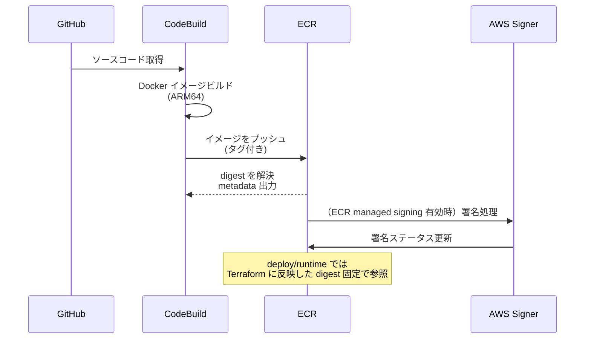
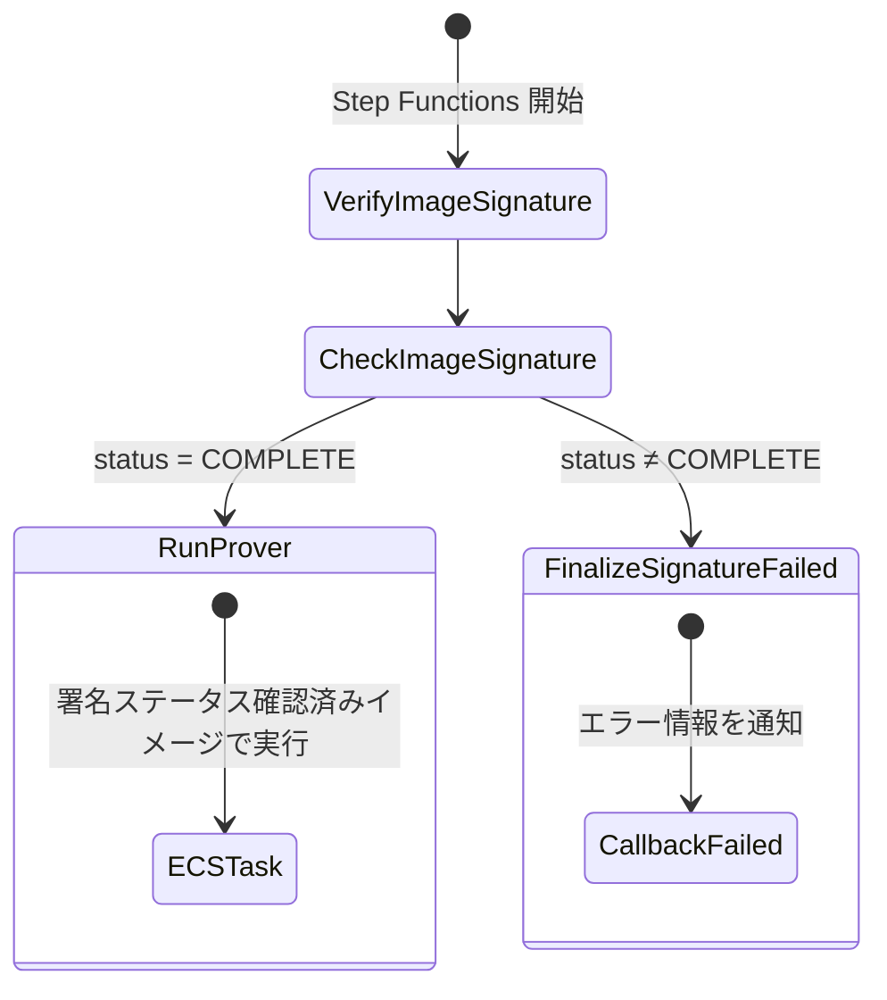
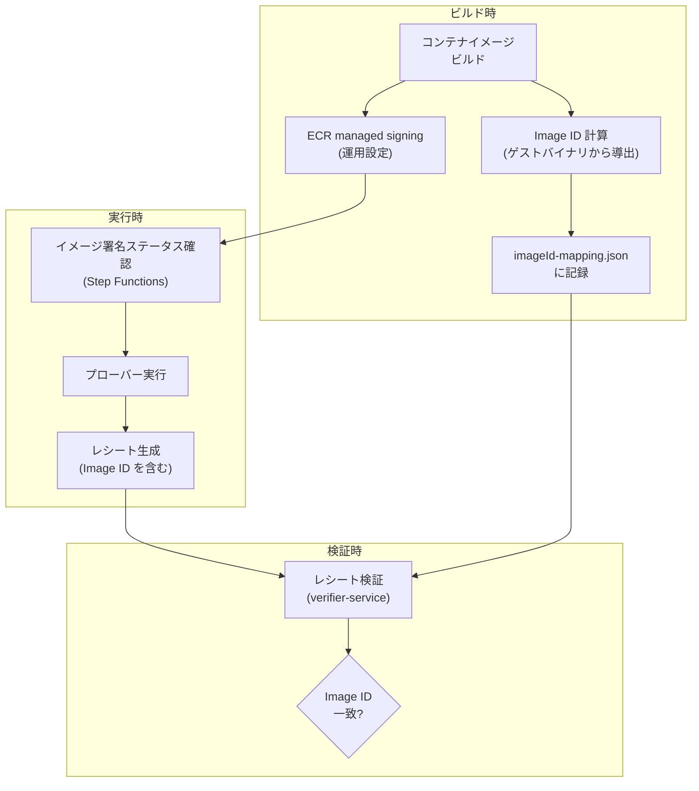

# イメージ署名

AWS Signer でプローバーイメージを署名し、ECS 実行前にゲートとして検証する仕組みを扱う章です。

STARK 証明は「特定のゲストプログラムが正しく実行された」ことを保証しますが、そもそもそのゲストプログラムを含むコンテナイメージ自体が改ざんされていないことも保証する必要があります。イメージ署名は、信頼されたビルドパイプラインが生成したイメージのみが証明生成に使用されることを担保するセキュリティゲートです。

## 脅威モデル

イメージ署名が防止する攻撃シナリオを示します。

### 署名なしの場合

1. 攻撃者がタグやデプロイ設定を未承認の ECR イメージへ差し替える
2. 未承認プローバーが集計結果、レシート、公開 bundle などの成果物を生成しようとする
3. 生成された成果物は最終検証側で Image ID 照合や STARK レシート検証によって拒否され得る。ただし、証明生成インフラ上で未承認イメージが実行されること自体は起動前に止められない

### 署名ありの場合

1. 攻撃者が未承認の ECR イメージをデプロイ設定へ混入させようとする
2. Step Functions が署名ステータスを確認
3. 署名なし/未完了を検出 → タスク起動を拒否

STARK 証明は Image ID（ゲストバイナリの暗号的識別子）に紐づきますが、イメージ署名はそれとは別のレイヤで「未承認コンテナイメージの実行」を起動前に抑止します。両者は相補的な防御を形成します。

| 保証の種類               | メカニズム            | 検出対象                                 |
| ------------------------ | --------------------- | ---------------------------------------- |
| ゲストプログラムの同一性 | Image ID（RISC Zero） | ゲストバイナリの改変                     |
| イメージ実行許可         | AWS Signer            | 未承認または署名未完了のコンテナイメージ |

## 署名フロー

### ビルドと署名

CodeBuild がプローバーコンテナイメージをビルドして ECR に push し、ECR 上で解決されたイメージ digest をビルドメタデータとして出力します。その digest を運用手順で Terraform の `ecs_image_uri` に反映し、Step Functions は digest 固定のイメージ参照に対して署名ステータスを確認します。
ECR マネージド署名が有効な環境では、push 後に AWS Signer プロファイルに基づく署名ステータスが対象 digest に付与されます。

> 注: このリポジトリでコード化されているのは署名ステータス確認（`DescribeImageSigningStatus`）です。  
> 署名付与そのもの（ECR managed signing の有効化）は、ECR 側の設定・運用が前提です。

CodeBuild の build/push では運用上のタグを使用できますが、Terraform に渡す `ecs_image_uri` と Step Functions が署名確認する対象は常にダイジェスト固定（`@sha256:<64-hex>`）です。これにより、タグの上書きによるイメージのすり替えを防止します。

prover image のビルド時にベースとなる RISC Zero ツールチェーンイメージも、ECR 上のタグから digest を解決した `RISC0_TOOLCHAIN_IMAGE` として Docker build に渡されます。非 digest 形式は buildspec 側で拒否されます。

### 実行前確認

Step Functions ステートマシンの最初のステートで、`check-image-signature` Lambda がイメージの署名ステータスを確認します。

`check-image-signature` Lambda は以下の処理を行います。

1. ECR の `DescribeImageSigningStatus` API を呼び出す
2. 指定されたリポジトリ名とイメージダイジェストに対する署名ステータスを取得
3. 取得した `status`（`COMPLETE` / それ以外）を Step Functions に返す

署名ステータスが `COMPLETE` でない場合、Step Functions の Choice ステートが `FinalizeSignatureFailed` に遷移し、コールバック Lambda に `ImageSignatureVerificationFailed` エラーを通知します。ECS タスクは一切起動されません。

> **ステータス確認と暗号学的検証の違い**
> 本システムの実行前チェックは、ECR の `DescribeImageSigningStatus` API が返す署名ステータス（`COMPLETE` / それ以外）を確認するものであり、署名値そのものの暗号学的検証（署名の正当性確認や証明書チェーンの検証）ではありません。
> これは、AWS ECR が署名のステータス照会 API は提供する一方、署名を暗号学的に独立検証する API を提供していないことによるものです。ECR managed signing の信頼モデルは、署名の付与・管理を AWS インフラに委任し、利用者はステータスを参照する設計です。
> 独立した署名検証が必要な場合は、[Notation](https://notaryproject.dev/) 等の外部ツールの併用が選択肢となります。

## ECR リポジトリとイメージ管理

### リポジトリ構成

| リポジトリ                                 | 用途                                   | ライフサイクル         |
| ------------------------------------------ | -------------------------------------- | ---------------------- |
| `stark-ballot-simulator/zkvm-prover-{env}` | プローバーコンテナイメージ             | 最新 10 イメージを保持 |
| `stark-ballot-simulator/risc0-toolchain`   | RISC Zero ツールチェーンベースイメージ | 最新 5 イメージを保持  |

両リポジトリとも、プッシュ時の脆弱性スキャン（Scan on Push）が有効です。

### ダイジェスト固定

Terraform の `ecs_image_uri` 変数には、ダイジェスト固定の URI のみが許可されます。バリデーションルールにより `@sha256:<64-hex>` 形式が強制されます。

Step Functions の定義に含まれるイメージダイジェストは、Terraform の変数から以下のように抽出されます。

- **リポジトリ名**: URI の `@` より前の部分からレジストリホストを除去
- **ダイジェスト**: URI の `@` より後の部分（`sha256:...`）

この分解により、`check-image-signature` Lambda は正確なリポジトリとダイジェストの組み合わせで署名ステータスを確認できます。

## ビルドパイプライン

### CodeBuild プロジェクト

2 つの CodeBuild プロジェクトがイメージのビルドを担当します。

| プロジェクト                                     | ビルド対象         | タイムアウト | インスタンス |
| ------------------------------------------------ | ------------------ | ------------ | ------------ |
| `stark-ballot-simulator-fargate-prover-{env}`    | プローバーイメージ | 30 分        | ARM64 Small  |
| `stark-ballot-simulator-risc0-toolchain-builder` | ベースイメージ     | 120 分       | ARM64 Large  |

RISC Zero ツールチェーンのビルドは低頻度（ツールチェーンバージョン更新時のみ）ですが、ビルドに時間を要するため Large インスタンスと長いタイムアウトが設定されています。

### CodeBuild の IAM 権限

CodeBuild ロールには以下の権限が付与されています。

| 権限カテゴリ         | 対象 API                                                   | 目的                                                              |
| -------------------- | ---------------------------------------------------------- | ----------------------------------------------------------------- |
| ECR                  | `GetAuthorizationToken`, `PutImage` 等                     | イメージのプッシュ                                                |
| AWS Signer           | `SignPayload`, `GetSigningProfile`                         | 署名連携用の権限（運用/拡張時）                                   |
| CloudWatch Logs      | `CreateLogGroup`, `PutLogEvents` 等                        | ビルドログの出力                                                  |
| S3                   | `GetObject`, `PutObject`                                   | CodePipeline 連携時のアーティファクト入出力                       |
| CodeStar Connections | `codestar-connections:UseConnection`, `GetConnectionToken` | 接続方式切り替えに備えた権限（現行 CodeBuild source は `GITHUB`） |

## Image ID との関係

イメージ署名と [Image ID](../zkvm/image-id.md) は異なるレイヤのセキュリティメカニズムですが、共に「正しいプログラムが実行されたこと」の信頼チェーンを構成します。

| 検証ポイント  | タイミング | 検証主体                | 失敗時の動作         |
| ------------- | ---------- | ----------------------- | -------------------- |
| イメージ署名  | 証明生成前 | Step Functions + Lambda | ECS タスクの起動拒否 |
| Image ID 照合 | 検証時     | verifier-service        | 検証失敗の報告       |

<!-- source: terraform/lambda_check_image_signature.tf, terraform/lambda/check-image-signature/index.mjs, terraform/codebuild.tf, terraform/ecr.tf, terraform/step_functions.tf -->
