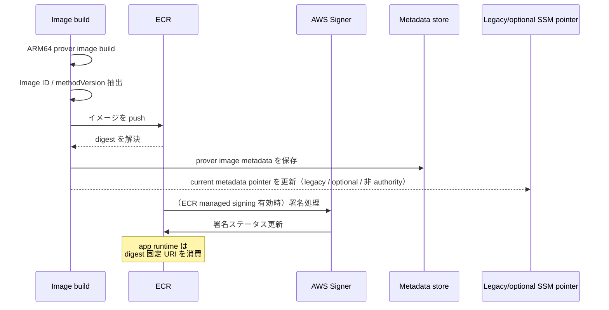
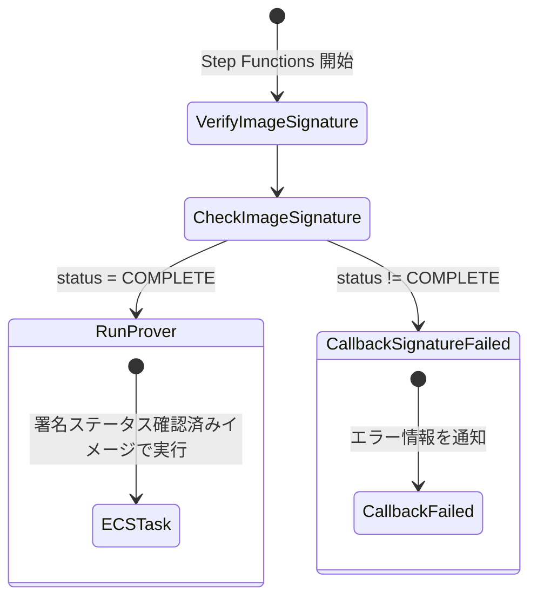
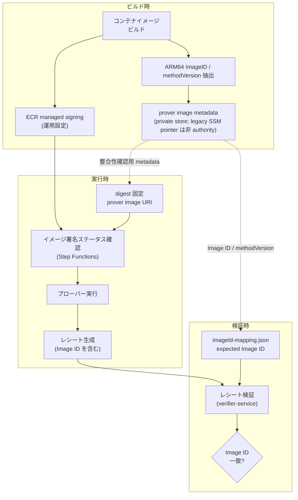

# イメージ署名

AWS Signer でプローバーイメージを署名し、ECS 実行前にゲートとして検証する仕組みを扱う章です。

STARK 証明は「特定のゲストプログラムが正しく実行された」ことを保証します。
ただし、そのゲストプログラムを含むコンテナイメージ自体が改ざんされていないことも確認する必要があります。
イメージ署名は、信頼されたビルド手順で生成されたイメージだけを証明生成に使うためのセキュリティゲートです。

## 脅威モデル

署名なしの場合、未承認イメージへの差し替えは検証段階の Image ID 照合や STARK レシート検証で拒否され得ます。
しかし、証明生成インフラ上で未承認イメージが実行されること自体は起動前に止められません。
署名ありの場合、Step Functions が起動前に署名ステータスを確認し、署名なしまたは未完了であればタスク起動を拒否します。

STARK 証明は Image ID（ゲストバイナリの暗号的識別子）に紐づきます。
イメージ署名はそれとは別レイヤで、未承認コンテナイメージの実行を起動前に抑止します。
両者は相補的な防御です。

| 保証の種類               | メカニズム            | 検出対象                                 |
| ------------------------ | --------------------- | ---------------------------------------- |
| ゲストプログラムの同一性 | Image ID（RISC Zero） | ゲストバイナリの改変                     |
| イメージ実行許可         | AWS Signer            | 未承認または署名未完了のコンテナイメージ |

## 署名、メタデータ、実行時ゲート

### 責務境界

イメージ署名では、プローバーコンテナのビルド、ECR 上の digest、AWS Signer の署名ステータス、Image ID、runtime 設定を別々の責務として扱います。
公開仕様では、個別の承認手順や内部証跡ではなく、どの情報がどの境界で使われるかを説明します。

| 領域                       | 責務                                                                                                                               |
| -------------------------- | ---------------------------------------------------------------------------------------------------------------------------------- |
| ECR repository             | プローバーイメージと RISC Zero toolchain image を保持し、署名ステータスを digest 単位で参照できるようにする                        |
| Prover image metadata      | image digest、digest 固定 URI、Image ID、`methodVersion`、ソース識別子、toolchain image などを結び付ける非公開メタデータを保存する |
| Legacy SSM current pointer | 旧構成の候補 metadata lookup。target topology の release authority ではない                                                        |
| App runtime                | digest 固定の prover image URI と expected Image ID を入力として受け取り、実行前に署名ステータスを確認する                         |
| verifier-service / UI      | STARK レシート内の Image ID と公開 trust material を照合し、検証結果を fail-closed に表示する                                      |

app runtime が実行するイメージは digest 固定 URI で決まります。
検証時の guest program identity は Image ID mapping とレシート検証で決まります。
Prover image metadata は、これらがずれていないことを確認するための接続情報です。
受理された release authority は、選択された prover release record、accepted pointer、app deployment record、および必要な承認・scan・signing evidence で構成されます。
Prover image metadata は public proof bundle の構成要素ではありません。

### ビルドと署名の概念

プローバーイメージのビルドでは、ARM64 用のコンテナを作成し、同じイメージから guest Image ID と `methodVersion` を抽出します。
イメージを ECR に push した後、ECR 上で解決された digest、digest 固定 URI、Image ID、`methodVersion`、ソース識別子、RISC Zero toolchain image を prover image metadata として記録します。
ECR managed signing が有効な環境では、対象 digest に AWS Signer の署名ステータスが付与されます。

```mermaid
sequenceDiagram
  participant BUILD as Image build
  participant ECR as ECR
  participant SGN as AWS Signer
  participant META as Metadata store
  participant SSM as Legacy/optional SSM pointer

  BUILD->>BUILD: ARM64 prover image build
  BUILD->>BUILD: Image ID / methodVersion 抽出
  BUILD->>ECR: イメージを push
  ECR-->>BUILD: digest を解決
  BUILD->>META: prover image metadata を保存
  BUILD-->>SSM: current metadata pointer を更新（legacy / optional / 非 authority）
  ECR->>SGN: （ECR managed signing 有効時）署名処理
  SGN->>ECR: 署名ステータス更新
  Note over ECR: app runtime は<br/>digest 固定 URI を消費
```

> 注: app runtime でコード化されている実行前チェックは署名ステータス確認（`DescribeImageSigningStatus`）です。 
> ECR managed signing の authority は foundation Terraform が Signer profile と registry signing configuration として管理しますが、個別 digest が署名済みかどうかは build / release / runtime の各境界で `COMPLETE` ステータスとして確認します。

Build/push では運用上のタグを使う場合があります。
ただし、app runtime が参照する `prover_image_uri` と署名ステータス確認の対象は常に digest 固定（`@sha256:<64-hex>`）です。
これにより、タグの上書きによるイメージのすり替えを防止します。
ベースとなる RISC Zero toolchain image も digest 固定で扱い、プローバーイメージの再現性と metadata の整合性を保ちます。
直接の CodeBuild output、`latest.json`、legacy SSM current pointer は、保持された release record と承認 evidence に結び付かない限り promotion evidence ではありません。

### 実行前確認

Step Functions ステートマシンの最初のステートで、`image-signature-gate` Lambda がイメージの署名ステータスを確認します。

```mermaid
stateDiagram-v2
  [*] --> VerifyImageSignature: Step Functions 開始
  VerifyImageSignature --> CheckImageSignature

  state CheckImageSignature <<choice>>
  CheckImageSignature --> RunProver: status = COMPLETE
  CheckImageSignature --> CallbackSignatureFailed: status != COMPLETE

  state CallbackSignatureFailed {
    [*] --> CallbackFailed: エラー情報を通知
  }

  state RunProver {
    [*] --> ECSTask: 署名ステータス確認済みイメージで実行
  }
```

`image-signature-gate` Lambda は以下の処理を行います。

1. ECR の `DescribeImageSigningStatus` API を呼び出す
2. 指定されたリポジトリ名とイメージダイジェストに対する署名ステータスを取得
3. 取得した `status`（`COMPLETE` / それ以外）を Step Functions に返す

署名ステータスが `COMPLETE` でない場合、Step Functions の Choice ステートは失敗経路に遷移し、finalization writer に署名ゲート失敗を通知します。
ECS タスクは起動されません。

> **ステータス確認と暗号学的検証の違い**
> 本システムの実行前チェックは ECR の `DescribeImageSigningStatus` が返すステータス参照です。
> 署名値そのものの暗号学的検証（証明書チェーン検証など）は行いません。
> 独立検証が必要な場合は [Notation](https://notaryproject.dev/) などの外部ツールを併用してください。

## ECR リポジトリと digest 固定

### リポジトリ構成

| リポジトリ種別                 | 用途                                      | 所有境界                                |
| ------------------------------ | ----------------------------------------- | --------------------------------------- |
| Prover image repository        | ECS Fargate で実行するプローバーイメージ  | foundation resource / app runtime input |
| RISC Zero toolchain repository | プローバーイメージの base toolchain image | foundation resource / build input       |

ECR repository は app runtime の前提リソースです。
app root は repository を作成したり image publication を所有したりせず、digest 固定の prover image URI を入力として消費します。

### ダイジェスト固定

Terraform の prover image URI 変数には、digest 固定 URI のみが許可されます。
バリデーションルールにより `@sha256:<64-hex>` 形式が強制されます。

Step Functions の定義に含まれるイメージダイジェストは、Terraform の変数から以下のように抽出されます。

- **リポジトリ名**: URI の `@` より前の部分からレジストリホストを除去
- **ダイジェスト**: URI の `@` より後の部分（`sha256:...`）

この分解により、`image-signature-gate` Lambda は正確なリポジトリとダイジェストの組み合わせで署名ステータスを確認できます。

## Image ID との関係

イメージ署名と [Image ID](../zkvm/image-id.md) は異なるレイヤのセキュリティメカニズムです。
両者は共に「正しいプログラムが実行されたこと」の信頼チェーンを構成します。

```mermaid
flowchart TD
  subgraph "ビルド時"
    BUILD["コンテナイメージ<br/>ビルド"] --> SIGN["ECR managed signing<br/>(運用設定)"]
    BUILD --> IMGID["ARM64 ImageID / methodVersion 抽出"]
    IMGID --> META["prover image metadata<br/>(private store; legacy SSM pointer は非 authority)"]
  end

  subgraph "実行時"
    URI["digest 固定<br/>prover image URI"] --> VERIFY_SIG
    VERIFY_SIG["イメージ署名ステータス確認<br/>(Step Functions)"] --> RUN["プローバー実行"]
    RUN --> RECEIPT["レシート生成<br/>(Image ID を含む)"]
  end

  subgraph "検証時"
    MAP["imageId-mapping.json<br/>expected Image ID"]
    RECEIPT --> VERIFY_RECEIPT["レシート検証<br/>(verifier-service)"]
    MAP --> VERIFY_RECEIPT
    VERIFY_RECEIPT --> MATCH{"Image ID<br/>一致?"}
  end

  SIGN --> VERIFY_SIG
  META -. "整合性確認用 metadata" .-> URI
  META -. "Image ID / methodVersion" .-> MAP
```

Prover image metadata は、digest 固定 URI と Image ID / `methodVersion` の対応関係を追跡するための非公開 metadata です。
公開検証で「正しいゲストが実行された」と判断する authority は、STARK レシート検証と expected Image ID の照合です。
イメージ署名はその前段で、未承認または署名未完了のコンテナイメージを実行させないための runtime gate として機能します。

| 検証ポイント  | タイミング | 検証主体                | 失敗時の動作         |
| ------------- | ---------- | ----------------------- | -------------------- |
| イメージ署名  | 証明生成前 | Step Functions + Lambda | ECS タスクの起動拒否 |
| Image ID 照合 | 検証時     | verifier-service        | 検証失敗の報告       |

<!-- source: infra/terraform/app/step_functions.tf, infra/terraform/app/target_lambda_iam.tf, infra/lambdas/image-signature-gate/index.mjs, infra/terraform/foundation/ -->
