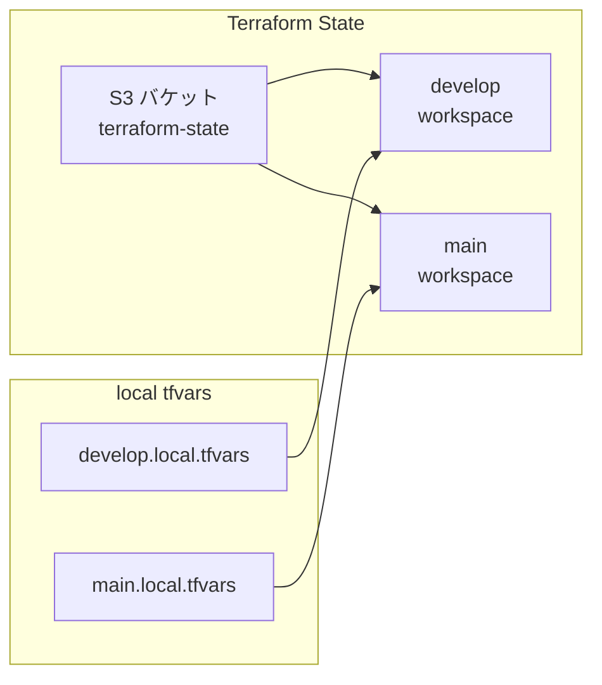
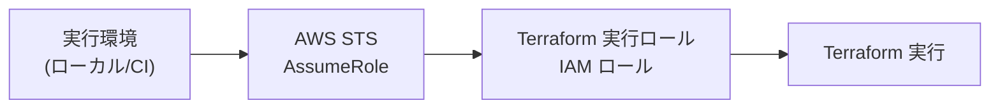
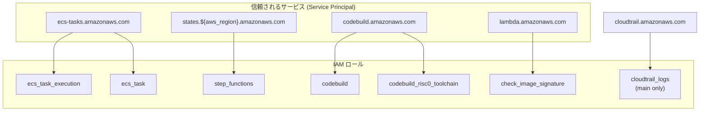
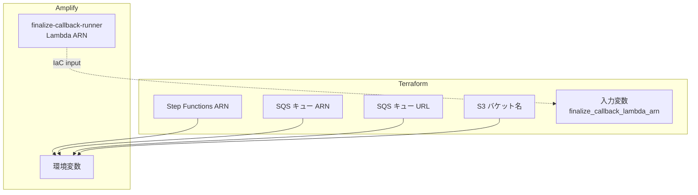

# Terraform

Terraform で非同期プローバーインフラを宣言的に管理する構成と、ワークスペース運用の方針を扱う章です。

Terraform は、証明生成パイプラインに関わる AWS リソース（ECS、Step Functions、SQS、S3、ECR、CodeBuild、VPC、Lambda、IAM、CloudWatch、CloudTrail）を宣言的に管理します。Amplify Gen 2 が管理するリソース（Web ホスティング、AppSync、hono-api Lambda 等）とは明確に分離されています。

## ディレクトリ構成

Terraform の構成ファイルは `terraform/` ディレクトリに配置され、機能別に分割されています。

| ファイル                          | 管理対象                                                |
| --------------------------------- | ------------------------------------------------------- |
| `backend.tf`                      | S3 ステートバックエンド宣言（実値は別ファイルで注入）   |
| `versions.tf`                     | Terraform / プロバイダーのバージョン制約                |
| `main.tf`                         | ローカル変数、環境設定、データソース                    |
| `variables.tf`                    | 入力変数の定義とバリデーション                          |
| `outputs.tf`                      | 他ツール連携用の出力値                                  |
| `terraform.tfvars.example`        | 公開向け sanitized tfvars 例                            |
| `backend.local.hcl`               | 実 backend 値（git 管理外、生成ファイル）               |
| `*.local.tfvars`                  | 実 deploy 値（git 管理外、生成ファイル）                |
| `iam.tf`                          | IAM ロール / ポリシー（ECS、Step Functions、CodeBuild） |
| `ecs.tf`                          | ECS クラスター + Fargate タスク定義                     |
| `step_functions.tf`               | ステートマシン定義（ASL）                               |
| `sqs.tf`                          | ワークキュー + デッドレターキュー                       |
| `s3.tf`                           | 証明バンドルバケット + ライフサイクル                   |
| `ecr.tf`                          | ECR リポジトリ + ライフサイクルポリシー                 |
| `codebuild.tf`                    | ビルドプロジェクト（プローバー + ツールチェーン）       |
| `lambda_check_image_signature.tf` | イメージ署名検証 Lambda                                 |
| `lambda/check-image-signature/`   | イメージ署名検証 Lambda のソース                        |
| `vpc.tf`                          | VPC + サブネット + インターネットゲートウェイ           |
| `security_groups.tf`              | ECS タスク用セキュリティグループ                        |
| `cloudwatch.tf`                   | ログ群 + 保持期間設定                                   |
| `cloudtrail.tf`                   | 監査証跡（main 環境のみ）                               |

## 環境分離

### ワークスペース戦略

`develop` と `main` の 2 環境を、Terraform ワークスペースと git 管理外の `*.local.tfvars` ファイルの組み合わせで管理します。

`environment` 変数はバリデーションにより `develop` または `main` のみが許可されます。環境ごとの差分は `locals` で定義された設定マップにより解決されます。

| 設定              | develop | main          |
| ----------------- | ------- | ------------- |
| S3 ライフサイクル | 7 日    | 30 日         |
| ログ保持期間      | 7 日    | 14 日         |
| CloudTrail        | 無効    | 有効（90 日） |

### ワークスペースの確認

環境の取り違えを防ぐため、操作前にワークスペースの確認が推奨されます。

## ステート管理

### S3 バックエンド

Terraform ステートは S3 バケットに保存され、`use_lockfile = true` による S3 lockfile でステートの同時変更を防止します。tracked の `backend.tf` は partial backend として `backend "s3" {}` だけを持ち、bucket や region は `backend.local.hcl` から `terraform init` に渡します。

| 項目             | 設定                                                     |
| ---------------- | -------------------------------------------------------- |
| ステートバケット | `<TERRAFORM_STATE_BUCKET>`（`backend.local.hcl` で注入） |
| ステートキー     | `terraform.tfstate`                                      |
| ロック方式       | S3 lockfile (`use_lockfile = true`)                      |
| リージョン       | `ap-northeast-1` など、環境値から生成                    |
| 暗号化           | AES256                                                   |

named workspace ごとに state path と lockfile path が分かれるため、`develop` と `main` を同じ backend bucket で安全に運用できます。

### 認証方式

Terraform の実行は STS AssumeRole を前提としています。  
具体的な認証ツール（AWS IAM Identity Center / `aws-vault` など）は運用環境に依存し、Terraform コードの責務外です。

| 項目               | 設定                                                  |
| ------------------ | ----------------------------------------------------- |
| 認証方式           | STS AssumeRole                                        |
| IAM ロール         | Terraform 実行用ロール（名称は環境依存）              |
| 資格情報の保護方式 | 組織の標準（SSO / `aws-vault` / Keychain / KMS など） |
| 権限               | 最小権限を原則とする                                  |

## 主要な入力変数

Terraform の実行に必要な変数と、そのバリデーションルールの概要です。

### 必須変数

| 変数                           | 説明                                           | バリデーション                             |
| ------------------------------ | ---------------------------------------------- | ------------------------------------------ |
| `environment`                  | デプロイ環境                                   | `develop` または `main`                    |
| `ecs_image_uri`                | プローバーイメージ URI                         | ダイジェスト固定形式（`@sha256:<64-hex>`） |
| `finalize_callback_lambda_arn` | コールバック Lambda の ARN                     | 実 ARN を要求（placeholder 不可）          |
| `ecr_signing_profile_arn`      | AWS Signer プロファイルの ARN                  | 実 ARN を要求（placeholder 不可）          |
| `codestar_connection_arn`      | CodeStar Connections ARN（IAM ポリシーで参照） | 実 ARN を要求（placeholder 不可）          |
| `codebuild_source_location`    | CodeBuild が clone する GitHub repository URL  | 実 URL を要求（placeholder 不可）          |

`*_arn` / `*_location` の各変数は、sanitized placeholder を弾くバリデーションが入っているため、実値の注入が前提です。現行の CodeBuild `source` は `GITHUB` タイプ（`location` 指定）で構成されています。

### オプション変数

| 変数                                    | デフォルト                                       | 説明                                       |
| --------------------------------------- | ------------------------------------------------ | ------------------------------------------ |
| `aws_region`                            | `ap-northeast-1`                                 | デプロイリージョン                         |
| `aws_profile`                           | `terraform-admin`                                | 共有 config 用プロファイル名（通常未使用） |
| `project_name`                          | `stark-ballot-simulator`                         | リソース命名プレフィックス                 |
| `ecs_cpu`                               | `16384`                                          | Fargate の CPU ユニット                    |
| `ecs_memory`                            | `32768`                                          | Fargate のメモリ（MiB）                    |
| `s3_proof_prefix`                       | `sessions/`                                      | S3 パスプレフィックス                      |
| `s3_cors_allowed_origins`               | `[]`                                             | CORS 許可オリジン                          |
| `risc0_toolchain_codebuild_name`        | `stark-ballot-simulator-risc0-toolchain-builder` | 共有 toolchain builder のプロジェクト名    |
| `risc0_toolchain_source_version`        | `refs/heads/main`                                | 共有 toolchain builder の Git ref          |
| `risc0_version`                         | `3.0.5`                                          | RISC Zero の pin                           |
| `risc0_commit`                          | `8eb06ab020a92dc5b63ba6dd0836d432aba6d890`       | `risc0/risc0` の pin commit                |
| `risc0_rust_version`                    | `1.91.1`                                         | host Rust toolchain の pin                 |
| `risc0_rust_toolchain_tag`              | `r0.1.91.1`                                      | ARM64 guest toolchain tag                  |
| `risc0_toolchain_image_retention_count` | `5`                                              | 共有 toolchain ECR の保持イメージ数        |

`s3_cors_allowed_origins` は Terraform 変数としては空配列を許可し、空の場合は S3 CORS 設定を作成しません。ただし標準の local tfvars 生成ヘルパーは、bundle ダウンロードがブラウザから壊れることを避けるため、非空の origin を要求します。

## 出力値

Terraform の出力値は、Amplify 環境変数や運用ツールから参照されます。

| 出力                             | 対応する値 / 参照元        | 用途                                             |
| -------------------------------- | -------------------------- | ------------------------------------------------ |
| `prover_state_machine_arn`       | `PROVER_STATE_MACHINE_ARN` | dispatch-proxy が SFN を起動                     |
| `prover_work_queue_arn`          | `PROVER_WORK_QUEUE_ARN`    | Amplify backend が SQS event source / IAM に使用 |
| `prover_work_queue_url`          | `PROVER_WORK_QUEUE_URL`    | API が SQS にメッセージ送信                      |
| `s3_bucket_name`                 | `S3_PROOF_BUCKET`          | Lambda が S3 にアクセス                          |
| `ecr_repository_url`             | 運用者 / CLI               | プローバーイメージの push 先確認                 |
| `risc0_toolchain_repository_url` | 運用者 / CLI               | 共有 toolchain イメージの push 先確認            |

## IAM 設計

最小権限の原則に基づき、各コンポーネントに専用の IAM ロールが割り当てられています。

| ロール                         | 信頼サービス                       | 主要権限                                                        |
| ------------------------------ | ---------------------------------- | --------------------------------------------------------------- |
| `ecs_task_execution`           | ecs-tasks                          | ECR イメージ取得、CloudWatch Logs 書き込み                      |
| `ecs_task`                     | ecs-tasks                          | S3 `var.s3_proof_prefix` 配下への読み書き（既定: `sessions/*`） |
| `step_functions`               | states.${aws_region}.amazonaws.com | ECS RunTask、Lambda Invoke、ログ、EventBridge managed rule      |
| `codebuild`                    | codebuild                          | 環境別 prover image の ECR 操作、AWS Signer、ログ               |
| `codebuild_risc0_toolchain`    | codebuild                          | 共有 toolchain image の ECR 操作、AWS Signer、ログ              |
| `check_image_signature`        | lambda                             | ECR 署名ステータス照会、ログ                                    |
| `cloudtrail_logs`（main のみ） | cloudtrail                         | CloudTrail から CloudWatch Logs への書き込み                    |

### スコープの制限

- ECS タスクロールの S3 権限は `var.s3_proof_prefix` 配下に制限（既定: `sessions/*`）
- Step Functions ロールの ECS 権限は特定クラスター ARN に制限
- Step Functions ロールの `iam:PassRole` は ECS 関連ロールのみに制限
- Step Functions ロールの EventBridge 権限は `ecs:runTask.sync` の managed rule 操作用

## Amplify との連携ポイント

Terraform と Amplify は相互に独立して管理されますが、以下のポイントで連携します。

| 方向                | 情報                                     | 設定方法                                          |
| ------------------- | ---------------------------------------- | ------------------------------------------------- |
| Terraform → Amplify | SFN ARN、SQS ARN、SQS URL、S3 バケット名 | Terraform 出力値 → Amplify 環境変数               |
| Amplify → Terraform | callback Lambda ARN                      | Terraform 入力変数 `finalize_callback_lambda_arn` |

この双方向の参照により、Amplify が管理する Lambda を Terraform が管理する Step Functions から呼び出すことが可能になります。
Terraform / CLI ワークフローから Amplify 環境変数は自動更新しないため、Terraform 出力を変更した場合は Amplify 側の app-level / branch override の実効値も合わせて確認します。

## バージョン制約

| ツール               | バージョン                                    |
| -------------------- | --------------------------------------------- |
| Terraform            | >= 1.10.0                                     |
| AWS プロバイダー     | ~> 6.0                                        |
| Archive プロバイダー | 2.x（`terraform/.terraform.lock.hcl` で解決） |

<!-- source: terraform/*.tf, docs/current/guides/7-terraform/ -->
