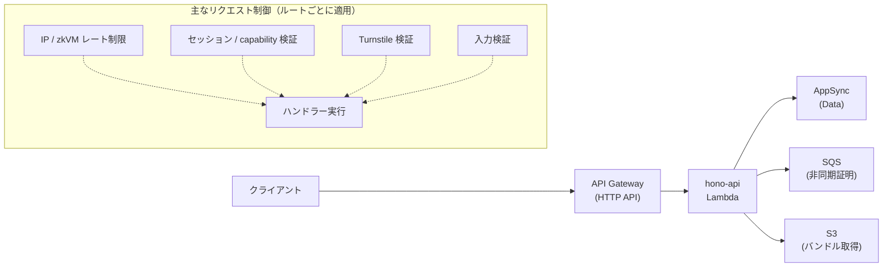
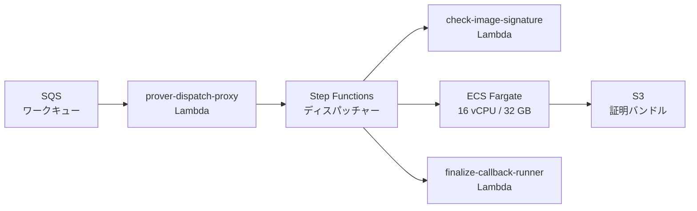
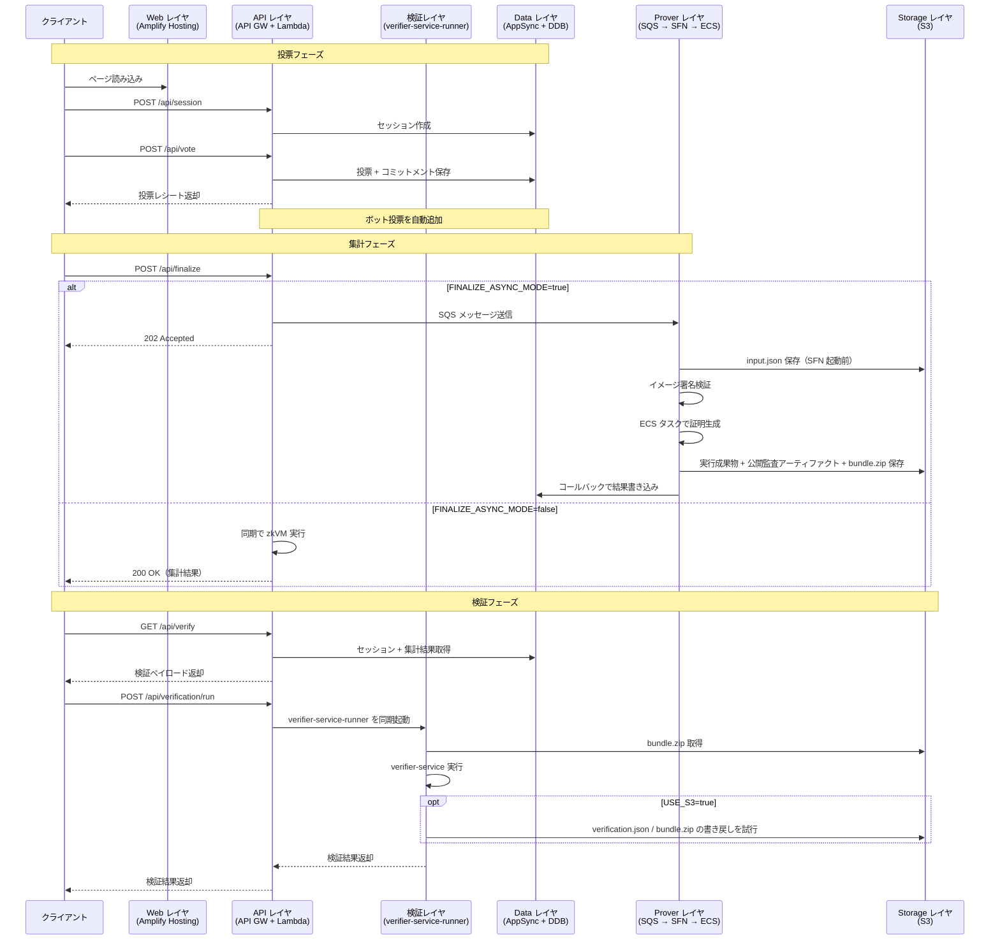
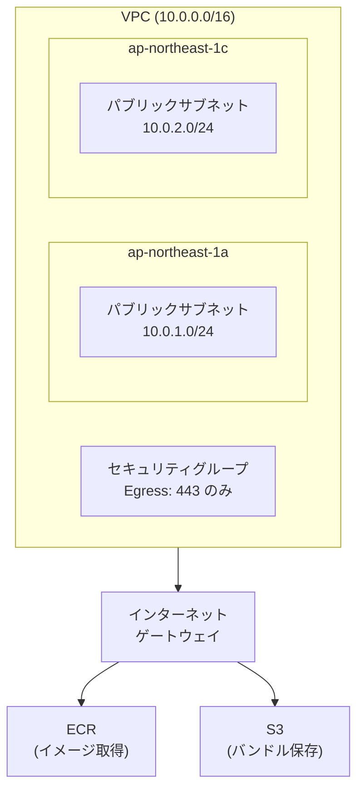

# トポロジー

AWS 上のサービス配置と、コンポーネント間の通信経路を俯瞰する章です。

本システムは 5 つの論理レイヤ（Web、API、Data、Prover、Storage）で構成され、各レイヤは明確な責務を持ちます。

## レイヤ別トポロジー

### Web レイヤ

Amplify Hosting が Next.js アプリケーションのビルドとホスティングを担当します。GitHub リポジトリのブランチ（`develop` / `main`）と Amplify の環境が 1 対 1 で対応し、プッシュをトリガーとする自動デプロイが行われます。

### API レイヤ

API Gateway（HTTP API）が `/api/*` パスパターンのリクエストを受け取り、単一の Lambda 関数（`hono-api`）にプロキシします。`hono-api` は Hono フレームワーク上に構築されており、ルーティング、セッション管理、Turnstile 検証、レート制限を処理します。

下図の「主なリクエスト制御」は固定順のパイプラインではなく、`hono-api` がルートごとに適用有無と順序を切り替える代表的な制御要素です。

CORS 設定では `X-Session-ID` と `X-Session-Capability` ヘッダーを許可し、セッションスコープと capability トークンによるリクエスト制御を実現しています。

なお、`POST /api/verification/run` は `hono-api` が専用の `verifier-service-runner` Lambda を同期起動する構成です。S3 上の `bundle.zip` 取得と verifier-service の実行は、この専用 Lambda 側で行われます。

### Data レイヤ

AppSync（GraphQL API）と DynamoDB が、セッション・投票・集計結果のデータ永続化を担当します。データプレーンは `allow.resource(...)` により `hono-api` / `prover-dispatch-proxy` / `finalize-callback-runner` からの SigV4 呼び出しに限定され、未認証アクセスは無効です。

注: Amplify Data の検証要件として fallback group は定義していますが、エンドユーザーには割り当てていません。

主要なデータモデルは以下の 2 つです（集計結果は `VotingSession.finalizationResultJson` に格納）。

| モデル        | キー/識別子                     | 主要フィールド                                                         | TTL   |
| ------------- | ------------------------------- | ---------------------------------------------------------------------- | ----- |
| VotingSession | `id`                            | electionId, botCount, finalized, userVoteIndex, finalizationResultJson | `ttl` |
| Vote          | 識別子: `sessionId + voteIndex` | choice, random, commitment, rootAtCast, isUserVote                     | —     |

レート制限用に 2 つの追加テーブル（RateLimitEvents、RateLimitCounters）が PAY_PER_REQUEST モードで運用されています。

### Prover レイヤ

STARK 証明の生成を担当するレイヤです。SQS キュー、Step Functions ステートマシン、ECS Fargate タスクで構成されます。詳細は [非同期プローバー](async-prover.md) を参照してください。

ECS タスクは ARM64 アーキテクチャの Fargate で実行され、専用の VPC（10.0.0.0/16）内のパブリックサブネットに配置されます。セキュリティグループは HTTPS エグレスのみを許可し、インバウンドトラフィックは一切受け付けません。

### Storage レイヤ

S3 バケットが、証明バンドルに含まれる配布対象アーティファクトと非公開ワーク入力の保存を担当します。

| 項目               | 設定                                            |
| ------------------ | ----------------------------------------------- |
| バケット命名       | `stark-ballot-simulator-proof-bundles-{環境名}` |
| 暗号化             | AES256（サーバーサイド暗号化）                  |
| パブリックアクセス | 全ブロック                                      |
| ライフサイクル     | develop: 7 日、main: 30 日で自動削除            |
| バージョニング     | Suspended（新規バージョン作成なし）             |

オブジェクトのパスは既定では `sessions/{sessionId}/{executionId}/` 配下に構造化されています。先頭プレフィックスは Terraform 変数 `s3_proof_prefix` で変更可能ですが、Amplify 側に `sessions/` を前提とする箇所があるため変更時は注意が必要です。詳細は [非同期プローバー > フェーズ 2: ディスパッチ](async-prover.md#フェーズ-2-ディスパッチ)を参照してください。

| ファイル                 | 扱い     | 説明                                                                                                                           |
| ------------------------ | -------- | ------------------------------------------------------------------------------------------------------------------------------ |
| `input.json`             | 非公開   | zkVM への完全な入力（プライベートウィットネス）                                                                                |
| `*-receipt.json`         | 内部保存 | zkVM host の生出力（レシート）。現行フローでは配布対象ではないが、`bundle.zip` 用の元データ                                    |
| `*-output.json`          | 内部保存 | zkVM host の生出力（集計結果）。現行フローでは配布対象ではないが、`journal.json` 生成の元データ                                |
| `public-input.json`      | 公開可能 | zkVM 検証に使う秘密データを含まない検証用レコード                                                                              |
| `election-manifest.json` | 公開可能 | 選挙設定の公開監査用スナップショット                                                                                           |
| `close-statement.json`   | 公開可能 | 集計締切時点のログ境界を表す公開監査レコード                                                                                   |
| `included-bitmap.json`   | 非公開   | 厳密な counted bitmap。隣接オブジェクト（sibling object）として保持、`bundle.zip` には含まない                                 |
| `seen-bitmap.json`       | 非公開   | 厳密な presented bitmap。隣接オブジェクト（sibling object）として保持、`bundle.zip` には含まない                               |
| `bundle.zip`             | 公開可能 | `receipt.json` + `journal.json` + `public-input.json` + `election-manifest.json` + `close-statement.json` の配布対象アーカイブ |
| `verification.json`      | 非公開   | 検証サービスの出力。`POST /api/verification/run` 後に S3 sibling object として追加されうる                                     |

補足:

- `receipt.json` と `journal.json` は S3 直下には個別オブジェクトとして置かれず、`bundle.zip` 内のエントリとして配布されます。
- 非同期 finalize では `public-input.json`・`election-manifest.json`・`close-statement.json` が個別ファイルとしても S3 に保存され、`bundle.zip` にも同梱されます。
- S3 バケット自体はパブリックアクセス全ブロックです。表の「公開可能」は機密性上の区分を指す表現で、配布経路は [バンドル構造](../verification/bundle-structure.md) を参照してください。

## エンドツーエンドのデータフロー

投票から検証までの全データフローを、レイヤ間の通信として示します。

`verifier-service-runner` は S3 書き戻しが有効な構成では、`verification.json` と更新済み `bundle.zip` の保存を試みます。新しい `s3ReportKey` と更新済み bundle key は、保存に成功したときだけ finalization state に反映されます。書き戻しが失敗しても、もとの `s3BundleKey` はそのまま維持されるため、配信元は失われません。

注: 現行の async ECS bundle は `metadata.json` を生成しないため、bundle を再アーカイブして書き戻すパスは常に成功するとは限りません。bitmap artifact が利用可能な場合は、同じ execution 配下に private sibling object として保持されます。

## ネットワーク構成

### VPC

Terraform が管理する VPC は、ECS Fargate タスク専用です。Amplify 管理のリソース（Lambda、AppSync）は VPC 外で動作します。

ECS タスクはパブリック IP を持ちますが、セキュリティグループがインバウンドを全拒否するため、外部からのアクセスはできません。アウトバウンドは HTTPS（ポート 443）のみ許可され、ECR からのイメージ取得、S3 へのアップロード、CloudWatch Logs などの AWS API 通信に使用されます。

## 監視とロギング

### 主な CloudWatch ログ群

| ログ群                                                          | 対象                     | 保持期間                    |
| --------------------------------------------------------------- | ------------------------ | --------------------------- |
| `/aws/ecs/{project}-prover-{env}`                               | ECS Fargate タスク       | develop: 7 日 / main: 14 日 |
| `/aws/stepfunctions/{project}-prover-{env}`                     | Step Functions 実行      | develop: 7 日 / main: 14 日 |
| `/aws/codebuild/{project}-fargate-prover-{env}`                 | 環境別 prover CodeBuild  | develop: 7 日 / main: 14 日 |
| `/aws/codebuild/stark-ballot-simulator-risc0-toolchain-builder` | 共有 toolchain CodeBuild | 14 日                       |
| `/aws/lambda/{project}-check-image-signature-{env}`             | イメージ署名検証 Lambda  | develop: 7 日 / main: 14 日 |
| `/aws/lambda/*hono-api*` などの Amplify 生成ログ群              | Amplify 管理 Lambda 4 種 | develop: 7 日 / main: 14 日 |
| `/aws/apigateway/{project}-hono-api-{env}`                      | API Gateway アクセスログ | develop: 7 日 / main: 14 日 |
| `/aws/appsync/apis/*` などの Amplify 生成ログ群                 | AppSync field/error ログ | develop: 7 日 / main: 14 日 |

Amplify 管理 Lambda と AppSync の実際のロググループ名には app / branch / API 由来の識別子が入るため、運用時は runbook の discovery クエリで特定します。

### CloudTrail（main 環境のみ）

main 環境では CloudTrail による全リージョン監査ログが有効です。

| 項目           | 設定                               |
| -------------- | ---------------------------------- |
| 対象リージョン | 全リージョン                       |
| ログ検証       | 有効                               |
| 保存先         | 専用 S3 バケット + CloudWatch Logs |
| 保持期間       | 90 日                              |

<!-- source: terraform/vpc.tf, terraform/security_groups.tf, terraform/cloudwatch.tf, terraform/cloudtrail.tf, terraform/s3.tf, amplify/backend.ts, amplify/data/resource.ts, amplify/functions/prover-dispatch-proxy/handler.ts, amplify/functions/verifier-service-runner/handler.ts, docker/entrypoint.sh, src/lib/verification/verification-bundle.ts -->
