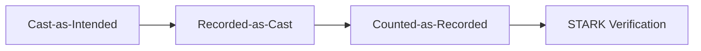
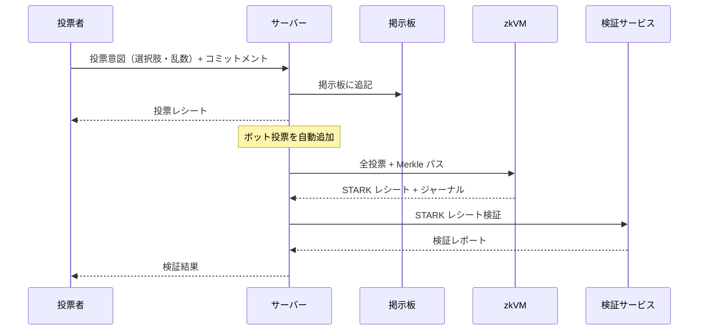

# 全体像

`STARK Ballot Simulator` は、投票の完全性を段階的に検証するための PoC です。



## データフロー概観



## コアコンセプト

- 投票コミットメントと投票レシートにより Cast-as-Intended を検証
- RFC 6962 / CT スタイルの掲示板で Recorded-as-Cast を検証
- zkVM ジャーナル、入力整合、ビットマップ証明により Counted-as-Recorded を検証
- RISC Zero レシート検証で STARK 実行の正当性を検証
- AWS クラウド費用の目標月額を 1 USD（デプロイなし、アプリのアクセスなし時）

## バンドル用語の階層

検証で扱うアーティファクト群は階層的な 3 つの用語で呼び分けます。

```text
証明バンドル ⊃ 配布対象アーカイブ ⊃ bundle.zip（ファイル）
```

詳細: [バンドル構造](verification/bundle-structure.md)、定義: [用語集 > 証明バンドル](appendix/glossary.md#証明バンドルproof-bundle)。

## プロジェクト規模

概算（2026-05-23 時点、tracked files ベース、生成物を除く、千行単位に丸め）。

| 区分                                        | 行数              |
| ------------------------------------------- | ----------------- |
| TypeScript / React（アプリ本体）            | 約 57,000 行      |
| TypeScript（テストコード）                  | 約 67,000 行      |
| Rust（zkVM ゲスト + ホスト + 検証サービス） | 約 5,000 行       |
| Terraform / Shell / 補助スクリプト          | 約 7,000 行       |
| **合計**                                    | **約 136,000 行** |

## 各章への案内

| 部                                           | 内容                                                                                          |
| -------------------------------------------- | --------------------------------------------------------------------------------------------- |
| [暗号プロトコル](protocol/index.md)          | コミットメント、掲示板 (CT Merkle)、入力コミットメント、STH ダイジェスト、ビットマップ Merkle |
| [zkVM 設計](zkvm/index.md)                   | ゲストプログラム、ホスト・証明生成、検証サービス、Image ID                                    |
| [検証パイプライン](verification/index.md)    | 4 段階モデル、チェック一覧、バンドル構造、ゲーティングロジック                                |
| [改ざんシナリオ](tamper/index.md)            | S0〜S5 シナリオ、検出メカニズム                                                               |
| [品質保証と形式手法](quality/index.md)       | 単体・結合・E2E、Property-based Testing、Lean による形式化                                    |
| [AWS アーキテクチャ](aws/index.md)           | トポロジー、非同期プローバー、イメージ署名、Terraform                                         |
| [API リファレンス](api/index.md)             | エンドポイント一覧、セッションライフサイクル                                                  |
| [第三者検証ガイド](reproducibility/index.md) | 検証ページで取得した `bundle.zip` を使う Ubuntu 向けローカル検証手順                          |
| [設計判断](decisions/index.md)               | PoC の意図的な制約、設計ふりかえり                                                            |
