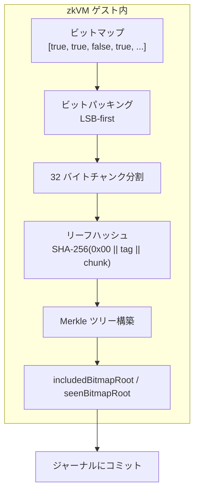
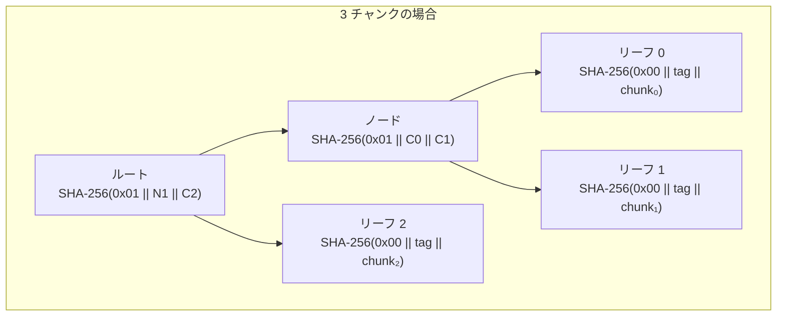
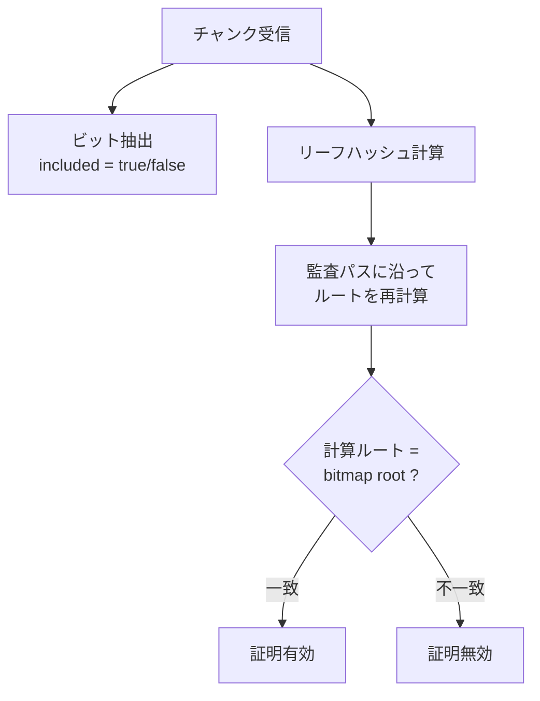

# ビットマップ Merkle

自票が集計に含まれたかを Merkle 証明で開示するためのビットマップツリーを扱う章です。

zkVM ゲスト内で計算されるビットマップにより、各投票インデックスが集計に含まれたかどうかを個別に検証可能にします。Merkle 証明により、自分の投票が含まれていることをサーバーを信頼せずに確認できます。

## 概要

Counted-as-Recorded 段階の検証では、zkVM に提示された入力に対する集計の正しさは STARK 証明で保証されますが、個々の投票者にとって「自分の票が集計に含まれたか」を直接確認する手段が別途必要です。

ビットマップ Merkle ツリーは、この「個別のカウント証明」を提供します。zkVM ゲストは投票ごとの状態をビットマップとしてエンコードし、その Merkle ルートをジャーナルにコミットします。投票者は自分のインデックスに対応するビットの Merkle 証明を取得し、「自分の票がカウントされたか」「そもそも prover に提示されたか」を独立に検証できます。



## ビットマップの構造

### ビットマップの定義

ビットマップは、ツリーサイズ（投票数）と同じ長さのブール配列です。現行実装では同じエンコーディング規則を持つ 2 種類のビットマップを扱います。

- `includedBitmap[i] = true`: インデックス i の投票が正常に検証され、集計に含まれた
- `includedBitmap[i] = false`: インデックス i の投票が除外された
- `seenBitmap[i] = true`: インデックス i の投票が prover に提示された
- `seenBitmap[i] = false`: インデックス i の投票が prover に提示されなかった

本 PoC では 64 票を扱うため、ビットマップは 64 ビット（= 8 バイト）です。

### LSB-first ビットパッキング

ブール配列は LSB-first（Least Significant Bit first）方式でバイト列にパッキングされます。

```text
ビット配列: [b₀, b₁, b₂, b₃, b₄, b₅, b₆, b₇, b₈, ...]

バイト 0 = b₀ | (b₁ << 1) | (b₂ << 2) | ... | (b₇ << 7)
バイト 1 = b₈ | (b₉ << 1) | ...
```

| ビット位置 | バイトインデックス | バイト内ビット位置 |
| ---------- | ------------------ | ------------------ |
| 0          | 0                  | 0 (LSB)            |
| 1          | 0                  | 1                  |
| 7          | 0                  | 7 (MSB)            |
| 8          | 1                  | 0 (LSB)            |
| 63         | 7                  | 7 (MSB)            |

64 ビットのビットマップは 8 バイトにパッキングされます。

### 32 バイトチャンク分割

パッキングされたバイト列は 32 バイト（256 ビット）単位のチャンクに分割されます。各チャンクが Merkle ツリーの 1 つのリーフとなります。

- 1 チャンク = 32 バイト = 256 ビット分の投票カウント状態
- 最後のチャンクが 32 バイトに満たない場合はゼロパディング

本 PoC の 64 票は 8 バイトであるため、1 つのチャンク（24 バイトのゼロパディング付き）に収まります。

## Merkle ツリーの構築

### ハッシュ規則

ビットマップ Merkle ツリーは、CT Merkle ツリーと同一のハッシュ規則を使用します。

**リーフハッシュ**:

```text
LeafHash = SHA-256(0x00 || "stark-ballot:leaf|v1" || chunk)
```

**内部ノードハッシュ**:

```text
NodeHash = SHA-256(0x01 || left_hash || right_hash)
```

ドメイン分離プレフィックス（`0x00` / `0x01`）と使用タグ（`"stark-ballot:leaf|v1"`）は、[CT Merkle ツリー](ct-merkle.md)の章で解説したものと同一です。

### ツリー構築アルゴリズム

1. 各 32 バイトチャンクにリーフハッシュを適用
2. ボトムアップでペアを結合し、内部ノードハッシュを計算
3. 奇数ノードがある場合は、そのまま次のレベルに昇格（ハッシュなし）
4. ルートに到達するまで繰り返す



## Merkle 証明の生成と検証

### 証明の構造

`GET /api/bitmap-proof?i=<bitIndex>&kind=included|seen` のレスポンスは、以下の要素で構成されます:

| フィールド | 説明                                                     |
| ---------- | -------------------------------------------------------- |
| leafChunk  | 対象ビットを含む 32 バイトチャンク（16 進数）            |
| auditPath  | ルートまでの兄弟ハッシュ配列（各要素にハッシュ値と位置） |

`leafIndex`（`floor(bitIndex / 256)`）と `bitOffset`（`bitIndex mod 256`）は、クライアント側で `bitIndex` クエリから導出します。サーバーは返しません。

`kind` は省略可能で、既定値は `included` です。

- `kind=included`: `includedBitmapRoot` に対する証明を返す
- `kind=seen`: `seenBitmapRoot` に対する証明を返す

このエンドポイントはセッション ID と capability token によるセッションスコープ認証を前提とした証明材料 API です。外部クライアント向けに文書化されていますが、無認証公開 API ではありません。

### ビット抽出

投票者は受け取ったチャンクから、自分が指定した `bitIndex` のビットを以下の手順で抽出します:

```text
bit_offset  = bit_index mod 256
byte_index  = bit_offset / 8    (整数除算)
bit_in_byte = bit_offset mod 8

included = (chunk[byte_index] AND (1 << bit_in_byte)) != 0
```

`kind=included` で `included = true` なら、自分の投票がカウントされたことを意味します。`kind=seen` で `included = true` なら、自分の投票が prover に提示されたことを意味します。

### 検証手順

1. チャンクからビット値を抽出し、自分の投票がカウントされたか確認
2. チャンクのリーフハッシュを計算: `SHA-256(0x00 || "stark-ballot:leaf|v1" || chunk)`
3. 監査パスに沿ってルートまで再計算:
   - 兄弟の位置が `left` → `SHA-256(0x01 || sibling || current)`
   - 兄弟の位置が `right` → `SHA-256(0x01 || current || sibling)`
4. 計算されたルートが、`kind` に対応するジャーナル上のルートと一致するか確認
   - `kind=included` → `includedBitmapRoot`
   - `kind=seen` → `seenBitmapRoot`



## zkVM ゲストとの連携

ビットマップルートは zkVM ゲストプログラム内で計算され、ジャーナルにコミットされます。

ゲストプログラムは以下の手順を実行します:

1. 各投票に対してコミットメントの再計算と包含証明の検証を実施
2. prover に提示された投票インデックスを `seenBitmap` に記録
3. 検証に成功して集計対象になった投票インデックスを `includedBitmap` に記録
4. それぞれのビットマップを LSB-first でパッキングし、32 バイトチャンクに分割
5. CT スタイルのハッシュ規則で Merkle ルートを計算
6. `seenBitmapRoot` と `includedBitmapRoot` をジャーナルにコミット

この計算はゲスト内で行われるため、STARK 証明がビットマップの正しさも保証します。サーバーが事後的にビットマップを改ざんしても、ジャーナルのルート値と一致しなくなるため検出されます。

## サーバーのビットマップデータ管理

サーバーは `/api/bitmap-proof` 用に、最終化時の zkVM 出力（`includedBitmap`、ある場合は `seenBitmap` / `seenBitmapRoot`）を非公開 sidecar として保持します。これらは配布対象アーカイブ `bundle.zip` には含まれず、async finalize 経路では必要に応じて S3 の sibling object から復元されます。

### 安全性ゲートと検証結果の分岐

採用前と採用後で、`counted_my_vote_included` の判定が次の 2 つに分岐します。

- **採用前に弾かれる、または証明材料が取得できない** → `counted_my_vote_included` は `not_run`（証拠不足による fail-closed）。
  - 例: zkVM 出力に bitmap データが無い、保存・復元時の root 一致ゲートで採用されなかった、cast-time 証跡（`voteReceipt` / `userVote.proof`）が store から再構成できず `voteReceipt.bulletinIndex` が確定しない、など。
- **採用後にクライアント側の root 照合が失敗** → `counted_my_vote_included` は `failed`。
  - サーバーが返した chunk と audit path から再計算したルートが、ジャーナルの `includedBitmapRoot`（または `seenBitmapRoot`）と一致しない。

採用前ゲートおよび `counted_my_vote_included` の評価詳細は [チェック一覧 > `counted_my_vote_included`](../verification/checks-catalog.md#counted_my_vote_included) を参照してください。

## 検証パイプラインにおける役割

ビットマップ Merkle 証明は、Counted-as-Recorded 段階のチェックとして使用されます。

| チェック ID                | 検証内容                                                                             |
| -------------------------- | ------------------------------------------------------------------------------------ |
| `counted_my_vote_included` | ビットマップ Merkle 証明により、自分の投票インデックスがカウントされたことを確認する |

`seenBitmapRoot` が利用可能な場合は、このチェックが「prover に提示されたが無効化された」と「そもそも提示されなかった」も区別して説明します。

各チェックの判定ロジックは [チェック一覧 > Counted-as-Recorded](../verification/checks-catalog.md#counted-as-recorded10-チェック) を参照してください。

## プライバシーに関する注意

### チャンクレベルの情報漏洩

ビットマップ Merkle 証明では、対象ビットを含む 32 バイトチャンク全体がクライアントに提供されます。1 チャンクは 256 ビット分のカウント状態を含むため、近傍のインデックスのカウント状態が同時に開示されます。

本 PoC では 64 票が 1 チャンクに収まるため、チャンクを受け取った投票者は全 64 票のカウント状態を知ることができます。この漏洩の影響評価は [PoC の意図的な制約 > ビットマップチャンク漏洩](../decisions/poc-relaxations.md#2-ビットマップチャンク漏洩) を参照してください。

### PoC における許容性

本システムでは 63 票がボット（自動投票）であり、ボットのカウント状態が開示されても実質的なプライバシー侵害は生じません。人間の投票者が多数参加するシステムでは、以下のような緩和策が考えられます:

- チャンクサイズの縮小（より多くのリーフ、より深いツリー）
- ゼロ知識証明を用いたビット開示の最小化
- 投票者の明示的な同意に基づく開示

<!-- source: src/lib/zkvm/bitmap.ts, src/lib/zkvm/types.ts, src/lib/merkle/bitmap-merkle-tree.ts, src/server/api/handlers/bitmapProof.ts, src/lib/finalize/usecases/finalize-sync.ts, src/lib/aws/bundle-restore.ts -->
