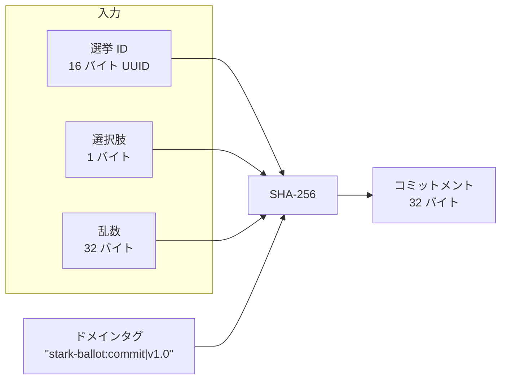
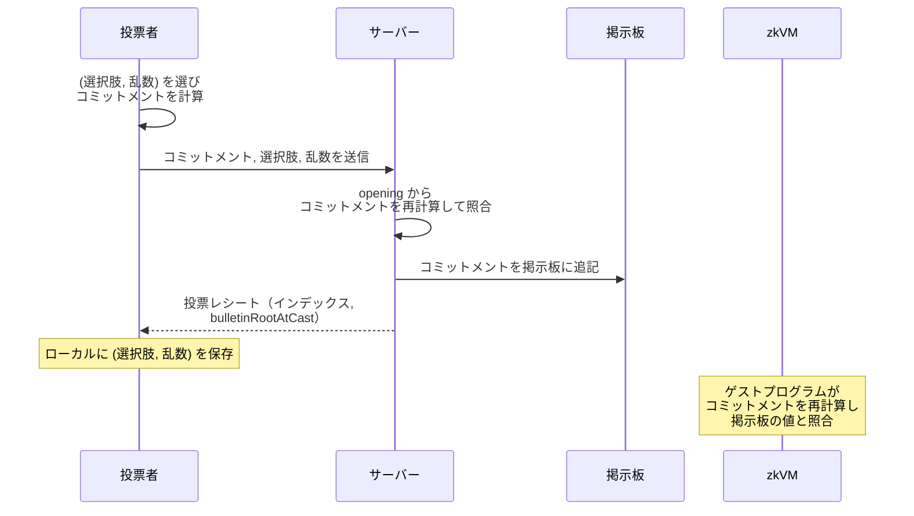

# コミットメントスキーム

投票者の選択を秘匿しつつ後から変更できないようにするコミットメントスキームを扱う章です。

SHA-256 ベースのコミットメントにより、投票内容の hiding（秘匿性）と binding（束縛性）を実現します。ドメイン分離タグにより、他プロトコルとのコミットメント衝突を防止します。

## 概要

投票コミットメントは、投票者が選んだ選択肢を公開データからは隠したまま、その選択に束縛されることを可能にする暗号プリミティブです。掲示板に記録されるのはコミットメント値のみで、選択肢と乱数（opening）は公開配布物（掲示板や `bundle.zip` 内の `public-input.json` など）には現れません。投票者は Cast-as-Intended 検証のために opening をローカルに保持します。



## コミットメントの正準フォーマット

コミットメント値は、以下の入力を連結し SHA-256 で圧縮して生成されます。

```text
commitment = SHA-256(
    domain_tag  ||   ← "stark-ballot:commit|v1.0" (24 バイト, UTF-8)
    election_id ||   ← UUID v4 のバイナリ表現 (16 バイト)
    choice      ||   ← 選択肢の値 (1 バイト, 0〜4)
    random           ← 一様乱数 (32 バイト)
)
```

### 各フィールドの仕様

| フィールド   | サイズ    | エンコーディング                                      | 説明                          |
| ------------ | --------- | ----------------------------------------------------- | ----------------------------- |
| ドメインタグ | 24 バイト | UTF-8 固定文字列                                      | `"stark-ballot:commit\|v1.0"` |
| 選挙 ID      | 16 バイト | UUID v4 からハイフンを除去し、16 進数をバイト列に変換 | 選挙スコープの識別子          |
| 選択肢       | 1 バイト  | 符号なし整数 (0 = A, 1 = B, 2 = C, 3 = D, 4 = E)      | 投票者の選択                  |
| 乱数         | 32 バイト | 暗号学的に安全な一様乱数                              | hiding 性を保証               |

SHA-256 への入力は合計 73 バイト、出力は 32 バイト（16 進数表記で 64 文字、`0x` プレフィックス付きでは 66 文字）です。

## ドメイン分離

ドメインタグ `"stark-ballot:commit|v1.0"` は、このコミットメントが他のプロトコルで使用されるハッシュ値と偶発的に衝突することを防ぐための仕組みです。

本システムの主要なハッシュ用途では、用途ごとに以下のようなドメインタグまたは構造的プレフィックスを使い、ハッシュ入力の意味を分離します。

| プリミティブ       | タグ / プレフィックス               |
| ------------------ | ----------------------------------- |
| コミットメント     | `"stark-ballot:commit\|v1.0"`       |
| 入力コミットメント | `"stark-ballot:input\|v1.0"`        |
| Merkle リーフ      | `0x00 \|\| "stark-ballot:leaf\|v1"` |
| Merkle ノード      | `0x01`                              |
| ログ ID            | `"stark-ballot:bulletin-log\|v1.0"` |

STH ダイジェストは専用のドメインタグを持たず、ログ ID を含む正準フォーマットで束縛されます（[STH ダイジェスト](sth-digest.md) を参照）。

## 安全性

### Hiding（秘匿性）

乱数フィールドが 32 バイト（256 ビット）のエントロピーを持つため、公開されたコミットメント値から選択肢を推測することは計算量的に不可能です。

**前提条件**:

- 乱数は暗号学的に安全な乱数生成器（CSPRNG）から生成される
- 同じ乱数は決して再利用しない（再利用すると、同じ選択肢で同じコミットメント値が現れて情報が漏洩する）

**PoC の制約**: 本 PoC は operator に対する完全な秘匿性を目的としていません。投票 API に送信された opening（選択肢と乱数）はサーバー側ストアに保持されうるため、ここでいう hiding は公開観測者と公開配布物に対する性質を指します。

### Binding（束縛性）

SHA-256 の原像耐性（preimage resistance）と第二原像耐性（second-preimage resistance）により、一度コミットした値と異なる選択肢に対して同じコミットメント値を生成することは計算量的に不可能です。

つまり、投票者はコミットメント公開後に「別の選択肢に投票した」と主張を変えることができません。

## TypeScript と Rust の実装同期

コミットメントは TypeScript（クライアント・サーバー）と Rust 実装（zkVM guest/host から共有される `zkvm/contract-core`）の双方で計算されます。この 2 系統の実装は、バイトレベルで完全に同一の出力を生成する必要があります。

同期が必要な要素:

- ドメインタグの文字列とエンコーディング（UTF-8）
- UUID からバイト列への変換規則（ハイフン除去 → 16 進数デコード）
- 選択肢の整数エンコーディング（1 バイト、符号なし）
- 乱数の 16 進数デコード規則

ドメインタグやエンコーディング規則を変更する場合は、TypeScript と Rust の両実装を同時に更新する必要があります。どちらか一方のみの変更は、コミットメント照合の失敗を引き起こします。

## 検証パイプラインにおける役割

コミットメントは、4 段階検証モデルの最初の 3 段階で中心的な役割を果たします。

| 検証段階            | コミットメントの役割                                                                                                       |
| ------------------- | -------------------------------------------------------------------------------------------------------------------------- |
| Cast-as-Intended    | 投票者がローカルに保持する（選択肢, 乱数, 選挙 ID）からコミットメントを再計算し、投票レシートと照合する                    |
| Recorded-as-Cast    | 掲示板上でコミットメントの包含証明を検証し、投票時点のツリー状態に対して正しく記録されたことを確認する                     |
| Counted-as-Recorded | zkVM ゲストが prover から渡された各 vote opening でコミットメントを再計算し、掲示板上の値と整合する票だけを tally に含める |

> **注意**: Cast-as-Intended と Counted-as-Recorded は同じコミットメント計算式を使いますが、opening の出所が異なります（投票者ローカル / prover に渡された値）。

Recorded-as-Cast は投票時点（cast-time）のツリー状態に対する包含証明を使い、レシートの `bulletinRootAtCast` と整合させます。`rootAtCast` の保存と再導出の詳細は [CT Merkle ツリー](ct-merkle.md) を参照してください。

各チェックの判定ロジックは [チェック一覧 > Cast-as-Intended](../verification/checks-catalog.md#cast-as-intended4-チェック) を参照してください。



<!-- source: src/lib/zkvm/types.ts:computeCommitment, zkvm/contract-core/src/sha256.rs, zkvm/methods/guest/src/tally.rs, zkvm/host/src/main.rs, src/server/api/handlers/vote.ts, src/lib/store/ct-proof.ts, src/lib/finalize/usecases/user-vote-artifacts.ts -->
