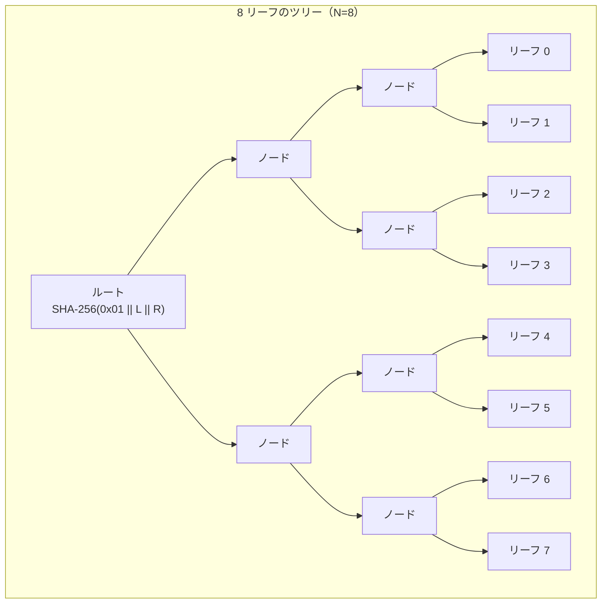
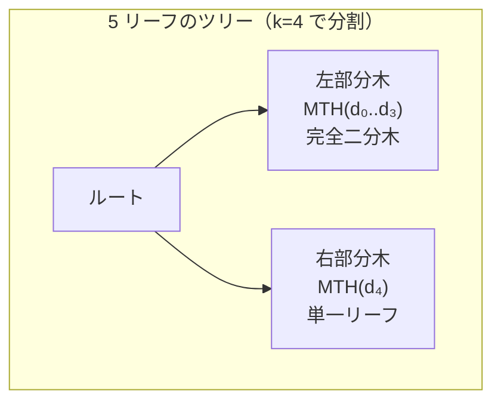
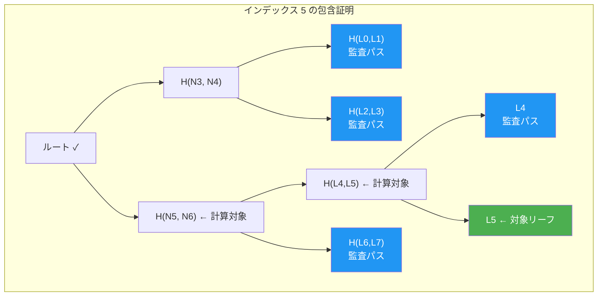

# CT Merkle ツリー

RFC 6962 を参照した追記専用 Merkle ツリーで、掲示板の透明性をどう作るかを扱う章です。

リーフハッシュ（`0x00` プレフィックス）とノードハッシュ（`0x01` プレフィックス）の区別により、second-preimage 攻撃を防止します。包含証明と整合性証明により、投票の記録と掲示板の追記専用性を検証可能にします。

## なぜ RFC 6962 CT スタイルか

- 整合性証明で追記専用性を示せるため、Recorded-as-Cast に必要な「後から削除・改変されていない」保証を与えられる。
- 包含証明と整合性証明の両方を同一モデルで扱える。
- STH ダイジェストと組み合わせてスプリットビュー攻撃の検出力を上げられる。

## 概要

本システムの掲示板（Bulletin Board）は、Certificate Transparency (CT) で実績のある追記専用ログの設計を投票に応用しています。各投票コミットメントは Merkle ツリーのリーフとして追記され、一度記録されたエントリは削除も改変もできません。



## RFC 6962 参照ハッシュ規則

RFC 6962 Section 2 に従い、リーフノードと内部ノードに異なるドメイン分離プレフィックスを適用します。

### リーフハッシュ

```text
LeafHash = SHA-256(0x00 || "stark-ballot:leaf|v1" || leaf_data)
```

| 要素           | サイズ    | 説明                                                     |
| -------------- | --------- | -------------------------------------------------------- |
| プレフィックス | 1 バイト  | `0x00`（リーフ識別子）                                   |
| 使用タグ       | 20 バイト | `"stark-ballot:leaf\|v1"`（UTF-8）                       |
| リーフデータ   | 可変      | コミットメント hex をデコードした生バイト列（32 バイト） |

### 内部ノードハッシュ

```text
NodeHash = SHA-256(0x01 || left_hash || right_hash)
```

| 要素           | サイズ    | 説明                       |
| -------------- | --------- | -------------------------- |
| プレフィックス | 1 バイト  | `0x01`（内部ノード識別子） |
| 左子ハッシュ   | 32 バイト | 左部分木のハッシュ         |
| 右子ハッシュ   | 32 バイト | 右部分木のハッシュ         |

### ドメイン分離の安全性

`0x00`（リーフ）と `0x01`（内部ノード）のプレフィックス区別は、second-preimage 攻撃を防止するために不可欠です。この区別がなければ、攻撃者はリーフノードを内部ノードとして解釈させる（またはその逆の）偽造データを構築できる可能性があります。

使用タグ `"stark-ballot:leaf|v1"` は、他システムのリーフハッシュとの偶発的な衝突を防止する追加の防御層です。

## Merkle Tree Hash（MTH）アルゴリズム

RFC 6962 で定義される MTH アルゴリズムは、任意のサイズのデータセットからルートハッシュを計算します。

### アルゴリズムの定義

1. **空のツリー**: `MTH({}) = SHA-256()` （空入力のハッシュ）
2. **単一リーフ**: `MTH({d₀}) = LeafHash(d₀)`
3. **複数リーフ**: サイズ n のツリーに対し、k を n 未満の最大の 2 のべき乗とする

```text
MTH({d₀, ..., dₙ₋₁}) = SHA-256(0x01 || MTH({d₀, ..., dₖ₋₁}) || MTH({dₖ, ..., dₙ₋₁}))
```

### 非 2 のべき乗サイズへの対応

ツリーサイズが 2 のべき乗でない場合（例: 5, 6, 7 リーフ）、MTH アルゴリズムは「n 未満の最大の 2 のべき乗」で分割を行います。これにより、左部分木は常に完全二分木（2 のべき乗サイズ）となり、右部分木にのみ不完全さが集中します。



デフォルトのデモ構成では 64 票（2⁶）を扱うため、最終的なツリーは完全二分木になります。ただし、実装は任意の `treeSize` を扱う前提であり、投票の追加途中や小規模な検証ケースでは非 2 のべき乗サイズのツリーが出現するため、MTH アルゴリズムの一般的な対応が必要です。

## 掲示板のリーフデータ形式

掲示板に追記される各投票のリーフデータは、コミットメントの正規化された 16 進数表現（`0x` なし、小文字、64 文字）を 32 バイトにデコードした生バイト列です。

```text
leaf_data = hex_decode(normalized_commitment_hex) (32 バイト)
```

掲示板は以下の不変条件を維持します:

- **単調増加インデックス**: 各投票に 0 から始まる連番が割り当てられる
- **重複排除**: 同一の投票 ID やコミットメントの二重追記を拒否する
- **ルート履歴**: 各追記時点のルートハッシュをタイムスタンプとともに保存する

## 包含証明（Inclusion Proof）

包含証明は、特定のコミットメントがツリーの特定位置に含まれていることを、ルートハッシュに対して暗号学的に証明するものです。

### 構造

包含証明は以下の要素で構成されます:

| フィールド | 説明                           |
| ---------- | ------------------------------ |
| leafIndex  | リーフの 0 始まりインデックス  |
| proofNodes | 兄弟ハッシュの配列（監査パス） |
| treeSize   | 証明時点のツリーサイズ         |
| rootHash   | 検証対象のルートハッシュ       |

#### 実装での名称

本章では RFC 6962 の抽象名を使いますが、API では異なるフィールド名で返します。

| 抽象名       | API フィールド名     |
| ------------ | -------------------- |
| `proofNodes` | `merklePath`         |
| `rootHash`   | `bulletinRootAtCast` |

`/api/verify` の `userVote.proof` や `/api/bulletin/:voteId/proof` がこの構造に対応します。

### PATH アルゴリズム

RFC 6962 の PATH 関数に従い、監査パスを再帰的に生成します。

1. ツリーをサイズ k（n 未満の最大の 2 のべき乗）で左右に分割
2. 対象リーフが左部分木にある場合（`index < k`）:
   - 左部分木の PATH を再帰計算
   - 右部分木のハッシュを監査パスに追加
3. 対象リーフが右部分木にある場合（`index >= k`）:
   - 右部分木の PATH を再帰計算（インデックスを `index - k` に調整）
   - 左部分木のハッシュを監査パスに追加

### 検証手順

検証者は以下の手順で包含を確認します:

1. コミットメントのリーフハッシュを計算: `LeafHash(commitment)`
2. PATH アルゴリズムと同じ木構造に従い、監査パスのノードを順に結合
3. 計算されたルートが期待するルートハッシュと一致するか確認

Recorded-as-Cast では、包含証明に加えて以下の cast-time 一貫性も確認します:

- `leafIndex` がレシートの `bulletinIndex` と一致すること
- `treeSize` が `bulletinIndex + 1` と一致すること（投票時点のツリーサイズ）

監査パスのサイズは O(log n) であり、64 票のツリーでは最大 6 ノードです。



## 整合性証明（Consistency Proof）

整合性証明は、古いツリー状態（サイズ m）が新しいツリー状態（サイズ n）の前方互換的なプレフィックスであること、つまり追記専用性を暗号学的に証明するものです。

### 構造

| フィールド | 説明                           |
| ---------- | ------------------------------ |
| oldSize    | 古いツリーのサイズ（m）        |
| newSize    | 新しいツリーのサイズ（n）      |
| proofNodes | 整合性を証明するハッシュの配列 |

> **補足**: `/api/bulletin/consistency-proof` は `proofNodes` に加えて `rootAtOldSize` と `rootAtNewSize` も返しますが、この endpoint は補助的な確認用であり、`/verify` ページの判定には直接使われません。`/verify` の `recorded_consistency_proof` 判定では、サーバー側の bulletin provider から取得した old/new root と整合性証明を検証し、old root がレシートの `bulletinRootAtCast`、new root が最終 `bulletinRoot` と一致することを確認します。

### SUBPROOF アルゴリズム

RFC 6962 の SUBPROOF 関数に基づき、整合性証明を再帰的に生成します。

1. `m = n` かつ古いツリーが完全部分木: 空の証明を返す
2. `m = n` かつ完全部分木でない: 部分木のルートハッシュを返す
3. k を n 未満の最大の 2 のべき乗とし:
   - `m <= k` の場合: 左部分木の SUBPROOF + 右部分木のハッシュ
   - `m > k` の場合: 右部分木の SUBPROOF + 左部分木のハッシュ

### 検証の意味

整合性証明の検証が成功することは、以下を意味します:

- 古いツリーのすべてのリーフが、新しいツリーにも同じ位置・同じ値で存在する
- 新しいツリーは古いツリーの末尾にリーフを追加しただけで構成されている
- 古いツリーのルートハッシュと新しいツリーのルートハッシュの両方が、提供された証明ノードから独立に再構成できる

これにより、サーバーが過去に記録した投票を密かに削除したり順序を変更したりする攻撃を検出できます。

## 検証パイプラインにおける役割

CT Merkle ツリーは、4 段階検証モデルの主に 2 段階で使用されます。

| 検証段階            | CT Merkle の役割                                                         |
| ------------------- | ------------------------------------------------------------------------ |
| Recorded-as-Cast    | 包含証明でコミットメントの記録を確認し、整合性証明で追記専用性を確認する |
| Counted-as-Recorded | zkVM ゲストが同じハッシュ規則で各 vote の包含を内部検証する              |

ユーザー向けの Recorded-as-Cast では、`recorded_inclusion_proof` が包含証明を、`recorded_consistency_proof` が追記専用性を担当し、他の派生チェックもこれらの結果に基づきます。zkVM ゲストも同じハッシュ規則で各 vote の包含を内部検証するため、規則の不一致はゲスト内での検証失敗として即座に検出されます。

各チェックの判定ロジックは [チェック一覧 > Recorded-as-Cast](../verification/checks-catalog.md#recorded-as-cast6-チェック) を参照してください。

## RFC 6962 参照範囲

| 要件                         | 対応状況 | 備考                               |
| ---------------------------- | -------- | ---------------------------------- |
| リーフ・ノードのドメイン分離 | 実装済   | `0x00` / `0x01` プレフィックス     |
| MTH アルゴリズム             | 実装済   | 再帰的分割 + キャッシュ最適化      |
| PATH 関数（包含証明）        | 実装済   | O(log n) サイズの監査パス          |
| SUBPROOF 関数（整合性証明）  | 実装済   | 再帰的生成 + 1→2 特殊ケース対応    |
| 非 2 のべき乗サイズ          | 実装済   | 最大 2 のべき乗分割                |
| 証明の独立検証               | 実装済   | ツリーの完全な再構築なしに検証可能 |

本システムはリーフハッシュに使用タグ `"stark-ballot:leaf|v1"` を追加しています。これは RFC 6962 の拡張であり、他システムとのリーフハッシュ衝突を防止するための措置です。標準の CT 実装との直接的な相互運用は意図していません。

<!-- source: src/lib/merkle/rfc6962-merkle-tree.ts, src/lib/bulletin/simple-bulletin-board.ts, src/lib/verification/verification-checks.ts, zkvm/methods/guest/src/main.rs -->
