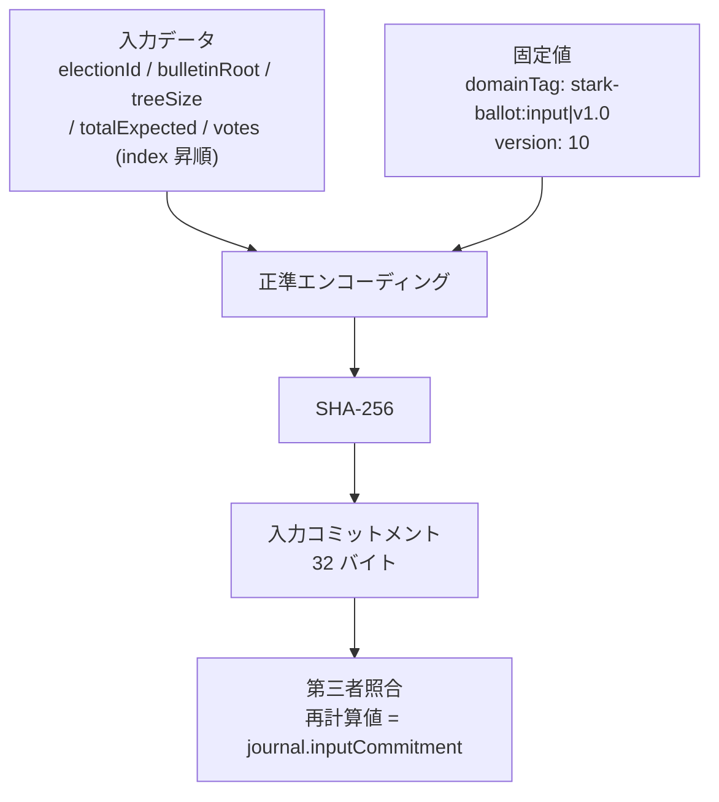
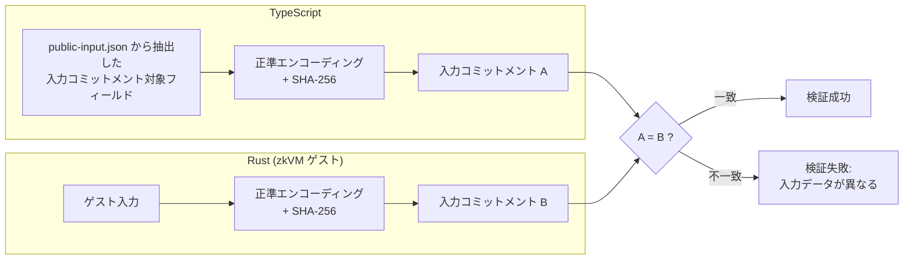

# 入力コミットメント

zkVM 入力のうち公開検証に使うフィールドを正準エンコーディングで束縛し、ジャーナルから再計算できる入力コミットメントを定義する章です。

入力コミットメントにより、「証明されたデータセット」と「主張されたデータセット」の一致を検証可能にします。バイトレベルの正準化により、TypeScript と Rust の間で決定的な一致を保証します。

## 概要

入力コミットメントは、公開可能な検証フィールドにドメインタグとバージョンを加えて正準連結し、SHA-256 で集約したハッシュ値です。対象フィールドの一覧と並び順は[バイトレイアウト](#バイトレイアウト)と[フィールド一覧](#フィールド一覧)を参照してください。

このハッシュ値は zkVM のジャーナル（公開出力）にコミットされるため、第三者はジャーナルに記録された入力コミットメントと、`public-input.json` などの公開可能な検証データから再計算した値を照合することで、zkVM が実際にどのデータセットを処理したかを独立に検証できます。



## 入力コミットメントが解決する問題

zkVM の STARK 証明は「ゲストプログラムが正しく実行された」ことを証明しますが、「どの入力に対して実行されたか」は証明のスコープ外です。入力コミットメントがなければ、悪意あるサーバーは以下の攻撃が可能になります:

1. 投票を除外した入力で zkVM を実行し、有効な STARK 証明を取得する
2. 公開用の入力データには除外されていない投票を含めて提示する
3. 第三者は STARK 証明が有効であることを確認できるが、実際に処理された入力は異なる

入力コミットメントをジャーナルに含めることで、第三者は「公開データから再計算した入力コミットメント」と「ジャーナルに記録された入力コミットメント」を照合し、不一致を検出できます。

## 正準エンコーディング

入力コミットメントの計算には、すべてのフィールドを決定的な順序・エンコーディングで連結する正準化が不可欠です。

### バイトレイアウト

```text
input_commitment = SHA-256(
    domain_tag       ← "stark-ballot:input|v1.0" (23 バイト, UTF-8)
    || version       ← u32 リトルエンディアン (4 バイト) = 10
    || election_id   ← UUID v4 バイナリ (16 バイト)
    || bulletin_root ← 32 バイト
    || tree_size     ← u32 リトルエンディアン (4 バイト)
    || total_expected← u32 リトルエンディアン (4 バイト)
    || votes_count   ← u32 リトルエンディアン (4 バイト)
    || [投票データ]  ← インデックス昇順でソートされた各投票
)
```

### 各投票のエンコーディング

投票配列の各要素は以下の形式でエンコードされます:

```text
vote_entry =
    index            ← u32 リトルエンディアン (4 バイト)
    || commitment_len← u16 リトルエンディアン (2 バイト) = 32 (固定)
    || commitment    ← 32 バイト
    || path_len      ← u16 リトルエンディアン (2 バイト)
    || path_nodes    ← path_len × 32 バイト
```

### フィールド一覧

| フィールド         | サイズ       | エンコーディング | 説明                         |
| ------------------ | ------------ | ---------------- | ---------------------------- |
| ドメインタグ       | 23 バイト    | UTF-8 固定文字列 | `"stark-ballot:input\|v1.0"` |
| バージョン         | 4 バイト     | u32 LE           | v1.0 = `10`                  |
| 選挙 ID            | 16 バイト    | UUID バイナリ    | 選挙スコープの識別子         |
| 掲示板ルート       | 32 バイト    | ハッシュ値       | 最終的な Merkle ルート       |
| ツリーサイズ       | 4 バイト     | u32 LE           | 掲示板のリーフ数             |
| 期待投票数         | 4 バイト     | u32 LE           | 想定される総投票数           |
| 投票数             | 4 バイト     | u32 LE           | 実際に含まれる投票数         |
| 各投票インデックス | 4 バイト     | u32 LE           | 掲示板上の位置               |
| コミットメント長   | 2 バイト     | u16 LE           | 固定値 32                    |
| コミットメント     | 32 バイト    | ハッシュ値       | 投票コミットメント           |
| パス長             | 2 バイト     | u16 LE           | Merkle パスのノード数        |
| パスノード         | 各 32 バイト | ハッシュ値       | 包含証明の兄弟ハッシュ       |

### `public-input.json` と公開監査アーティファクトとの関係

**要点**: `public-input.json` の全フィールドが入力コミットメントに束縛されるわけではありません。残りのフィールドは別チェックで補完的に検証されます。

`public-input.json` は、zkVM 検証に使う秘密データを含まない検証用レコードです。現行実装では `schema`、`version`、`contractGeneration`、`electionId`、`electionConfigHash`、`bulletinRoot`、`treeSize`、`totalExpected`、`logId`、`timestamp`、`methodVersion` と、各投票の `index`・コミットメント値・Merkle パスを含みます。

入力コミットメントが直接束縛するのは[フィールド一覧](#フィールド一覧)に示した対象のみで、`schema`、`version`、`contractGeneration`、`electionConfigHash`、`logId`、`timestamp`、`methodVersion` は対象外です。これら対象外のフィールドは proof bundle 内の `election-manifest.json` や `close-statement.json` を組み合わせて、次のように照合されます。

- `electionConfigHash` → `counted_election_manifest_consistent`（manifest と journal 等を照合）
- `logId`・`timestamp` → `counted_close_statement_consistent`（close statement と journal 等を照合）
- `schema`・`version`・`contractGeneration` → `public-input.json` の互換性マーカーとして artifact 採用時に検証
- `methodVersion` → `public-input.json` 採用時に journal と照合。Image ID 解決では正規化済み journal 値を使用

## 正準化規則

エンコーディングの決定性を保証するために、以下の規則が厳守されます。

### ソート規則

投票はエンコーディング前にインデックスの昇順にソートします。各投票の `index` は一意であることが前提であり、これにより同じ投票集合から常に同一のバイト列が生成されます。この規則に違反すると、TypeScript と Rust で異なるハッシュ値が計算され、検証が失敗します。

> **異常系の補助**: 重複インデックスはプロトコル違反です。TS/Rust 双方は決定性のために `commitment` / `merklePath` で tie-break しますが、正常系仕様は `index` 昇順のままです。

### エンディアン規則

すべての整数フィールドはリトルエンディアンでエンコードされます。

| 型  | バイト数 | エンコーディング   |
| --- | -------- | ------------------ |
| u16 | 2        | リトルエンディアン |
| u32 | 4        | リトルエンディアン |

### 16 進数正規化

コミットメント値やパスノードなどの 16 進数表現は、`0x` プレフィックスを除去した上でバイト列にデコードされます。16 進数文字列のまま連結するのではなく、常にバイナリ表現を使用します。

## TypeScript と Rust の同期

入力コミットメントは TypeScript（サーバー側）と Rust（zkVM ゲスト内）の双方で独立に計算され、結果が一致する必要があります。



同期が破壊される典型的な原因:

- ソート順序の不一致
- エンディアンの不一致
- ドメインタグの文字列差異
- バージョン番号の不一致
- 16 進数正規化規則の差異（大文字/小文字、`0x` プレフィックスの有無）

## 検証パイプラインにおける役割

入力コミットメントは、Counted-as-Recorded 段階での検証チェック `counted_input_commitment_match` として使用されます。

| チェック ID                      | 検証内容                                                                         |
| -------------------------------- | -------------------------------------------------------------------------------- |
| `counted_input_commitment_match` | 公開可能な検証データから再計算した入力コミットメントがジャーナルの値と一致するか |

このチェックが失敗すると、zkVM が処理した入力データと公開可能な検証データから再構成される対象フィールドが食い違うことを意味し、結果の信頼性が根本的に損なわれます。なお対象外フィールドは `counted_election_manifest_consistent` と `counted_close_statement_consistent` で補完的に検証されます（対応関係は[上記](#public-inputjson-と公開監査アーティファクトとの関係)を参照）。

各チェックの判定ロジックは [チェック一覧 > Counted-as-Recorded](../verification/checks-catalog.md#counted-as-recorded10-チェック) を参照してください。

## 注意事項

入力コミットメントには投票者の秘密データ（選択肢や乱数）は含まれません。したがって、入力コミットメントの公開は投票の秘密性を損ないません。

入力順序に依存しない正準エンコーディングは、[Property-based Testing](../quality/property-based-testing.md) の permutation invariance と、[Lean による形式化](../quality/lean-formalization.md) の input-commitment vectors で検査します。

<!-- source: src/lib/zkvm/types.ts:computeInputCommitmentFromPublicInput, src/lib/verification/public-input-contract.ts, zkvm/contract-core/src/encoding.rs, src/lib/verification/verification-checks.ts, src/lib/verification/engine/evaluate-checks.ts, src/lib/verification/verification-bundle.ts -->
