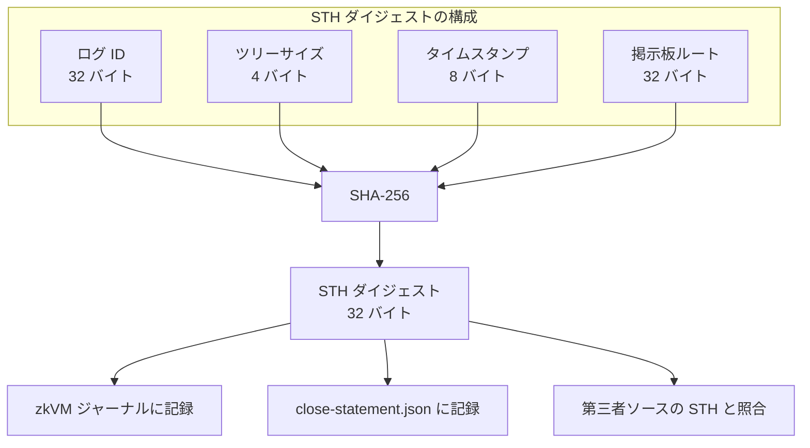
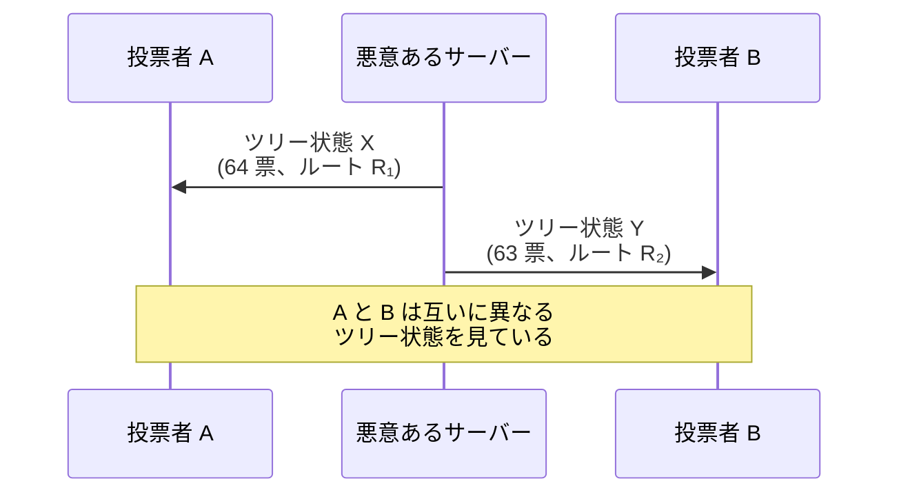
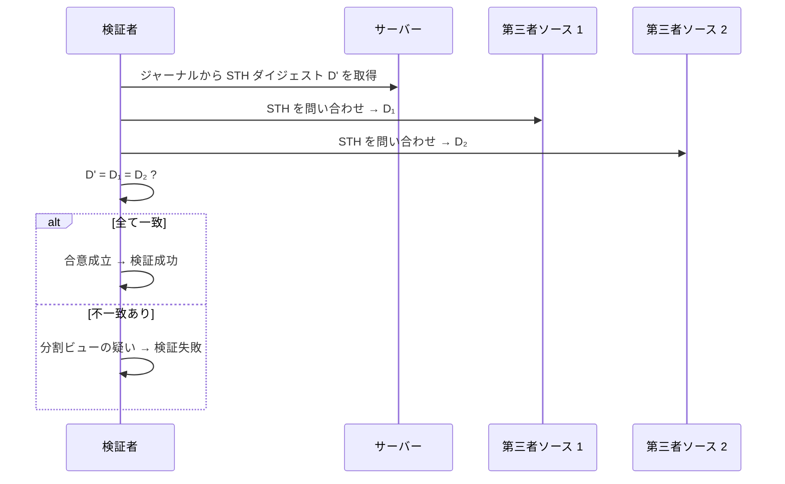

# STH ダイジェスト

Signed Tree Head ダイジェストを第三者と照合することで、分割ビュー攻撃をどう緩和するかを扱う章です。

ログ ID、ツリーサイズ、タイムスタンプ、掲示板ルートを束縛するダイジェストにより、サーバーが異なるクライアントに異なるツリー状態を提示する攻撃を検出可能にします。

## 概要

分割ビュー攻撃（split-view attack）とは、悪意あるサーバーが異なる検証者に対して異なる掲示板の状態を提示する攻撃です。例えば、投票者 A には「全 64 票が含まれたツリー」を見せながら、投票者 B には「特定の票が除外されたツリー」を見せることが考えられます。

STH ダイジェストは、掲示板の状態を（ログ ID、ツリーサイズ、タイムスタンプ、ルートハッシュ）の組として束縛し、独立した第三者ソースとの合意確認を通じてこの攻撃を検出します。



> **本実装での検証対象**: 本章で言う「STH ダイジェスト」は `sthDigest` 自体です。本実装は STH の署名検証は行いません（スコープの詳細は [合意ロジック](#合意ロジック) を参照）。

## ダイジェストフォーマット

```text
sth_digest = SHA-256(
    log_id        ← 32 バイト
    || tree_size  ← u32 リトルエンディアン (4 バイト)
    || timestamp  ← u64 リトルエンディアン (8 バイト, Unix 時刻ミリ秒)
    || bulletin_root ← 32 バイト
)
```

SHA-256 への入力は合計 76 バイトです。

### 各フィールドの仕様

| フィールド     | サイズ    | エンコーディング | 説明                       |
| -------------- | --------- | ---------------- | -------------------------- |
| ログ ID        | 32 バイト | ハッシュ値       | 掲示板インスタンスの識別子 |
| ツリーサイズ   | 4 バイト  | u32 LE           | 掲示板のリーフ数           |
| タイムスタンプ | 8 バイト  | u64 LE           | Unix 時刻（ミリ秒）        |
| 掲示板ルート   | 32 バイト | ハッシュ値       | Merkle ツリーのルート      |

## ログ ID

ログ ID は掲示板インスタンスを一意に識別するための値であり、以下のように生成されます:

```text
log_id = SHA-256("stark-ballot:bulletin-log|v1.0" || seed)
```

ドメインタグ `"stark-ballot:bulletin-log|v1.0"` と任意のシード値を連結し、SHA-256 でハッシュします。ログ ID は掲示板のライフタイム中に変化しない固定値です。

ログ ID を STH ダイジェストに含めることで、異なる掲示板インスタンスの STH が偶然に衝突することを防止します。

## 分割ビュー攻撃と検出メカニズム

### 攻撃シナリオ



この攻撃では、サーバーは投票者 B に対して特定の票を除外したツリーを見せています。投票者 B は自身に提示されたツリーに対する包含証明や整合性証明を検証できますが、投票者 A とは異なるツリーを見ていることに気づけません。

### 第三者合意による検出

検証者は、`NEXT_PUBLIC_STH_SOURCES` に設定された独立ソースへ問い合わせ、ジャーナル内の STH ダイジェストと照合することで分割ビューを検出できます。



### 合意ロジック

第三者 STH 検証は以下の条件をすべて満たした場合に成功します:

1. **十分な一致数**: 一致するソースの数が最小要求数（コードフォールバック値: 2）以上
2. **全会一致**: 応答可能なすべてのソースが一致すること（`matchingSources = comparableSources`）

各ソースに対して以下のフィールドが照合されます:

| 照合フィールド   | 条件                     |
| ---------------- | ------------------------ |
| STH ダイジェスト | 必須一致                 |
| 掲示板ルート     | 提供されている場合は一致 |
| ツリーサイズ     | 提供されている場合は一致 |

第三者ソースの応答は `sthDigest` を中心としたスナップショット情報として扱います。応答署名の検証、外部アンカリング、STH の自動公開は本実装のスコープ外です。

## zkVM との連携

zkVM ゲストプログラムは、入力として受け取ったログ ID、ツリーサイズ、タイムスタンプ、掲示板ルートから STH ダイジェストを再計算し、ジャーナルにコミットします。

finalize 時には、同じツリー状態から `close-statement.json` も構築され、`sthDigest` が配布対象アーカイブ `bundle.zip` に含まれる公開監査アーティファクトへ反映されます。

この仕組みにより、STARK 証明と `bundle.zip` 内の `close-statement.json` がともに特定のツリー状態へ束縛されます。第三者はジャーナルの STH ダイジェストを独立ソースの値と照合することで、サーバーが証明と異なるツリー状態を提示していないかを確認できます。

## 検証パイプラインにおける役割

STH ダイジェストは 2 つの段階で利用されます。

| 段階                | チェック ID                          | 検証内容                                                                         |
| ------------------- | ------------------------------------ | -------------------------------------------------------------------------------- |
| Recorded-as-Cast    | `recorded_sth_third_party`           | 独立ソースから取得した STH ダイジェストがジャーナルの値と一致するか              |
| Counted-as-Recorded | `counted_close_statement_consistent` | `close-statement.json` の `sthDigest` が公開入力およびジャーナルの値と整合するか |

`recorded_sth_third_party` は既定では任意チェック（optional）ですが、STH ソースが設定されている場合は必須扱いへ昇格します。昇格後は成功以外の状態にある限り「Verified」になりません（状態区分の扱いは [チェック一覧](../verification/checks-catalog.md) を参照）。

`counted_close_statement_consistent` は常に必須チェック（required）です。`close-statement.json` がジャーナルと整合しない場合、検証は失敗します。

各チェックの判定ロジックは [チェック一覧 > Recorded-as-Cast](../verification/checks-catalog.md#recorded-as-cast6-チェック) と [チェック一覧 > Counted-as-Recorded](../verification/checks-catalog.md#counted-as-recorded10-チェック) を参照してください。

## 設定

第三者 STH 検証は環境変数で制御されます。

| 環境変数                      | 説明                          | コードフォールバック値           |
| ----------------------------- | ----------------------------- | -------------------------------- |
| `NEXT_PUBLIC_STH_SOURCES`     | カンマ区切りの STH ソース URL | 未設定（第三者照合を実行しない） |
| `NEXT_PUBLIC_STH_MIN_MATCHES` | 必要な最小一致ソース数        | 2                                |

STH ソースが未設定の場合、`recorded_sth_third_party` は `not_run`（未実行）となり、第三者照合は行いません。

開発用の `.env.local.example` では次の値が設定されています:

- `NEXT_PUBLIC_STH_SOURCES=/api/sth`
- `NEXT_PUBLIC_STH_MIN_MATCHES=1`

### same-origin と /api/sth の取り扱い

**same-origin 解決と認証ヘッダ転送**: 相対パス（例: `/api/sth`）はリクエスト元のオリジンに対して解決されます。`/api/sth` は same-origin の session-scoped 開発用 API で、アクセスにはセッション capability が必要です。検証ロジックはセッション認証ヘッダーを same-origin ソースにのみ転送し、cross-origin ソースへは送りません。独立第三者ソースを absolute URL で構成する場合、それらはセッション認証に依存しない公開 STH エンドポイントである必要があります。

**`/api/sth` の timestamp**: `/api/sth` が返す `timestamp` はジャーナル内の canonical な時刻ではなく `session.lastActivity` です。そのため、第三者合意の一致判定で実際に照合するのは必須の `sthDigest` と、ソースが返した場合の `bulletinRoot` / `treeSize` です。

## PoC における制約

本 PoC の開発用テンプレート（`.env.local.example`）では、STH ソースとして同一サーバー上の API エンドポイント（`/api/sth`）を使用します。同一サーバー上のソースのみでは防御力が限定的であるため、独立した組織が運営する複数ソースを `NEXT_PUBLIC_STH_MIN_MATCHES >= 2` で構成することを推奨します。

<!-- source: src/lib/verification/sth-verifier.ts, src/server/api/handlers/sth.ts, src/lib/zkvm/types.ts:computeSTHDigest, src/lib/zkvm/log-id.ts, zkvm/methods/guest/src/sth.rs, src/lib/verification/public-audit-artifacts.ts, src/lib/verification/verification-bundle.ts, docker/entrypoint.sh, src/lib/verification/verification-checks.ts, src/lib/verification/engine/evaluate-checks.ts, src/lib/finalize/finalization-result.ts, .env.local.example -->
