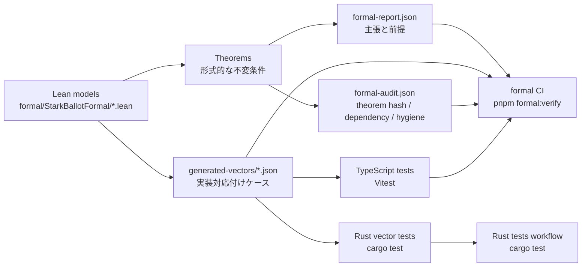

# Lean による形式化

本プロジェクトでは Lean 4 を使い、`Verified` 表示の fail-closed 条件、journal count の整合性、input commitment の canonical encoding、LSB-first bitmap packing、抽象 guest tally model の不変条件を形式化しています。

Lean は実装を直接証明するのではなく、抽象モデル上で不変条件を証明し、そこから生成した generated vectors / formal report / formal audit を TypeScript・Rust のテストと CI に接続することで、モデルと実装の対応付けを継続的に検査します。Lean が扱わない範囲は末尾の [証明していないこと](#証明していないこと) を参照してください。

## Lean で定義しているもの

| Lean module                | 主な定義                                                                                                  | 役割                                                   |
| -------------------------- | --------------------------------------------------------------------------------------------------------- | ------------------------------------------------------ |
| `Basic.lean`               | `CheckStatus`, `SummaryStatus`, `SummaryTone`, `CheckId`, `CheckCategory`, `CheckRole`, `Criticality`     | 検証チェックと summary model の基礎型                  |
| `JournalCounts.lean`       | `missingSlotsOf`, `invalidPresentedSlotsOf`, `excludedSlotsOf`                                            | zkVM journal の count 分解を `Nat` モデルで表す        |
| `VerificationSummary.lean` | `checkDefinitions`, `isRequiredCheck`, `canFullyVerify`, `deriveSummaryModel`                             | `/verify` の最終判定に関わる fail-closed model         |
| `InputCommitment.lean`     | `CommitmentVote`, `InputCommitmentCase`, canonical order, `u16LE`, `u32LE`, preimage encoding             | input commitment の byte layout と順序安定性をモデル化 |
| `Bitmap.lean`              | `packedByteCount`, `packedAddress`, `byteValueAt`, `packBits`                                             | LSB-first bitmap packing と bit address をモデル化     |
| `GuestModel.lean`          | `RejectReason`, `GuestVote`, `CandidateTally`, `GuestState`, `classifyVote`, `processVotes`, guest bounds | zkVM guest の抽象 tally / rejection state machine      |

`GuestModel.lean` は `zkvm/methods/guest/src/main.rs` を行単位で翻訳したものではありません。外部的に重要な処理順序、つまりインデックス範囲、重複 index、選択肢、コミットメント、重複 commitment、包含証明、集計反映の順序を抽象 state machine として表します。

## Lean で証明していること

| 領域                 | 代表 theorem                                                                                                                               | 主張                                                                                     |
| -------------------- | ------------------------------------------------------------------------------------------------------------------------------------------ | ---------------------------------------------------------------------------------------- |
| Journal count        | `excluded_zero_implies_no_slot_loss`, `slot_partition_total`                                                                               | `excludedSlots = 0` なら missing / invalid presented が 0 になり、slot loss がない       |
| Verification summary | `fully_verified_implies_all_required_success`, `fully_verified_implies_no_unknown_checks`, `fully_verified_implies_required_roles_success` | `fully_verified` は required check 成功、unknown check 不在、重要 role 成功を要求する    |
| Input commitment     | `canonical_vote_order_total`, `canonical_encoding_permutation_invariant`                                                                   | vote の入力順序に依存しない canonical encoding が定義されている                          |
| Bitmap               | `pack_bits_length`, `pack_bits_get_bit`                                                                                                    | LSB-first packing の byte 数と bit 取得がモデル通りになる                                |
| Guest model          | `accepted_votes_count_tally`, `valid_votes_count_accepted`, `processVotes_fold_invariant`                                                  | 抽象 guest fold が tally / validVotes / seen index の不変条件を保つ                      |
| Guest completeness   | `zero_exclusion_guest_model_complete`                                                                                                      | `excludedSlots = 0` が guest model 上で missing / invalid presented の不存在につながる   |
| Bounded counts       | `no_overflow_under_guest_bounds`                                                                                                           | 明示した guest bounds 内で seen / valid / rejected / tally bucket が Rust `u32` に収まる |

これらは抽象モデル上の主張です。実装との対応は、次の generated vectors とテストで検査します。

## 実装との接続

| generated vector                  | 消費先                           | 目的                                                                   |
| --------------------------------- | -------------------------------- | ---------------------------------------------------------------------- |
| `verification-summary-cases.json` | TypeScript summary tests         | Lean summary model と `deriveVerificationSummary` の対応               |
| `verification-display-cases.json` | verify page overall-status tests | UI が `verified` を誤表示しないことの drift guard                      |
| `check-definitions.json`          | TypeScript check-definition test | check ID / category / role / criticality / required 条件の drift guard |
| `input-commitment-cases.json`     | TypeScript / Rust tests          | canonical order と pre-hash bytes の対応                               |
| `bitmap-cases.json`               | TypeScript / Rust tests          | LSB-first packing と bitmap behavior の対応                            |
| `guest-model-cases.json`          | Rust guest tests                 | 抽象 guest model と Rust guest inspection surface の対応               |

`pnpm formal:verify` は Lean build、formal report / generated vectors / audit の freshness、TypeScript の vector-consuming tests、生成 JSON の format check をまとめて実行します。Rust 側の vector-consuming tests は `docs/current/formal/generated-vectors/**` の変更で起動する Rust tests workflow の `cargo test` によって検査します。

この接続により、Lean model が変わったのに実装テストが追従していない場合、または実装側の encoding / summary / guest behavior が model から外れた場合に、CI 上で drift を検出できます。

## 対応付けを支える成果物

Lean の成果物を public documentation と実装テストに接続するため、次を組み込んでいます。

- guest-model generated vectors
- check-definition drift vector
- theorem statement hash
- generated-vector hash
- `#print axioms` に基づく theorem dependency audit
- proof hygiene scan
- explicit guest bounds
- TypeScript / Rust 側の vector-consuming tests
- `pnpm formal:verify` による freshness gate

## 実行コマンド

| コマンド                    | 目的                                                                      |
| --------------------------- | ------------------------------------------------------------------------- |
| `pnpm formal:build`         | Lean workspace を build する                                              |
| `pnpm formal:report`        | `formal-report.json` を再生成する                                         |
| `pnpm formal:report:check`  | report が最新か確認する                                                   |
| `pnpm formal:vectors`       | Lean から generated vectors を再生成する                                  |
| `pnpm formal:vectors:check` | generated vectors が最新か確認する                                        |
| `pnpm formal:audit`         | theorem statement / dependency / proof hygiene audit を生成する           |
| `pnpm formal:audit:check`   | audit artifact が最新か確認する                                           |
| `pnpm formal:test:ts`       | Lean vector を消費する TypeScript tests を実行する                        |
| `pnpm formal:verify`        | build、report、vectors、audit、TS tests、format checks をまとめて検証する |

## 証明していないこと

Lean は次を証明しません。

- SHA-256 の衝突困難性
- RISC Zero receipt soundness
- Rust compiler / TypeScript runtime / browser runtime の完全な正しさ
- AWS runtime behavior
- React rendering 全体の正しさ
- 本番選挙システムとしての安全性
- zkVM guest Rust 実装全体の line-by-line verification

したがって、正確な主張は「投票システム全体を形式検証した」ではありません。正確には、選択した安全モデルを Lean で証明し、generated vectors と CI drift guard によって TypeScript / Rust 実装との対応を検査している、というものです。

<!-- source: formal/StarkBallotFormal/*.lean, formal/Scripts/EmitFormalReport.lean, formal/Scripts/EmitTestVectors.lean, formal/README.md, docs/current/formal/README.md, docs/current/formal/formal-report.json, docs/current/formal/formal-audit.json, docs/current/formal/generated-vectors/, package.json -->
