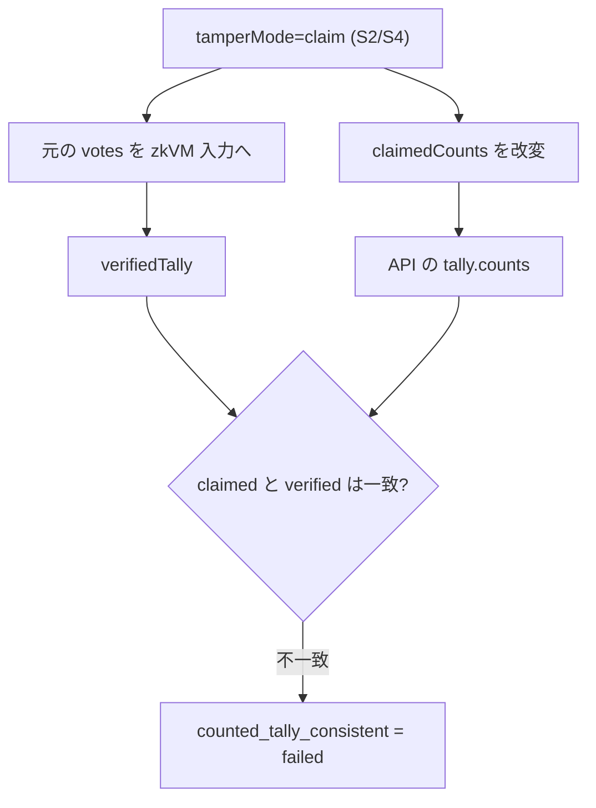
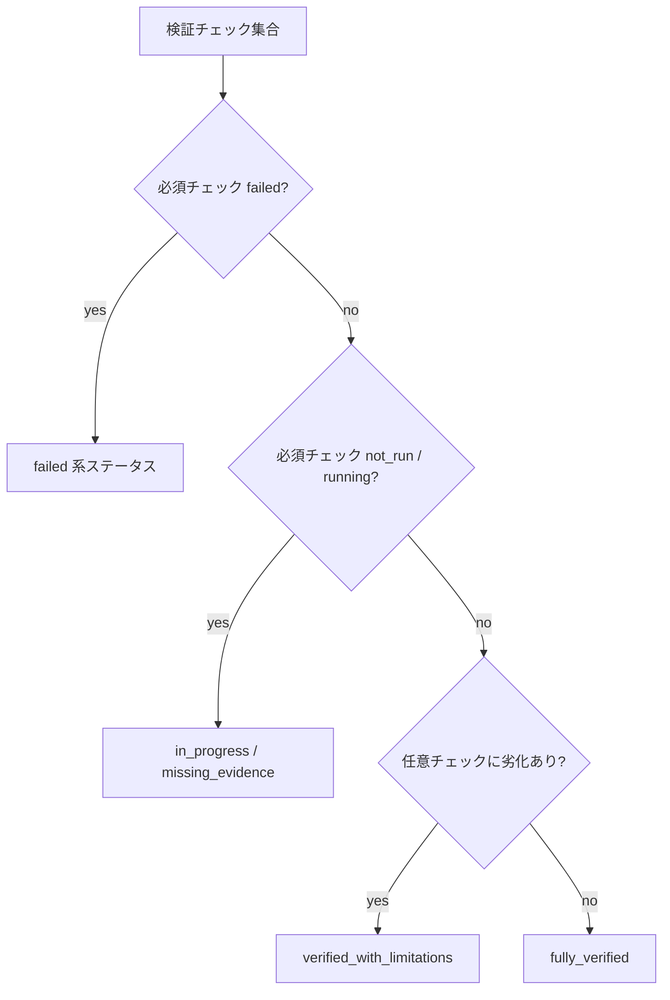

# 検出メカニズム

各改ざんシナリオに対して、検証パイプラインがどのチェックで失敗するかを整理します。本章は実 API の判定ロジックを基準にしており、STARK 検証が `success` になった後の挙動を前提とします。

## 前提

- `NEXT_PUBLIC_USE_MOCK_API=true` の mock API fixture は本章と異なるチェック結果を返すことがある。
- `USE_MOCK_ZKVM=true` の mock zkVM executor は CT inclusion proof を簡略化するため、S5 再集計分岐の journal 統計は real zkVM と異なることがある。以降、再集計分岐の挙動は real zkVM を前提に記述する。
- 現行 API は `castSource=client` のため、`cast_*` チェックはシナリオに関係なく `not_run`。

Counted 系チェックの zkGate について

`/api/verify` の Counted 系チェックには、STARK 前に評価できる項目と、STARK 状態でゲートされる項目が混在します。

- `counted_input_sanity` / `counted_unique_indices` / `counted_unique_commitments` は `publicInputArtifact` から導出した内部 `publicInputSummary` があれば STARK 未解決でも評価されます
- `counted_tally_consistent` / `counted_missing_indices_zero` / `counted_expected_vs_tree_size` / `counted_election_manifest_consistent` / `counted_close_statement_consistent` / `counted_my_vote_included` / `counted_input_commitment_match` は zkGate の対象です
- STARK 未解決（`not_run`/`running`）の間、zkGate 対象チェックは `not_run` または `pending` になります
- `verificationStatus=failed` では、zkGate 対象チェックも `failed` になり得ます

---

## 検出の 2 つの原理

- **原理1: 完全性違反** (`excludedSlots > 0`) → `counted_missing_indices_zero` が失敗（主に S1/S3/S5）
- **原理2: 主張集計の不整合** (claimed ≠ verified) → `counted_tally_consistent` が失敗（主に S2/S4）

---

## シナリオ別の主な失敗チェック（STARK 解決後）

| シナリオ | 主に失敗するチェック           | 説明                                                                         |
| -------- | ------------------------------ | ---------------------------------------------------------------------------- |
| S0       | なし                           | 正常系                                                                       |
| S1       | `counted_missing_indices_zero` | ユーザー票除外により `excludedSlots=1`                                       |
| S2       | `counted_tally_consistent`     | claimed tally と verified tally が不一致                                     |
| S3       | `counted_missing_indices_zero` | 現行実装では botId=1 のボット票除外により `excludedSlots=1`                  |
| S4       | `counted_tally_consistent`     | claimed tally と verified tally が不一致                                     |
| S5       | `counted_missing_indices_zero` | `excludedSlots>0` が発生し、除外・再集計どちらでも完全性違反として検出される |

補足:

- S1 では、ビットマップ証明が利用可能な場合 `counted_my_vote_included` も失敗し得ます
- S2/S4 では、`counted_input_commitment_match` は通常成功します（zkVM 入力を改変していないため）
- S5 の再集計分岐では `counted_tally_consistent` も失敗します（詳細は下記「S5 の実装依存ポイント」参照）

---

## 4 段階検証モデルとの対応（`/api/verify` 応答）

| 検証段階            | S0        | S1        | S2        | S3        | S4        | S5        |
| ------------------- | --------- | --------- | --------- | --------- | --------- | --------- |
| Cast-as-Intended    | `not_run` | `not_run` | `not_run` | `not_run` | `not_run` | `not_run` |
| Recorded-as-Cast    | ✅        | ✅        | ✅        | ✅        | ✅        | ✅        |
| Counted-as-Recorded | ✅        | ❌        | ❌        | ❌        | ❌        | ❌        |
| STARK Verification  | ✅        | ✅        | ✅        | ✅        | ✅        | ✅        |

この表は「シナリオ適用による典型挙動」を示します。`running` や追加の `not_run` は運用状態や証拠不足により別途発生します。
なお、ここでの `STARK Verification` は段階別の表示ステータスです。全体の `verificationStatus` は fail-closed ルールにより `failed` になることがあります。

---

## チェックID（主要項目）マトリクス（STARK 解決後）

| チェック ID                      | S0        | S1                  | S2        | S3        | S4        | S5        |
| -------------------------------- | --------- | ------------------- | --------- | --------- | --------- | --------- |
| `cast_commitment_match`          | `not_run` | `not_run`           | `not_run` | `not_run` | `not_run` | `not_run` |
| `counted_tally_consistent`       | ✅        | ✅                  | ❌        | ✅        | ❌        | 分岐依存  |
| `counted_missing_indices_zero`   | ✅        | ❌                  | ✅        | ❌        | ✅        | ❌        |
| `counted_my_vote_included`       | ✅        | ❌ または `not_run` | ✅        | ✅        | ✅        | 分岐依存  |
| `counted_input_commitment_match` | ✅        | ✅                  | ✅        | ✅        | ✅        | ✅        |

- S5 の `counted_my_vote_included` は、ランダム対象がユーザー票（除外または再集計）なら失敗し得ます。証拠不足時は `not_run` になります
- S5 の `counted_tally_consistent` は、除外パスでは成功、再集計パスでは失敗します（詳細は下記「S5 の実装依存ポイント」参照）
- いずれの分岐でも主な失敗は `counted_missing_indices_zero` です

---

## S2/S4 で何が起きるか

S2/S4 は「入力改ざん」ではなく「主張集計改ざん」です。

このため `counted_input_commitment_match` の失敗は通常発生しません（zkVM 入力は元票）。

---

## S5 の実装依存ポイント

S5 はランダムに除外または再集計を選びますが、実装上は常に `tamperMode=input` です。つまり claim tamper ではなく、改変後の `votes` が zkVM 入力に入ります。ジャーナル統計は sync / async どちらでも zkVM が返した値をそのまま使います（詳細は[シナリオ一覧 > ジャーナル統計の扱い](scenarios.md#ジャーナル統計の扱いsync--async-共通)を参照）。

- 除外分岐: `missingSlots=1` となり、`counted_missing_indices_zero` が失敗
- 再集計分岐: `invalidPresentedSlots=1` となり、`counted_missing_indices_zero` が失敗
- 再集計分岐では `counted_tally_consistent` も失敗します。`claimedCounts` は改変後の 64 票から算出されますが、zkVM は元の CT 掲示板 proof/root と新しい commitment が整合しない票を除外するため `verifiedTally` は 63 票ベースになります

---

## ビットマップ証明の役割

`counted_my_vote_included` は、チェック定義上 `required` のユーザー包含チェックです。

- S1（ユーザー票除外）では、証明が利用可能なら失敗して「自分の票が未集計」であることを直接示せる
- 証拠不足で `not_run` になる場合でも、最終判定は Verified になりません:
  - 完全性違反が同時にある場合 → `votes_excluded_unknown`
  - 完全性違反が無く required evidence が欠ける場合 → `missing_evidence`

---

## 最終判定（Verified 表示）

最終表示は `verification-summary` のルールで決定されます。

代表的な失敗ステータス:

- `user_vote_excluded` / `votes_excluded` / `votes_excluded_unknown`: 完全性違反（S1/S3/S5）
- `published_tally_mismatch`: claimed と verified の不一致（S2/S4）
- `counted_integrity_failed`: Counted 系必須チェック失敗の一般ケース

<!-- source: src/server/api/handlers/verify.ts, src/lib/verification/engine/evaluate-checks.ts, src/lib/verification/verification-checks.ts, src/lib/verification/verification-summary.ts, src/lib/finalize/usecases/finalize-session.ts, src/lib/finalize/usecases/finalize-sync.ts, src/lib/finalize/finalization-result.ts, amplify/functions/finalize-callback-runner/handler.ts, src/lib/mock-api/fetcher.ts -->
