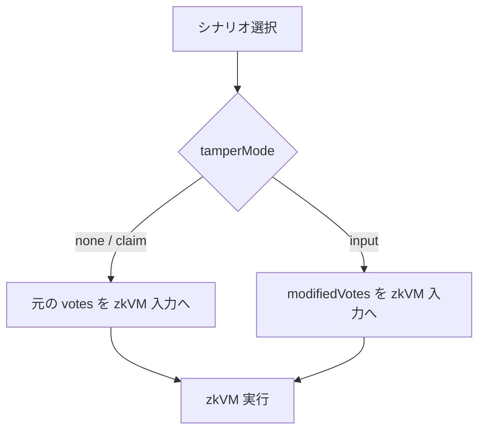
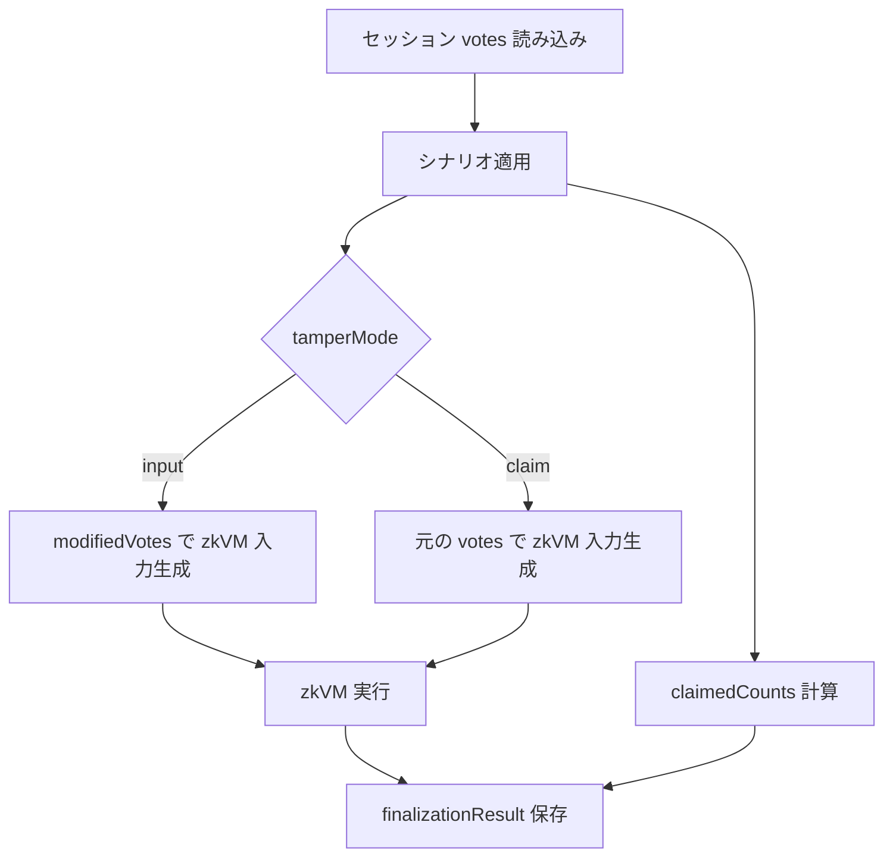

# シナリオ一覧

改ざんシナリオ S0〜S5 の定義と、実装上どこを改変するかを整理します。ここでは「zkVM 入力」「主張集計（claimed tally）」「ジャーナル統計（missing/invalid/excluded）」の関係を中心に説明します。

## 教育モードの目的

改ざんシナリオは、暗号的検証が実際に機能することを確認するために設計されています。

- 正常ケース（S0）を基準として、検証パイプラインが通過する状態を確認する
- 攻撃シナリオ（S1〜S5）を適用して、どの不変条件が破れると検証が失敗するかを確認する

## 攻撃の 2 類型

- **入力改ざん** (`tamperMode=input`): S1 / S3 / S5
- **主張改ざん** (`tamperMode=claim`): S2 / S4

この図は「改ざんがどこに入るか」の分類のみを示します。どのチェックで失敗するかの詳細は [検出メカニズム](detection-mechanism.md) を参照してください。

---

## 実装上の共通前提

- 1 回の finalize で選択されるシナリオは 1 つ（S0〜S5）
  - UI: `/aggregate` は single-select（S0〜S5 のラジオボタン）
  - API: `POST /api/finalize` は `scenarioId` を 1 つ受け取る
- `totalExpected` は 64（ユーザー 1 + ボット 63）
- 掲示板（CT Merkle）は追記専用で、シナリオ適用で既存エントリは削除しない
- `tamperMode` は `none` / `input` / `claim` の 3 種

注意事項:

- 本章は実 API 経路（`/api/finalize` → `finalize-session` → `finalize-sync|async`）を基準に説明する
- finalize 実行モードは `FINALIZE_ASYNC_MODE` で切り替わる（`false`: 同期, `true`: 非同期）。AWS 運用では通常 `true`
- mock mode の差分:
  - `NEXT_PUBLIC_USE_MOCK_API=true` の mock API fixture は本章と異なるチェック結果を返すことがある
  - `USE_MOCK_ZKVM=true` の mock zkVM executor は CT inclusion proof を簡略化するため、特に S5 再集計分岐の journal 統計は real zkVM と異なることがある
- 本章の「主な失敗点」は STARK 検証が `success` の局面を前提とする（zkGate の詳細は[検出メカニズム](detection-mechanism.md)を参照）

`tamperMode` により、zkVM 入力へ反映されるかどうかが決まります。

---

## S0: 正常（改ざんなし）

改ざんを適用しない基準シナリオです。

| 項目                | 値     |
| ------------------- | ------ |
| tamperMode          | `none` |
| zkVM 入力票数       | 64     |
| claimed と verified | 一致   |
| `excludedSlots`     | 0      |

---

## S1: ユーザー票の除外

ユーザー票（インデックス 0）を `modifiedVotes` から削除し、63 票を zkVM に渡します。

| 項目                | 値                                                             |
| ------------------- | -------------------------------------------------------------- |
| tamperMode          | `input`                                                        |
| zkVM 入力票数       | 63                                                             |
| claimed と verified | 一致（どちらも 63 票入力ベース）                               |
| ジャーナル統計      | `missingSlots=1`, `invalidPresentedSlots=0`, `excludedSlots=1` |

ポイント:

- 掲示板上のユーザー票エントリは残る
- 検出は主に完全性チェック（`excludedSlots > 0`）
- ビットマップ証明が利用可能なら `counted_my_vote_included` でも検出可能

---

## S2: ユーザー票に関する主張集計の改ざん

ユーザー票に対する「主張集計（表示する tally）」のみ改ざんします。zkVM には元の 64 票を渡します。

| 項目                | 値                                         |
| ------------------- | ------------------------------------------ |
| tamperMode          | `claim`                                    |
| zkVM 入力票数       | 64（元データ）                             |
| claimed と verified | 不一致（ユーザー選択肢が -1、別候補が +1） |
| `excludedSlots`     | 0（通常）                                  |
| `inputCommitment`   | zkVM 入力由来のため通常は一致              |

ポイント:

- 「票の中身を zkVM 入力で差し替える」実装ではない
- レシートや STARK 証明は通常どおり有効
- 検出の主因は `counted_tally_consistent` の失敗

---

## S3: ボット票の除外

現行実装ではボット票インデックス `1`（`targetBotId` 初期値）を削除し、63 票を zkVM に渡します。

| 項目                | 値                                                             |
| ------------------- | -------------------------------------------------------------- |
| tamperMode          | `input`                                                        |
| zkVM 入力票数       | 63                                                             |
| claimed と verified | 一致（どちらも 63 票入力ベース）                               |
| ジャーナル統計      | `missingSlots=1`, `invalidPresentedSlots=0`, `excludedSlots=1` |

S1 との違い:

- S1: ユーザー自身の未集計をビットマップで直接示せる
- S3: ユーザー票は含まれるが、集計全体の完全性違反で検出される

---

## S4: ボット票に関する主張集計の改ざん

1 票のボット票に関する「主張集計」だけを改ざんします。zkVM 入力は元の 64 票のままです。

| 項目                | 値                                             |
| ------------------- | ---------------------------------------------- |
| tamperMode          | `claim`                                        |
| zkVM 入力票数       | 64（元データ）                                 |
| claimed と verified | 不一致（対象ボットの元候補が -1、別候補が +1） |
| `excludedSlots`     | 0（通常）                                      |
| `inputCommitment`   | zkVM 入力由来のため通常は一致                  |

ポイント:

- S2 と同様に、改ざん対象は `tally.counts` 側
- 検出の主因は `counted_tally_consistent` の失敗

---

## S5: ランダムエラー注入

64 票からランダムに 1 票を選び、50% で「除外」または「再集計（別候補化）」を行います。

実装上の重要点:

- `tamperMode` は常に `input`
- そのため zkVM 入力は常に `modifiedVotes` が使われる
- 除外パスでは `missingSlots` が増え、real zkVM の再集計パスでは CT inclusion proof の不整合により `invalidPresentedSlots` が増えるため、いずれも `excludedSlots > 0` になる
- 再集計パスでは `counted_tally_consistent` も失敗する（`claimedCounts` は 64 票ベース、`verifiedTally` は inclusion proof 不整合の票を除外した 63 票ベース）

| 分岐       | zkVM 入力 | 代表的な統計                                                   |
| ---------- | --------- | -------------------------------------------------------------- |
| 除外パス   | 63 票     | `missingSlots=1`, `invalidPresentedSlots=0`, `excludedSlots=1` |
| 再集計パス | 64 票     | `missingSlots=0`, `invalidPresentedSlots=1`, `excludedSlots=1` |

---

## シナリオ一覧表

| シナリオ | 類型                     | tamperMode | zkVM 入力             | 主な失敗点（STARK 解決後）                                  |
| -------- | ------------------------ | ---------- | --------------------- | ----------------------------------------------------------- |
| S0       | 正常                     | `none`     | 元の 64 票            | なし                                                        |
| S1       | 除外                     | `input`    | 63 票（ユーザー除外） | `excludedSlots > 0`                                         |
| S2       | 主張改ざん               | `claim`    | 元の 64 票            | claimed ≠ verified                                          |
| S3       | 除外                     | `input`    | 63 票（ボット除外）   | `excludedSlots > 0`                                         |
| S4       | 主張改ざん               | `claim`    | 元の 64 票            | claimed ≠ verified                                          |
| S5       | ランダム（実装上 input） | `input`    | 63 または 64 票       | `excludedSlots > 0`（再集計では claimed ≠ verified も発生） |

---

## ジャーナル統計の扱い（sync / async 共通）

現行実装では、`missingSlots` / `invalidPresentedSlots` / `excludedSlots` / `validVotes` などのジャーナル統計は、sync / async いずれも **zkVM が返した proof-derived な値をそのまま使います**。

- sync / async いずれも、finalize 後にジャーナル統計を上書きしない
- async finalize はコールバックで `bundle.zip` から復元した `journal` をそのまま使う

シナリオ由来の `ignoredCount` / `recountedCount` / `claimedCounts` は presentation 用であり、`journal` の統計値を書き換えません。

- `ignoredCount` / `recountedCount` → `tamperSummary` や `tamperedCount` に反映
- `claimedCounts` → S2/S4 や S5 再集計分岐での表示用 tally

`tamperMode=claim`（S2/S4）でも同様に、journal 統計は zkVM の値のままです。

---

## 集計フローへの挿入点

<!-- source: src/lib/scenarios/processor.ts, src/lib/finalize/scenario-application.ts, src/lib/finalize/usecases/finalize-session.ts, src/lib/finalize/usecases/finalize-sync.ts, src/lib/finalize/finalization-result.ts, src/server/api/handlers/finalize.ts, amplify/functions/finalize-callback-runner/handler.ts, src/lib/mock-api/fetcher.ts, .env.local.example -->
