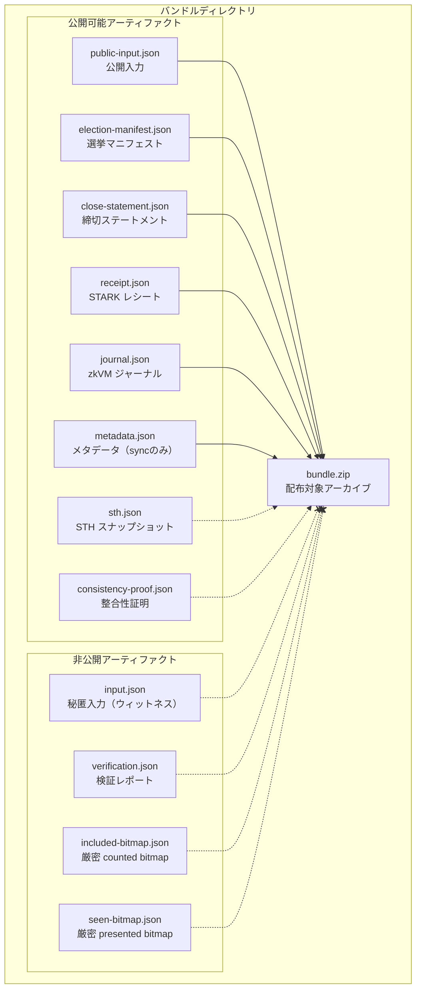

# バンドル構造

証明バンドルの内訳と公開許可リスト、同期・非同期それぞれのモードでの差分を扱う章です。

## 概要

[証明バンドル](../appendix/glossary.md#証明バンドルproof-bundle) は、zkVM の実行結果を検証可能な形で保存・配布するためのアーティファクト群です。実際に配布される [`bundle.zip`](../appendix/glossary.md#配布対象アーカイブbundlezip) は、厳格な許可リストによって公開可能アーティファクトだけを含める配布対象アーカイブです。

本書で `public` / 「公開可能」と記述する場合、秘密情報を含まず第三者検証に利用可能であるという機密性の分類を指します。無認証で誰でも取得できるという意味ではなく、アクセス経路は [バンドルのアクセス方法](#バンドルのアクセス方法) を参照してください。

`bundle.zip` 自体は監査用成果物であり、`/verify` 画面の最終判定を単体で完全再現することは目的としていません。UI 最終判定に必要な追加材料は [第三者検証ガイド](../reproducibility/index.md) を参照してください。



## 公開許可リスト

バンドルアーカイブ（`bundle.zip`）に含められるファイルは、許可リストによって厳格に制限されています。

### 公開可能なアーティファクト

| ファイル                 | 内容                                                               | 用途                                         |
| ------------------------ | ------------------------------------------------------------------ | -------------------------------------------- |
| `public-input.json`      | zkVM 検証に使う秘密データを含まない検証用レコード                  | 第三者が入力コミットメントを再計算するため   |
| `election-manifest.json` | 選挙設定の公開監査用スナップショット                               | 選挙設定と `electionConfigHash` の照合       |
| `close-statement.json`   | 集計締切時点のログ境界を表す公開監査レコード                       | `logId` / `treeSize` / `bulletinRoot` の照合 |
| `receipt.json`           | ホストが出力する `{ receipt, image_id }` ラッパー JSON             | 第三者がレシートを独立に検証するため         |
| `journal.json`           | zkVM ゲストの公開出力（集計結果、除外情報、ビットマップルート等）  | 集計結果と整合性データの確認                 |
| `metadata.json`          | バンドルの作成日時、セッション ID、メソッドバージョン（sync のみ） | バンドルの来歴追跡                           |
| `sth.json`               | 第三者 STH 検証のスナップショット（任意）                          | STH 合意の再現可能な証拠                     |
| `consistency-proof.json` | RFC 6962 整合性証明（任意）                                        | 追記専用性の独立検証                         |

`sth.json` と `consistency-proof.json` は許可リストに含まれますが、現行フローでは通常生成されません。

### 非公開アーティファクト

| ファイル               | 内容                                                               | 非公開の理由                                                             |
| ---------------------- | ------------------------------------------------------------------ | ------------------------------------------------------------------------ |
| `input.json`           | zkVM への完全な入力（選択肢・乱数・コミットメント・Merkle パス等） | 投票の秘匿入力（ウィットネス）を含む                                     |
| `verification.json`    | 検証サービスの詳細レポート                                         | `bundle.zip` の許可リスト外（必要時は専用エンドポイントで参照）          |
| `included-bitmap.json` | 厳密な counted bitmap artifact                                     | 個票 explainability 用の非公開アーティファクトであり `bundle.zip` 対象外 |
| `seen-bitmap.json`     | 厳密な presented bitmap artifact                                   | 個票 explainability 用の非公開アーティファクトであり `bundle.zip` 対象外 |

`input.json` が公開されると投票の秘匿性が失われます。`verification.json` は必要時のみ専用の capability 保護エンドポイント経由で扱います。`included-bitmap.json` と `seen-bitmap.json` は `/api/bitmap-proof` の trusted source ですが、配布対象アーカイブ `bundle.zip` には含めません。

---

## 公開入力の構造

`public-input.json` は、第三者検証に必要で、かつ選択肢と乱数を含まない入力側レコードです。`input.json` の単純なサブセットではありません。

| フィールド           | 説明                                                    |
| -------------------- | ------------------------------------------------------- |
| `schema`             | スキーマ識別子（`"stark-ballot.public_input"`）         |
| `version`            | スキーマバージョン（`"1.1"`）                           |
| `contractGeneration` | 現行契約世代を示す互換性マーカー                        |
| `electionId`         | 選挙 ID（UUID）                                         |
| `electionConfigHash` | 選挙設定のハッシュ                                      |
| `bulletinRoot`       | 掲示板の最終ルートハッシュ                              |
| `treeSize`           | 掲示板のツリーサイズ                                    |
| `totalExpected`      | 期待される投票数                                        |
| `logId`              | 掲示板ログ ID                                           |
| `timestamp`          | 集計時のタイムスタンプ                                  |
| `methodVersion`      | zkVM メソッドバージョン                                 |
| `votes`              | 各投票のインデックス、コミットメント、Merkle パスの配列 |

`votes` 配列には各投票のインデックスとコミットメント、Merkle パスが含まれますが、選択肢と乱数は含まれません。これにより、入力コミットメントの再計算が可能でありながら、投票内容の秘匿性は維持されます。

`public-input.json` と `inputCommitment` は同一ではなく、後者が直接束縛するのはこのレコードの一部です。計算対象フィールドと非対象フィールドの整理は [入力コミットメント](../protocol/input-commitment.md) を参照してください。

---

## 同期バンドルと非同期バンドルの違い

証明生成には 2 つのパスがあります。**同期モード** はローカルプロセス / Lambda 上で TypeScript がアーティファクトを生成し、検証サービスから戻った verification.json を含めて bundle.zip を作成します。**非同期モード** は ECS Fargate コンテナの `entrypoint.sh` が公開可能アーティファクトを生成し、bundle.zip を S3 に置いた後コールバック Lambda がセッションに結果を反映します。両モードとも、`public-input.json` / `election-manifest.json` / `close-statement.json` は `journal.json` と正準な proof-bound data との整合性検査を通過した場合にのみ bundle 化されます。不一致があれば [fail-closed](../appendix/glossary.md#fail-closed) で処理を中断します。

| 項目                     | 同期モード                                  | 非同期モード                                                                                                             |
| ------------------------ | ------------------------------------------- | ------------------------------------------------------------------------------------------------------------------------ |
| 実行環境                 | ローカルプロセス / Lambda                   | ECS Fargate コンテナ                                                                                                     |
| `input.json`             | 生成される（非公開保存）                    | ワーク入力として S3 に置かれる（配布対象外）                                                                             |
| `public-input.json`      | TypeScript で生成                           | entrypoint.sh 内で生成                                                                                                   |
| `election-manifest.json` | TypeScript で生成                           | entrypoint.sh 内で生成                                                                                                   |
| `close-statement.json`   | TypeScript で生成                           | entrypoint.sh 内で生成                                                                                                   |
| `journal.json`           | TypeScript で生成                           | `*-output.json` から `bundle.zip` 用に生成                                                                               |
| `receipt.json`           | ホストの `{ receipt, image_id }` 出力を保存 | `*-receipt.json` を `receipt.json` としてコピーして同梱                                                                  |
| `included-bitmap.json`   | 生成される場合は private に保持             | 生成される場合は隣接オブジェクト（sibling object）として保持                                                             |
| `seen-bitmap.json`       | 生成される場合は private に保持             | 生成される場合は隣接オブジェクトとして保持                                                                               |
| `metadata.json`          | 生成される                                  | 生成されない                                                                                                             |
| `verification.json`      | 検証サービス呼び出し後に保存                | finalize コールバック時点では生成されない。後続の `/api/verification/run` で report が保存された場合に限り参照可能       |
| `bundle.zip`             | 許可リストに基づき作成                      | `receipt.json` / `journal.json` / `public-input.json` / `election-manifest.json` / `close-statement.json` を同梱して作成 |
| 保存先                   | ローカルファイルシステム（+ 任意で S3）     | S3                                                                                                                       |
| presigned URL            | S3 アップロード時に生成                     | コールバック Lambda が生成                                                                                               |

### 非同期バンドルの生成フロー

非同期モードでは、ECS Fargate コンテナの `entrypoint.sh` が以下の手順でバンドルを構築します。

1. S3 から入力 JSON をダウンロード
2. ホストバイナリを実行し、レシートと出力を生成
3. 出力から `journal.json` を変換生成
4. 入力と出力から `public-input.json`、`election-manifest.json`、`close-statement.json` を構築
5. 整合性検査（本節冒頭参照）を通過したものだけを bundle に含める
6. `receipt.json`、`journal.json`、`public-input.json`、`election-manifest.json`、`close-statement.json` を `bundle.zip` にアーカイブ
7. `*-receipt.json` / `*-output.json` / `public-input.json` / `election-manifest.json` / `close-statement.json` / `included-bitmap.json` / `seen-bitmap.json` / `bundle.zip` などを S3 にアップロード

コールバック Lambda は S3 の `bundle.zip` からジャーナル、レシート、`public-input.json`、`election-manifest.json`、`close-statement.json` を復元します。利用可能な場合は隣接オブジェクトの bitmap artifact も取り込み、presigned URL の生成と監査用データの保存を行います。

`docker/entrypoint.sh` は methodVersion 14 のホスト出力を検証し、`journal.json` / `public-input.json` / `election-manifest.json` / `close-statement.json` の methodVersion と `inputCommitment` が一致することを確認してから `bundle.zip` を生成します。methodVersion が現行契約と一致しない出力は fail-closed で停止します。

---

## バンドルディレクトリ構造

### 同期モード（ローカルファイルシステム）

```text
{VERIFIER_WORK_DIR}/
  {sessionId}/
    {executionId}/
      input.json               ← 非公開: ウィットネス
      public-input.json        ← 公開可能
      election-manifest.json   ← 公開可能
      close-statement.json     ← 公開可能
      journal.json             ← 公開可能
      receipt.json             ← 公開可能
      metadata.json            ← 公開可能
      included-bitmap.json     ← 非公開: 厳密 counted bitmap artifact
      seen-bitmap.json         ← 非公開: 厳密 presented bitmap artifact
      verification.json        ← 非公開: 検証レポート
      bundle.zip               ← 配布対象: 許可リストファイルのアーカイブ
```

### 非同期モード（S3）

```text
s3://{BUCKET}/sessions/{sessionId}/{executionId}/
  input.json                 ← 非公開: ワーク入力
  {inputBase}-receipt.json   ← ホストの生出力
  {inputBase}-output.json    ← ホストの生出力
  {inputBase}-journal.json   ← ホストが生成した場合のみ
  public-input.json          ← 公開可能
  election-manifest.json     ← 公開可能
  close-statement.json       ← 公開可能
  included-bitmap.json       ← 非公開: 厳密 counted bitmap artifact
  seen-bitmap.json           ← 非公開: 厳密 presented bitmap artifact
  bundle.zip                 ← 配布対象: 内部は receipt.json / journal.json / public-input.json / election-manifest.json / close-statement.json
  verification.json          ← `/api/verification/run` 後に参照可能になる場合あり（非公開）
```

### 補足

- 非同期モードの S3 オブジェクト名は固定の `receipt.json` / `journal.json` になりません。`inputBase` がコンテナ実行時に生成される一時入力ファイル名に依存するためです。
- 非同期モードの `verification.json` は `bundle.zip` の構成要素ではなく、report エンドポイントから参照する別アーティファクトです。S3 上の report がこのセッションの配信対象として記録されていれば短命な presigned URL にリダイレクトされ、未記録ならローカル report を探し、いずれもなければ `404` を返します。

---

## バンドルのアクセス方法

### ダウンロードエンドポイント

| エンドポイント                                                 | 内容                        |
| -------------------------------------------------------------- | --------------------------- |
| `GET /api/verification/bundles/:sessionId/:executionId`        | `bundle.zip` のダウンロード |
| `GET /api/verification/bundles/:sessionId/:executionId/report` | `verification.json` の取得  |

両エンドポイントとも `X-Session-Capability` ヘッダーが必須です。つまり、ダウンロードは capability 保護 API から開始されます。

加えて、`executionId` はそのセッションで現在許可されている `verificationExecutionId` と一致しなければなりません。不一致や未設定の場合、API は `404` を返します。

S3 バンドルは capability 保護済みのダウンロードエンドポイント経由でのみ配布されます。エンドポイントは現在の `verificationExecutionId` と S3 key を確認したうえで、そのつど短命な presigned URL にリダイレクトします。

### アーカイブの再現性

同期モード（`verification-bundle.ts`）の `bundle.zip` は再現性を確保するため、以下の措置を講じています。

- エントリのタイムスタンプをゼロに固定
- 許可リストに一致するファイルのみを含める
- ファイル名のアルファベット順でエントリを追加

非同期モード（`docker/entrypoint.sh`）は `zip -r` で作成され、上記の再現性制御とは実装が異なります。

---

## セキュリティ上の制約

### パストラバーサル防止

バンドルのパスセグメント（セッション ID、実行 ID）は英数字とハイフンのみに制限されています。`..` を含むパスや許可されていない文字を含むパスは拒否されます。

### 非公開ファイルの保護

`input.json`、`verification.json`、`included-bitmap.json`、`seen-bitmap.json` は `bundle.zip` には含まれません。

<!-- source: src/lib/verification/verification-bundle.ts, docker/entrypoint.sh, amplify/functions/finalize-callback-runner/handler.ts, src/lib/aws/bundle-restore.ts, amplify/functions/verifier-service-runner/handler.ts, src/server/api/routes/registry.ts, src/server/api/handlers/verificationBundles.ts -->
