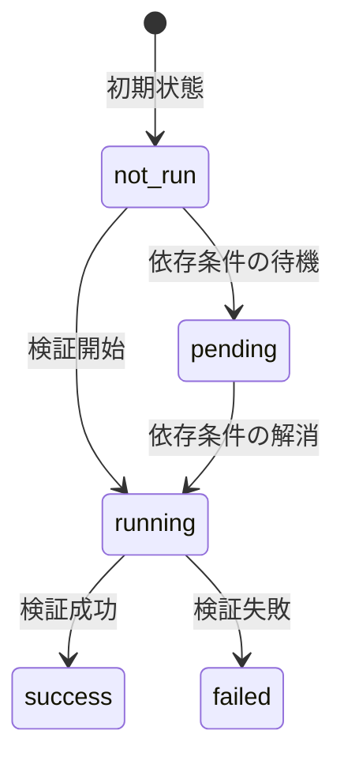

# チェック一覧

全検証チェック ID の定義、判定ロジック、失敗時の影響を一覧で解説します。

各チェックは一意の ID を持ち、`success` / `failed` / `not_run` / `running` / `pending` のステータスで管理されます。`required` チェックが `not_run` / `running` / `pending` のまま残っている場合、「Verified」は表示されません。`optional` チェックの取り扱いは [ゲーティングロジック](gating-logic.md#最終判定の種類) を参照してください。

## チェックの属性

各チェックには以下の属性が定義されています。

| 属性     | 説明                                                  |
| -------- | ----------------------------------------------------- |
| ID       | チェックの一意な識別子（スネークケース）              |
| カテゴリ | 所属する検証段階                                      |
| 証拠種別 | チェックに使用するデータの出所                        |
| 重要度   | `required`（必須）または `optional`（任意）           |
| 派生元   | 他のチェックから結果を導出する場合のソースチェック ID |

### 証拠種別

現行 22 チェックで使う証拠種別です。

| 種別     | 説明                                                                                  |
| -------- | ------------------------------------------------------------------------------------- |
| `local`  | 投票者の端末に保持されたユーザー固有データ（`localStorage` の投票意図など）           |
| `public` | 掲示板や capability 保護 API から取得する、秘密データを含まない検証用データ           |
| `zk`     | zkVM が束縛した公開証拠（ジャーナル、receipt 検証結果、bitmap root に基づく証明など） |

### 重要度

| 重要度     | 説明                                                                                         |
| ---------- | -------------------------------------------------------------------------------------------- |
| `required` | 「Verified」表示に必須。失敗すれば即座にブロック                                             |
| `optional` | 補助的な検証。通常は単独で失敗扱いにしないが、実行時条件により blocking に昇格する場合がある |

代表例は [`recorded_sth_third_party`](#recorded_sth_third_party) です。

注意: `verificationChecks` と UI 表示用の `verificationSteps` は 1 対 1 ではありません。対応関係は [ゲーティングロジック](gating-logic.md#ステップとチェックの対応関係) を参照してください。

---

## Cast-as-Intended（4 チェック）

投票者の意図通りにコミットメントが生成されたかを検証するチェック群です。
このカテゴリはクライアントが `voteReceipt`（`/api/verify` 応答）とローカル投票意図（`electionId`/`myVote`/`myRand`）を使って評価します。

| ID                      | 説明                                                         | 証拠種別 | 重要度     |
| ----------------------- | ------------------------------------------------------------ | -------- | ---------- |
| `cast_receipt_present`  | 投票レシートが存在し、voteId とコミットメントを含む          | `local`  | `required` |
| `cast_choice_range`     | 選択肢が有効範囲内（A〜E）                                   | `local`  | `required` |
| `cast_random_format`    | 乱数が 32 バイトの 16 進数文字列                             | `local`  | `required` |
| `cast_commitment_match` | 投票時データから再計算したコミットメントが投票レシートと一致 | `local`  | `required` |

### 判定ロジックの詳細

#### `cast_receipt_present`

`voteReceipt` が存在し、`voteId` と `commitment` フィールドが存在することを確認します（このチェック単体では UUID/hex 形式までは検証しません）。

#### `cast_choice_range`

投票時データの選択肢が `A`〜`E` のいずれかであることを確認します。範囲外の値は不正な入力として `failed` となります。

#### `cast_random_format`

投票時データの乱数が 32 バイト（64 文字）の 16 進数文字列であることを確認します。`0x` プレフィックスの有無は正規化により吸収されます。

#### `cast_commitment_match`

投票時データから再計算した投票コミットメントが投票レシートの `commitment` 値と一致することを確認します。再計算規則（ドメインタグ・正準フォーマット）は [コミットメントスキーム](../protocol/commitment.md) を参照してください。

---

## Recorded-as-Cast（6 チェック）

コミットメントが掲示板に正しく記録されたかを検証するチェック群です。

| ID                                 | 説明                                                   | 証拠種別 | 重要度     |
| ---------------------------------- | ------------------------------------------------------ | -------- | ---------- |
| `recorded_commitment_in_bulletin`  | コミットメントが掲示板ツリーに存在する                 | `public` | `optional` |
| `recorded_index_in_range`          | 掲示板インデックスが 0 以上かつツリーサイズ未満        | `public` | `required` |
| `recorded_root_at_cast_consistent` | 投票時のルートが最終ツリーの正当なプレフィックスである | `public` | `optional` |
| `recorded_inclusion_proof`         | RFC 6962 包含証明が暗号学的に検証成功                  | `public` | `required` |
| `recorded_consistency_proof`       | RFC 6962 整合性証明が暗号学的に検証成功                | `public` | `required` |
| `recorded_sth_third_party`         | 第三者 STH ソース間で合意が成立（比較可能応答間）      | `public` | `optional` |

### 判定ロジックの詳細

`recorded_inclusion_proof` と `recorded_consistency_proof` は [cast-time 証跡](../appendix/glossary.md#cast-time-証跡cast-time-ct-artifact)（`voteReceipt` と `userVote.proof`）の存在を前提とし、まず cast snapshot の一貫性（`leafIndex`、`treeSize`、`bulletinRootAtCast` が receipt と矛盾しないこと）を確認してから個別の検証に進みます。証跡が揃わない場合はどちらも `not_run` となり、全体判定は [fail-closed](../appendix/glossary.md#fail-closed) で `missing_evidence` 側へ倒れます。

#### `recorded_commitment_in_bulletin`

包含証明（`recorded_inclusion_proof`）の結果から派生します。包含証明が成功すれば、コミットメントがツリーに存在することが暗号学的に証明されています。

#### `recorded_index_in_range`

掲示板インデックスが `0 <= index < treeSize` の範囲内であることを確認します。範囲外のインデックスは、データの不整合を示します。

#### `recorded_root_at_cast_consistent`

整合性証明（`recorded_consistency_proof`）の結果から派生します。整合性証明が成功すれば、投票時のルートが最終ツリーの有効な追記専用プレフィックスであることが証明されています。

#### `recorded_inclusion_proof`

投票者のコミットメントに対する RFC 6962 包含証明（監査パス）を検証します。リーフハッシュと監査パスから cast 時点のルートを再計算し、receipt の `bulletinRootAtCast` と一致することを確認します。proof の `treeSize` が `voteReceipt.bulletinIndex + 1` と一致しない場合は `failed` です。

#### `recorded_consistency_proof`

投票時のツリー（oldSize, oldRoot）から最終ツリー（newSize, newRoot）への RFC 6962 整合性証明を検証します。bulletin provider から取得した old/new 両時点の root が期待値と一致することを確認し、投票時ルートが最終ツリーの追記専用プレフィックスであることを保証します。`treeSize` チェックは包含証明と同条件です。

#### `recorded_sth_third_party`

設定された STH ソースからスナップショットを取得し、比較可能な応答同士で合意を確認します。判定は `matchingSources >= minMatches`（デフォルト: 2）に加えて、比較対象になった応答間の全会一致（consensus）が必要です。照合対象は STH ダイジェストが必須で、`bulletinRoot` / `treeSize` は各ソースが返した場合に追加で照合されます。STH ソースが未設定の場合は `not_run` になります。

早見表では `optional` ですが、STH ソース設定時は required 相当に昇格します。詳細は [ゲーティングロジック](gating-logic.md#ステップとチェックの対応関係) を参照してください。

---

## Counted-as-Recorded（10 チェック）

記録された全投票が正しく集計に含まれたかを検証するチェック群です。

| ID                                     | 説明                                                                          | 証拠種別 | 重要度     |
| -------------------------------------- | ----------------------------------------------------------------------------- | -------- | ---------- |
| `counted_input_sanity`                 | 公開入力サマリーが有効                                                        | `public` | `required` |
| `counted_unique_indices`               | 入力中の全インデックスが一意                                                  | `public` | `required` |
| `counted_unique_commitments`           | 入力中の全コミットメントが一意                                                | `public` | `required` |
| `counted_tally_consistent`             | claimed tally と zkVM の検証済み集計が一致（fallback: 合計整合）              | `zk`     | `required` |
| `counted_missing_indices_zero`         | 解決済み fail-closed exclusion count（`excludedSlots` 優先）が 0              | `zk`     | `required` |
| `counted_expected_vs_tree_size`        | `totalExpected` がツリーサイズと一致                                          | `zk`     | `required` |
| `counted_election_manifest_consistent` | `election-manifest.json` が自己整合し、選挙 ID / electionConfigHash と一致    | `public` | `required` |
| `counted_close_statement_consistent`   | `close-statement.json` が自己整合し、log/tree/timestamp/root/sthDigest と一致 | `public` | `required` |
| `counted_my_vote_included`             | bitmap 証明により自分のインデックスが counted 側に含まれたことを確認          | `zk`     | `required` |
| `counted_input_commitment_match`       | 公開入力から計算した入力コミットメントがジャーナルの値と一致                  | `public` | `required` |

### 判定ロジックの詳細

#### `counted_input_sanity`

`public-input.json` 相当から組み立てた公開入力サマリーが存在し、スキーマ検証に成功していることを確認します。加えて、`treeSize` が正の整数、`votesCount <= treeSize`、`bulletinRoot` が 32 バイト hex かつゼロ値でないことを要求します。

#### `counted_unique_indices`

zkVM に渡された全投票のインデックスが重複なく一意であることを確認します。重複インデックスは、同一投票の二重カウントを示す可能性があります。

#### `counted_unique_commitments`

zkVM に渡された全投票のコミットメントが重複なく一意であることを確認します。重複コミットメントは、同一コミットメントに対する複数投票を示す可能性があります。

#### `counted_tally_consistent`

主経路では、公開される claimed tally（`tally.counts`）が zkVM の `verifiedTally` と選択肢ごとに一致し、かつ `verifiedTally` の合計が `tally.totalVotes` と一致することを確認します。これにより「公開表示された集計値」と「zkVM が証明した集計値」の不一致を検出します。claimed tally が利用できない場合は、フォールバックとして `journal.verifiedTally` の合計と `journal.validVotes` の一致を検証します。

#### `counted_missing_indices_zero`

fail-closed（安全側に倒す）な除外数が 0 であることを確認します。除外数は次の優先順で解決し、0 でなければ即座に `failed` とします。

1. `journal` がある場合: `journal.excludedSlots` を proof-bound な除外数として使用。`excludedSlots` / `missingSlots` / `invalidPresentedSlots` / `validVotes` が非負整数であることも先に確認する
2. `journal` がない場合: `excludedSlots` → `missingSlots + invalidPresentedSlots` の順で探索

`rejectedRecords` は説明用の補助値で、この判定には使いません。旧フィールド (`excludedCount` / `missingIndices` / `invalidIndices`) は fail-closed 補正経路でのみ参照され、本判定では使用しません。

#### `counted_expected_vs_tree_size`

`totalExpected`（期待される投票数）が掲示板のツリーサイズと一致することを確認します。不一致は、暗黙の投票除外を示す可能性があります。

#### `counted_election_manifest_consistent`

`election-manifest.json` の `electionConfigHash` を再計算し、manifest 自身の宣言値と一致することを確認します。そのうえで `electionId` と `electionConfigHash` を、セッション値・`publicInputArtifact` から導出した内部 `publicInputSummary`・ジャーナルに含まれる対応値と相互照合します。

#### `counted_close_statement_consistent`

`close-statement.json` から `sthDigest` を再計算し、宣言された snapshot と一致することを確認します。そのうえで `timestamp` が `publicInputArtifact` から導出した内部 `publicInputSummary.timestamp` と一致し、`logId` / `treeSize` / `bulletinRoot` / `sthDigest` が検証入力やジャーナルと矛盾しないことを確認します。

#### `counted_my_vote_included`

`includedBitmapRoot` に対する bitmap Merkle 証明を検証し、投票者のインデックスに対応するビットが 1（counted に含まれた）であることを確認します。

`seenBitmapRoot` もある場合は `/api/bitmap-proof?kind=included|seen` の両方を使い、`presented but invalid` / `not presented to the prover` / `unknown excluded` を説明可能にします。

証明材料が取得できない場合は `not_run` になり、補助 note が付くことがあります。

#### `counted_input_commitment_match`

公開入力から再構成した入力コミットメントが、zkVM ジャーナルの値と一致することを確認します。対象フィールドの集合と正準エンコーディングは [入力コミットメント](../protocol/input-commitment.md) を参照してください（`public-input.json` 全体の単純なハッシュではない点に注意）。

---

## STARK Verification（2 チェック）

STARK 証明の暗号学的正当性を検証するチェック群です。

| ID                     | 説明                                                                   | 証拠種別 | 重要度     |
| ---------------------- | ---------------------------------------------------------------------- | -------- | ---------- |
| `stark_image_id_match` | verifier-confirmed な Image ID と expected / host-side metadata が整合 | `zk`     | `required` |
| `stark_receipt_verify` | STARK レシートが暗号学的に検証成功                                     | `zk`     | `required` |

### 判定ロジックの詳細

#### `stark_image_id_match`

STARK status が `success` に解決された後で、期待 Image ID・verifier-confirmed Image ID・ホスト主張値が相互に矛盾しないことを確認します。整合条件（report に Image ID フィールドが揃わない場合の挙動を含む）と fail-closed の取り扱いは [Image ID](../zkvm/image-id.md) を参照してください。

期待 Image ID の解決順:

| 優先順 | ソース                                           |
| ------ | ------------------------------------------------ |
| 1      | `EXPECTED_IMAGE_ID` 環境変数                     |
| 2      | `public/imageId-mapping.json` の current mapping |

variant は `EXPECTED_IMAGE_ID_VARIANT`（`default` または `x86_64`）で明示指定します（未指定時は `default`）。

#### `stark_receipt_verify`

サーバー側の Rust 検証サービスが `Receipt::verify(image_id)` を実行し、Seal（STARK 証明）が暗号学的に正当であることを確認します。チェック結果は `success` / `failed` / `not_run` / `running` で表現され、`dev_mode` は [ゲーティングロジック](gating-logic.md#stark-検証のゲーティング) に従って正規化されます。

---

## チェックステータスの遷移

| ステータス | 説明                                 | `required` の場合の影響 |
| ---------- | ------------------------------------ | ----------------------- |
| `not_run`  | 関連データが未取得、または検証未開始 | ブロック                |
| `pending`  | 依存する検証の完了を待機中           | ブロック                |
| `running`  | 検証を実行中                         | ブロック                |
| `success`  | 検証成功                             | 通過                    |
| `failed`   | 検証失敗                             | ブロック                |

全体判定（集約結果）の決まり方は [ゲーティングロジック](gating-logic.md#ステータスの判定順序) を参照してください。

---

## 全チェック早見表

| #   | チェック ID                            | カテゴリ | 証拠     | 重要度   | 派生元                       |
| --- | -------------------------------------- | -------- | -------- | -------- | ---------------------------- |
| 1   | `cast_receipt_present`                 | Cast     | `local`  | required | —                            |
| 2   | `cast_choice_range`                    | Cast     | `local`  | required | —                            |
| 3   | `cast_random_format`                   | Cast     | `local`  | required | —                            |
| 4   | `cast_commitment_match`                | Cast     | `local`  | required | —                            |
| 5   | `recorded_commitment_in_bulletin`      | Recorded | `public` | optional | `recorded_inclusion_proof`   |
| 6   | `recorded_index_in_range`              | Recorded | `public` | required | —                            |
| 7   | `recorded_root_at_cast_consistent`     | Recorded | `public` | optional | `recorded_consistency_proof` |
| 8   | `recorded_inclusion_proof`             | Recorded | `public` | required | —                            |
| 9   | `recorded_consistency_proof`           | Recorded | `public` | required | —                            |
| 10  | `recorded_sth_third_party`             | Recorded | `public` | optional | —                            |
| 11  | `counted_input_sanity`                 | Counted  | `public` | required | —                            |
| 12  | `counted_unique_indices`               | Counted  | `public` | required | —                            |
| 13  | `counted_unique_commitments`           | Counted  | `public` | required | —                            |
| 14  | `counted_tally_consistent`             | Counted  | `zk`     | required | —                            |
| 15  | `counted_missing_indices_zero`         | Counted  | `zk`     | required | —                            |
| 16  | `counted_expected_vs_tree_size`        | Counted  | `zk`     | required | —                            |
| 17  | `counted_election_manifest_consistent` | Counted  | `public` | required | —                            |
| 18  | `counted_close_statement_consistent`   | Counted  | `public` | required | —                            |
| 19  | `counted_my_vote_included`             | Counted  | `zk`     | required | —                            |
| 20  | `counted_input_commitment_match`       | Counted  | `public` | required | —                            |
| 21  | `stark_image_id_match`                 | STARK    | `zk`     | required | —                            |
| 22  | `stark_receipt_verify`                 | STARK    | `zk`     | required | —                            |

<!-- source: src/lib/verification/verification-checks.ts, src/lib/verification/build-verification-checks.ts, src/lib/verification/engine/evaluate-checks.ts, src/lib/verification/verification-summary.ts -->
