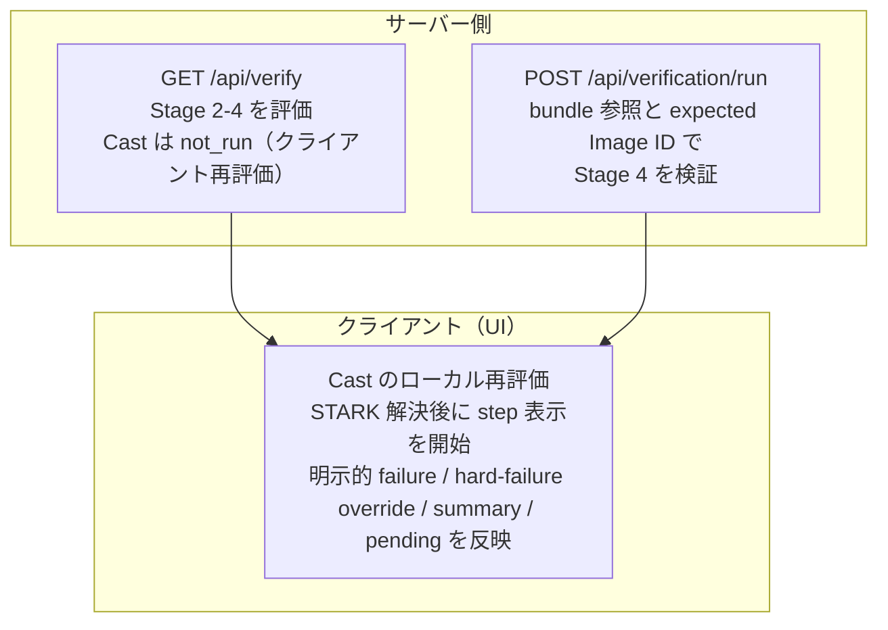
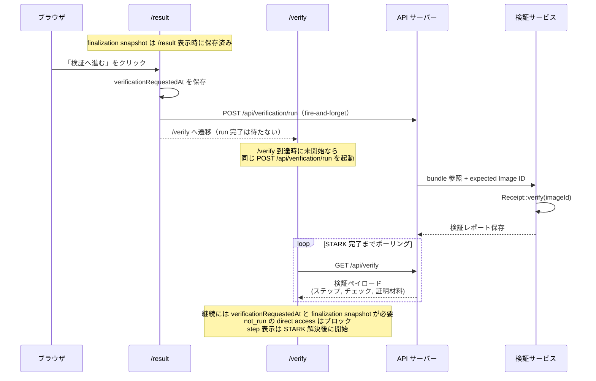

# 設計と実行フロー

検証パイプラインの設計原則と、リクエストから判定までの実行フローを扱う章です。

## 設計原則

本システムの検証パイプラインは、以下の 3 つの原則に基づいて設計されています。

### 原則 1: 必要な検証が未実行なら Verified を表示しない

required チェックが `not_run`（未実行）、`pending`（依存待ち）、`running`（実行中）のいずれかにある場合、システムは「Verified」を表示しません。証拠の不在や未解決状態を成功として扱わないという姿勢です。

### 原則 2: 失敗した検証は即座にブロックする

いずれかの必須チェックが失敗すれば、「Verified」表示は即座にブロックされます。代表的な失敗条件:

- `excludedSlots > 0`（除外されたスロットが存在する）
- 整合性証明の失敗
- 公開監査アーティファクトとの不一致
- 第三者 STH 合意の不成立（設定時）

### 原則 3: チェック評価はサーバー中心、集約はサーバーとクライアントの双方で実施

- `GET /api/verify` は 22 チェックのレスポンスを組み立てます。サーバーは Stage 2-4 の 18 チェックを評価し、Cast-as-Intended の 4 チェックは `not_run` で返したうえで、クライアントがローカル再評価で上書きします。
- Recorded-as-Cast は [cast-time 証跡](../appendix/glossary.md#cast-time-証跡cast-time-ct-artifact)（`voteReceipt` と `userVote.proof`）を前提とします。store から再構成できない場合でも `/api/verify` は `200` を返し、関連チェックを `not_run` にして全体判定を `missing_evidence` 側へ fail-closed に倒します。
- STARK 検証は専用サービス（`POST /api/verification/run`）で実行され、`GET /api/verify` がその結果を読み取ります。
- `deriveVerificationSummary` はサーバー側の `/api/verify` とクライアント側の `/verify` の両方で使われます。
- サーバーは `verificationStatus` を [fail-closed](../appendix/glossary.md#fail-closed) に補正します。unsupported な verifier status でも `verificationSteps` / `verificationChecks` を含む `200` 応答を返します。
- クライアントの最終判定は、明示的な STARK/server failure、hard-failure チェックの override、summary tone、pending state を優先順に解決します。UI 側の補助分岐については [ゲーティングロジック](gating-logic.md#最終判定の種類) を参照してください。

必要なデータ（`userVote.proof.treeSize`、`journal` など）が不在のときの `not_run` 補正など、ステップ status のガード条件の詳細は [ゲーティングロジック](gating-logic.md#ステップとチェックの対応関係) を参照してください。

## 検証パイプラインの全体構造

### 1. 段階の依存関係

1. **Stage 1** — Cast-as-Intended
2. **Stage 2** — Recorded-as-Cast
3. **Stage 3** — Counted-as-Recorded
4. **Stage 4** — STARK Verification
5. 結果表示

### 2. 実行責務（どこで評価・検証されるか）

## 検証の実行フロー

検証導線では通常 `/result` から `/verify` へ進みます。

1. `/result` は正準な finalization snapshot をクライアント状態に保存します。「検証へ進む」を押すと `verificationRequestedAt` を保存し、必要なら `POST /api/verification/run` を非同期に先行起動します（完了を待たずに `/verify` へ遷移します）
2. `/verify` はその継続状態がある場合に検証シーケンスを続行します。STARK が未開始ならシーケンス内で起動できます
3. 継続状態がなく STARK が `not_run` のまま直接 `/verify` へアクセスした場合は、自動続行せずブロックします
4. `/verify` の UI シーケンスは、step を順に見せる前に STARK が terminal status に到達するまでポーリングします。timeout や transport failure は STARK failure として扱われます

## 4 段階の概要

| 段階    | 名称                | 証明する内容                                     | 検証の実行場所                                 |
| ------- | ------------------- | ------------------------------------------------ | ---------------------------------------------- |
| Stage 1 | Cast-as-Intended    | 投票者の意図通りにコミットメントが生成された     | クライアント（`/verify` 画面でローカル再計算） |
| Stage 2 | Recorded-as-Cast    | コミットメントが追記専用掲示板に正しく記録された | サーバー（`GET /api/verify`）                  |
| Stage 3 | Counted-as-Recorded | 記録された全投票が正しく集計に含まれた           | サーバー（`GET /api/verify`）                  |
| Stage 4 | STARK Verification  | zkVM の実行が正しく行われたことの暗号学的証明    | サーバー（`POST /api/verification/run`）       |

各ステージの導出ルール（required チェック群からの集約、STH source 設定時の昇格、ガード条件）は [ゲーティングロジック](gating-logic.md#ステップとチェックの対応関係) を参照してください。

各段階の詳細は [4 段階検証モデル](four-stage-model.md) を参照してください。

## 検証チェック数

パイプライン全体で 22 個の検証チェックが定義されており、各チェックには一意の ID が割り当てられています。チェック ID の単一ソースは `src/lib/verification/verification-checks.ts` です。

| 段階                | チェック数 |
| ------------------- | ---------- |
| Cast-as-Intended    | 4          |
| Recorded-as-Cast    | 6          |
| Counted-as-Recorded | 10         |
| STARK Verification  | 2          |
| **合計**            | **22**     |

Counted-as-Recorded の required には `counted_election_manifest_consistent` と `counted_close_statement_consistent` も含まれ、公開された `election-manifest.json` / `close-statement.json` との整合が stage success の条件に入ります。チェック詳細は [チェック一覧](checks-catalog.md) を参照してください。

<!-- source: src/app/(routes)/result/page.tsx, src/app/(routes)/verify/page.tsx, src/app/(routes)/verify/lib/overall-status.ts, src/app/(routes)/verify/hooks/useVerificationData.ts, src/app/(routes)/verify/hooks/useVerificationSequence.ts, src/server/api/handlers/verify.ts, src/server/api/handlers/verificationRun.ts, src/lib/verification/build-verification-steps.ts, src/lib/verification/engine/derive-stages.ts, src/lib/verification/verification-summary.ts -->
