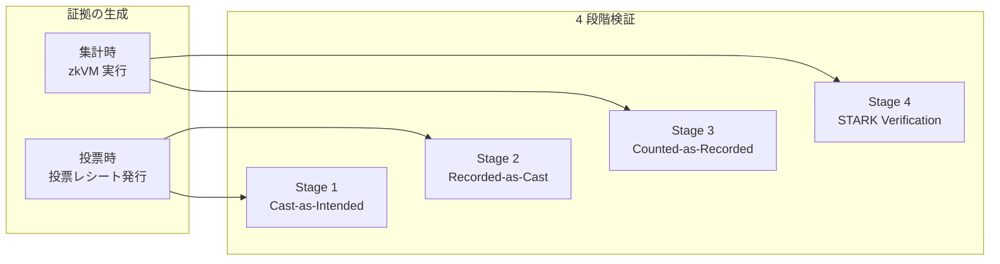
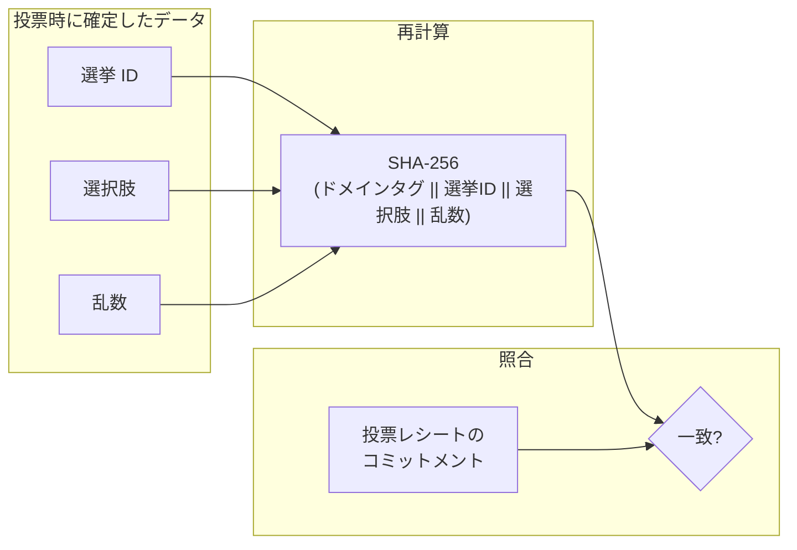
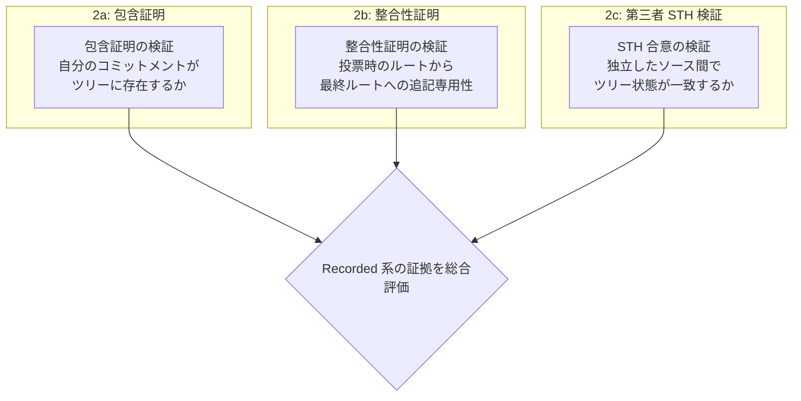
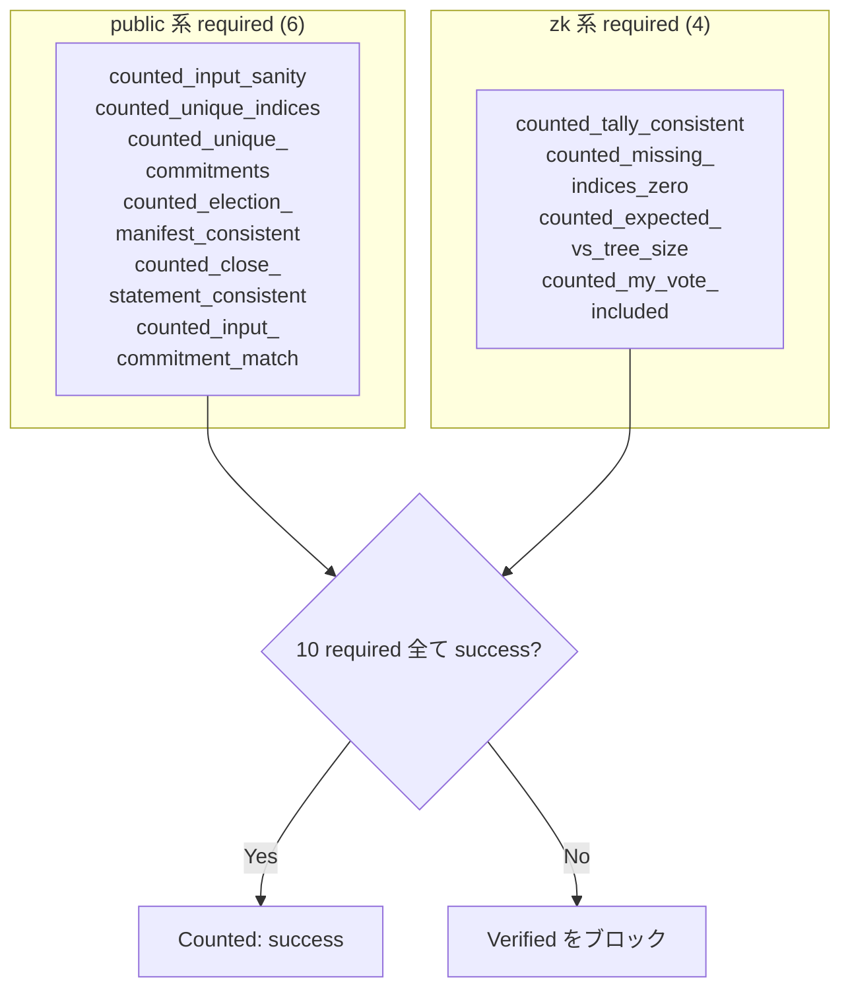
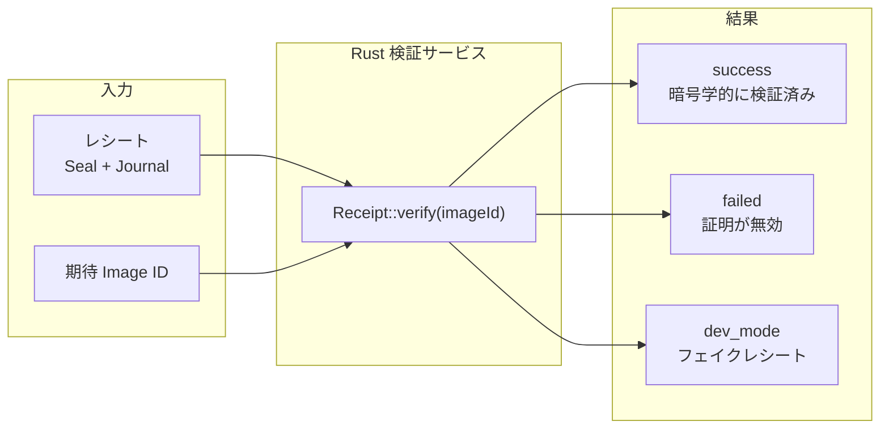

# 4 段階検証モデル

E2E 検証可能投票の各段階（Cast-as-Intended / Recorded-as-Cast / Counted-as-Recorded / STARK Verification）でどんな保証が成り立つかを扱う章です。

## 段階間の依存関係

概念モデルとしては 4 段階を順に評価しますが、実行場所は段階ごとに異なります（Stage 1 はクライアント、Stage 2-4 はサーバー中心）。実行責務の詳細は [設計と実行フロー](design-and-flow.md) を参照してください。

## Stage 1: Cast-as-Intended

### 目的

投票者が意図した選択肢のコミットメントが、サーバーから返却された投票レシートと一致することを確認します。これにより、サーバーが投票者の選択を差し替える攻撃を検出します。

### 検証する内容

`/verify` 画面のクライアントコードがローカルに保持された 3 つの値（選挙 ID、選択肢、乱数）からコミットメントを再計算し、投票レシートのコミットメント値と照合します。

### 必要な証拠

| 証拠         | 保管場所                                                    | 説明                                                                  |
| ------------ | ----------------------------------------------------------- | --------------------------------------------------------------------- |
| 選挙 ID      | クライアントセッション（`localStorage.starkBallotSession`） | セッション作成時に確定した UUID                                       |
| 選択肢       | クライアントセッション（`localStorage.starkBallotSession`） | 投票者が選択した値（A〜E）                                            |
| 乱数         | クライアントセッション（`localStorage.starkBallotSession`） | 投票時にクライアントが生成した 32 バイト乱数                          |
| 投票レシート | `GET /api/verify` 応答（`voteReceipt`）                     | 投票レシート（commitment, voteId, bulletinIndex, bulletinRootAtCast） |

`voteReceipt` は [cast-time 証跡](../appendix/glossary.md#cast-time-証跡cast-time-ct-artifact)を store から再構成できた場合にだけ `/api/verify` から返ります。再構成できない場合の動作は [設計原則 3](design-and-flow.md#原則-3-チェック評価はサーバー中心集約はサーバーとクライアントの双方で実施) を参照してください。

### 失敗モード

| 症状                   | 原因                                                               | 深刻度   |
| ---------------------- | ------------------------------------------------------------------ | -------- |
| ローカル証拠の欠落     | `localStorage` 消去や別端末アクセスで投票時データを復元できない    | 検証不能 |
| 投票レシート証跡の欠落 | store から cast-time 証跡を再構成できず、`voteReceipt` が省略      | 検証不能 |
| コミットメント不一致   | 投票時データと投票レシートの不整合、またはエンコーディングの不整合 | 重大     |
| 選択肢の範囲外         | 不正な入力（`A`〜`E` の範囲外）                                    | 重大     |
| 乱数フォーマット不正   | 32 バイト hex でない                                               | 重大     |

### 限界

Cast-as-Intended は以下の証拠に依存します:

- クライアント保持のローカル証拠（選挙 ID、選択肢、乱数）
- `/api/verify` が返す投票レシート（`voteReceipt`）

いずれかが欠ける場合、この段階は `not_run` になり最終判定は Verified になりません。

---

## Stage 2: Recorded-as-Cast

### 目的

投票者のコミットメントが、追記専用の掲示板（CT Merkle ツリー）に正しく記録されていることを確認します。さらに、掲示板が追記専用性を維持していること（過去のエントリが削除・改変されていないこと）を検証します。

### 検証する内容

この段階には 3 系統の検証があります。UI ステップとの対応関係は [ゲーティングロジック](gating-logic.md#ステップとチェックの対応関係) を参照してください。

#### 2a: 包含証明（Inclusion Proof）

RFC 6962 の PATH 関数に基づく CT スタイルの Merkle 包含証明を検証し、投票者のコミットメントが掲示板のツリーに含まれていることを確認します。検証者はリーフハッシュと監査パスからルートハッシュを再計算し、期待されるルートと照合します。

#### 2b: 整合性証明（Consistency Proof）

投票時点のツリー状態（ルートとサイズ）から、最終的なツリー状態への遷移が追記のみで行われたことを検証します。RFC 6962 の SUBPROOF アルゴリズムに基づく整合性証明により、サーバーが過去のエントリを密かに削除したり順序を変更したりするスプリットビュー攻撃を検出します。

#### 2c: 第三者 STH 検証（オプション）

複数の独立した STH（Signed Tree Head）ソースに問い合わせ、合意が成立しているかを確認します。これにより、サーバーが検証者ごとに異なるツリー状態を提示するスプリットビュー攻撃を検出します。照合条件の詳細は [チェック一覧](checks-catalog.md#recorded_sth_third_party) を参照してください。

### 必要な証拠

| 証拠                                  | 取得元                                       | 説明                                                                           |
| ------------------------------------- | -------------------------------------------- | ------------------------------------------------------------------------------ |
| 包含証明の検証結果                    | `/api/verify`                                | サーバー側で RFC 6962 包含証明を評価したチェック結果                           |
| 整合性証明の検証結果                  | `/api/verify`                                | サーバー側で RFC 6962 整合性証明を評価したチェック結果                         |
| 投票時のルートハッシュ                | 投票レシート                                 | 投票受理時のツリールート                                                       |
| 投票時のツリーサイズ（oldSize）       | `/api/verify` の `userVote.proof.treeSize`   | 整合性証明の oldSize                                                           |
| 最終ルートハッシュ/最終ツリーサイズ   | `/api/verify`                                | 集計時の最終状態                                                               |
| 独立検証用の包含証明材料（任意）      | `/api/bulletin/:voteId/proof`                | クライアント外で個別に包含証明を再検証するための材料                           |
| 補助 tooling の整合性証明材料（任意） | `/api/bulletin/consistency-proof`            | secondary tooling 向け。現行 `/verify` ページの verdict authority には含めない |
| STH スナップショット                  | 設定済み STH ソース（例: `/api/sth` + 外部） | 第三者ソースの照合対象（必須は digest、root/treeSize は返却時のみ）            |

`userVote.proof.treeSize` は整合性証明における authoritative な oldSize であり、現行実装では `voteReceipt.bulletinIndex + 1` との一致も要求します。cast-time 証跡が欠ける場合の fail-closed 動作は [設計原則 3](design-and-flow.md#原則-3-チェック評価はサーバー中心集約はサーバーとクライアントの双方で実施) を参照してください。

### 失敗モード

| 症状                     | 原因                                                                          | 深刻度         |
| ------------------------ | ----------------------------------------------------------------------------- | -------------- |
| 包含証明の検証失敗       | ツリーサイズ/インデックスの不一致、掲示板のリセット                           | 重大           |
| 整合性証明の検証失敗     | 追記専用性の違反（スプリットビュー攻撃の可能性）                              | 重大           |
| cast-time 証跡の欠落     | store から `voteReceipt` / `userVote.proof` を再構成できず、Recorded が未実行 | 検証不能       |
| 第三者 STH 合意の不成立  | サーバーが検証者ごとに異なるツリーを提示                                      | 重大（有効時） |
| ルートが履歴に存在しない | ルート履歴の不整合                                                            | 重大           |

---

## Stage 3: Counted-as-Recorded

### 目的

掲示板に記録された全投票が、zkVM の集計処理に正しく含まれたことを確認します。投票の除外、欠落、重複がないことに加え、公開された claimed tally（表示用集計値）が zkVM の `verifiedTally` と一致することを検証し、集計結果の完全性と整合性を保証します。

### 検証する内容

この段階では 10 個の required チェックが全て `success` であることを要求します。

`verificationSteps[].status` も最終サマリーも、Counted stage で required 扱いになるチェック群全体から導出されます。journal がない場合は guard により stage 自体が `not_run` になります。UI ステップとの対応や journal 省略時の詳細は [ゲーティングロジック](gating-logic.md#ステップとチェックの対応関係) を参照してください。

### 必要な証拠

| 証拠                     | 取得元                                               | 説明                                                                                                                       |
| ------------------------ | ---------------------------------------------------- | -------------------------------------------------------------------------------------------------------------------------- |
| zkVM ジャーナル（詳細）  | `/api/verify?includeJournal=1`                       | 集計結果、除外情報、`inputCommitment`、`includedBitmapRoot`、`seenBitmapRoot` などの詳細                                   |
| 集計サマリー（通常応答） | `/api/verify`                                        | `missingSlots` / `invalidPresentedSlots` / `rejectedRecords` / `excludedSlots` / `totalExpected` / `treeSize` などの上位値 |
| 公開入力サマリー         | サーバー内部評価用                                   | `public-input.json` 相当から組み立てた、秘密データを含まない入力要約                                                       |
| 選挙マニフェスト         | 公開監査アーティファクト（`election-manifest.json`） | `electionId` と `electionConfigHash` を束縛する公開可能アーティファクト                                                    |
| 締め処理ステートメント   | 公開監査アーティファクト（`close-statement.json`）   | `logId` / `treeSize` / `bulletinRoot` / `timestamp` / `sthDigest` を束縛する公開可能アーティファクト                       |
| ビットマップ証明材料     | `/api/bitmap-proof`                                  | `kind=included` と `kind=seen` を使い分け、自分のインデックスが counted されたことや prover に提示されたかを説明する材料   |
| ビットマップルート       | ジャーナル                                           | zkVM ゲストが計算した `includedBitmapRoot` と `seenBitmapRoot`                                                             |

公開入力サマリーはサーバー内部表現であり、レスポンスにそのまま含まれません。`inputCommitment` が束縛するのは `public-input.json` の部分集合です。各チェックの判定ロジックは [チェック一覧](checks-catalog.md#counted-as-recorded10-チェック) を参照してください。

### 重要な判定: 除外数（`excludedSlots`）

`excludedSlots` は authoritative な公開除外数です。

- `excludedSlots == 0`: 除外なし（正常）
- `excludedSlots > 0`: 掲示板スロットの未提示または計上失敗（即座に検証失敗）

`counted_missing_indices_zero` が除外数を解決し、0 でなければ `failed` になります。解決順序と legacy aliases の扱いは [チェック一覧](checks-catalog.md#counted_missing_indices_zero) を参照してください。除外数が残っている限り、最終判定は「Verified」を表示しません。

### 失敗モード

| 症状                                   | 原因                                                                                         | 深刻度                                            |
| -------------------------------------- | -------------------------------------------------------------------------------------------- | ------------------------------------------------- |
| `excludedSlots > 0`                    | 欠落スロットまたは計上失敗スロットが存在する                                                 | 重大（即座にブロック）                            |
| 欠落スロット / invalid presented slot  | 一部の bulletin slot が prover に提示されなかった、または提示後に計上されなかった            | 重大                                              |
| 公開集計値の不一致                     | 公開表示された `tally.counts` が zkVM の `verifiedTally` と一致しない                        | 重大（claimed tally 改ざんシナリオ S2/S4 で発火） |
| 集計合計の不一致                       | `verifiedTally` の合計が `validVotes` または `tally.totalVotes` と一致しない                 | 重大                                              |
| 選挙マニフェスト不整合                 | `electionId` または `electionConfigHash` が verification inputs と一致しない                 | 重大（必須チェック失敗）                          |
| 締め処理ステートメント不整合           | `logId` / `timestamp` / `sthDigest` / `bulletinRoot` / `treeSize` が一致しない               | 重大（必須チェック失敗）                          |
| 入力コミットメント不一致               | 公開入力のうち inputCommitment 対象フィールドと zkVM 実行で使用された入力が異なる            | 重大                                              |
| 自票のビットマップ証明が失敗または欠落 | bit が 0、proof source 不可、またはルート不一致                                              | 重大（required check が `failed/not_run`）        |
| ツリーサイズの不一致                   | `totalExpected` と `treeSize` が異なる（暗黙の除外、または close/input side の不整合を示す） | 重大（必須チェック失敗）                          |

---

## Stage 4: STARK Verification

### 目的

zkVM の実行が正しく行われたことを STARK 証明（レシート）の暗号学的検証により確認します。レシートの検証に成功すれば、ジャーナルの内容（集計結果、除外情報、入力コミットメント等）がゲストプログラムの正しい実行の結果であることが保証されます。

### 検証する内容

### 検証の 2 段階

STARK Verification では 2 つのチェックを実行します。

**Image ID 照合**: verifier-confirmed な `receipt_image_id` が期待 Image ID と一致し、ホスト主張値（`imageId`）や comparison-only の `journal.imageId` とも矛盾しないことを確認します。Image ID はゲストプログラムから導出される暗号的識別子であり、プログラムの改変やホスト主張値の食い違いを検出します。解決順の詳細は [チェック一覧](checks-catalog.md#stark_image_id_match) を参照してください。

**レシート検証**: RISC Zero の `Receipt::verify()` を呼び出し、Seal（STARK 証明）がジャーナルと Image ID に対して暗号学的に正当であることを検証します。この検証は計算量が多いため、サーバー側の Rust 検証サービスで実行されます。

### 必要な証拠

| 証拠                           | 取得元                    | 説明                                                                                                   |
| ------------------------------ | ------------------------- | ------------------------------------------------------------------------------------------------------ |
| レシート（Seal + Journal）     | 証明バンドル              | zkVM ホストが生成した STARK 証明                                                                       |
| 期待 Image ID                  | サーバー側で解決          | ゲストプログラムの暗号的識別子（解決順は [チェック一覧](checks-catalog.md) 参照）                      |
| ホスト主張値と比較用メタデータ | 検証コンテキストと report | `imageId`, `journal.imageId`, `verificationReport.receipt_image_id` を相互照合し、主張の食い違いを検出 |

### 開発モードの検出

`RISC0_DEV_MODE=1` で生成されたレシートは `InnerReceipt::Fake` 型であり、暗号学的な保証を持ちません。検証サービスはこれを `dev_mode` ステータスとして報告します。

通常は `not_run` に正規化され、最終判定で「Verified」には到達しません。`dev_mode` を `success` 相当として扱える経路は、非 production / insecure zkVM mode で明示許可がある場合に限られます。さらに `GET /api/verify` のレスポンス組み立てでは fail-closed が一段厳しくなり、明示許可がない `dev_mode` は UI 向けに `failed` へ補正されます。

### 失敗モード

| 症状             | 原因                                                                         | 深刻度 |
| ---------------- | ---------------------------------------------------------------------------- | ------ |
| Image ID 不一致  | マッピングが古い、ホスト主張値が誤っている、またはプローバーイメージが異なる | 重大   |
| レシート検証失敗 | 証明が暗号学的に無効                                                         | 重大   |
| 開発モード検出   | フェイクレシートが混入                                                       | 重大   |

---

## UI ステップと最終判定

UI ステップの対応チェック、集約ルール、最終 verdict の決定方法は [ゲーティングロジック](gating-logic.md) を参照してください。

<!-- source: src/server/api/handlers/verify.ts, src/lib/verification/engine/evaluate-checks.ts, src/lib/verification/verification-checks.ts, src/lib/verification/build-verification-steps.ts, src/app/(routes)/verify/hooks/useVerificationData.ts, src/app/(routes)/verify/hooks/useVerificationSequence.ts, src/lib/verification/consistency-verifier.ts -->
