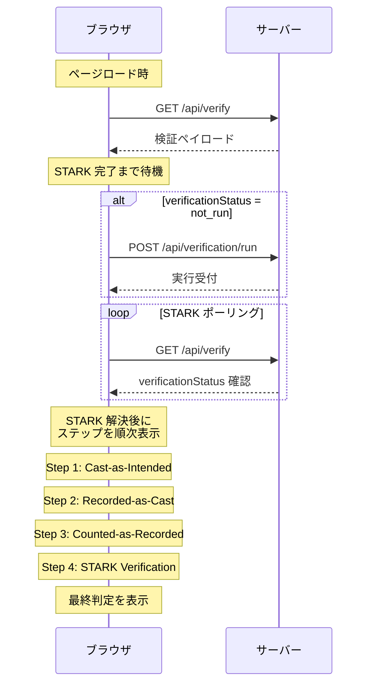

# ゲーティングロジック

「Verified」を表示してよい条件と、表示を必ず阻止する不変条件を厳密に並べる章です。

「必要な検証が未実行または失敗なら Verified を表示しない」という原則のもと、各チェックの結果がどう最終判定に集約されるかを定式化します。

## 最終判定の種類

検証パイプラインの結果は、主経路では `deriveVerificationSummary` によって集約され、UI 上は以下の 3 トーンに整理されます。なお `/verify` ページには STARK タイムアウト時の失敗表示など、集約結果に対する限定的な上書きもあります。

| 表示ステータス      | 主な条件                                                                                                    | UI 表示 |
| ------------------- | ----------------------------------------------------------------------------------------------------------- | ------- |
| Verified            | required 条件が満たされ、optional チェックの劣化もない（`fully_verified`）                                  | 緑色    |
| Verification Failed | 証明失敗、票除外、Recorded/Counted/Cast の必須失敗、または公開集計値と検証済み tally の不一致が確定した場合 | 赤色    |
| Warning             | required チェックが進行中、証拠不足がある、または optional チェックのみ劣化している場合                     | 黄色    |

### ステータスの判定順序

| 優先順 | 判定条件                                                                                                                        | 最終ステータス                                     |
| ------ | ------------------------------------------------------------------------------------------------------------------------------- | -------------------------------------------------- |
| 1      | required チェックに `pending` / `running` がある                                                                                | `Warning` (`in_progress`)                          |
| 2      | STARK 証明系ロールが `failed`                                                                                                   | `Verification Failed`                              |
| 3      | completeness ロールが `failed`（`user_vote_excluded` / `votes_excluded` / `votes_excluded_unknown`）                            | `Verification Failed`                              |
| 4      | Recorded-as-Cast の required チェックが `failed`                                                                                | `Verification Failed`                              |
| 5      | tally consistency だけが失敗し、proof / completeness / user inclusion / input integrity / Recorded required が成功              | `Verification Failed` (`published_tally_mismatch`) |
| 6      | Counted-as-Recorded または Cast-as-Intended の required チェックが `failed`                                                     | `Verification Failed`                              |
| 7      | (a) required に `not_run` がある (b) 必須ロール不足 (c) 既知チェックと混在する未知チェック (d) required 定義の未解決 のいずれか | `Warning` (`missing_evidence`)                     |
| 8      | optional チェックに `failed` / `not_run` がある                                                                                 | `Warning` (`verified_with_limitations`)            |
| 9      | 上記いずれにも該当しない                                                                                                        | `Verified`                                         |

この表は `deriveVerificationSummary` の集約結果です。チェックが空、または未知チェックだけで既知チェックが 1 件も解決できない場合、summary は `null` になり、Verified ではなく最終サマリー未表示として扱われます。

現行 `/verify` ページでは、`pending` / `running` のチェックが残っている間は最終サマリー自体を表示せず、ステップ表示が完了したあとに summary を表示します。UI レベルの最終表示は (1) 明示的なサーバー失敗、(2) hard-failure fallback、(3) summary、(4) pending warning の順で解決されます。

---

## 補助判定のゲーティング（`validateVotingIntegrity`）

現行 `/verify` の最終判定では使われない内部 helper ですが、整合性証明・完全性・第三者 STH 合意・ユーザーインデックス範囲を順に評価し、いずれかが失敗すれば `canShowVerified = false` を返します。意味論は [チェック一覧](checks-catalog.md) の `recorded_consistency_proof` / `counted_missing_indices_zero` / `counted_expected_vs_tree_size` / `recorded_sth_third_party` に対応します。

---

## STARK 検証のゲーティング

STARK 検証は整合性検証とは独立に評価されます。

| STARK ステータス | 説明                         | 最終判定への影響                                                                         |
| ---------------- | ---------------------------- | ---------------------------------------------------------------------------------------- |
| `success`        | 暗号学的に検証成功           | 他の必須チェックも `success` なら Verified 可能                                          |
| `failed`         | 検証失敗                     | Verified をブロック                                                                      |
| `dev_mode`       | 開発モードのフェイクレシート | core evaluator では `allowDevModeVerification=true` なら `success`、それ以外は `not_run` |
| `not_run`        | 未実行                       | `missing_evidence`（Warning）扱い。Verified をブロック                                   |
| `running`        | 実行中                       | `in_progress`（Warning）扱い。Verified をブロック                                        |

STARK が `not_run` のまま最終判定が Verified になる経路はありません（整合性チェックだけでは Verified に到達できません）。

### zkGate: STARK 結果に基づく Counted チェックの制御

STARK 検証の結果は、Counted-as-Recorded 段階のチェック評価にも影響します。これを zkGate と呼びます。

| STARK 解決後ステータス | Counted チェックへの反映 |
| ---------------------- | ------------------------ |
| `running`              | `pending`                |
| `not_run`              | `not_run`                |
| `failed`               | `failed`                 |
| `success`              | ゲートなしで通常評価     |

core evaluator では、`dev_mode` は事前に `success` または `not_run` に正規化されてから zkGate に入力されます。一方、現行 `/api/verify` の表示用ステータス組み立てでは、dev mode が許可されていない場合は [fail-closed](../appendix/glossary.md#fail-closed) の `failed` として反映されます。

---

## ステップとチェックの対応関係

UI に表示される 4 つのステップは、現行実装では 22 個のチェック定義から派生します。

ただし、`verificationSteps[].status` は「その stage で required 扱いになるチェック群」から導出され、`verificationSteps[].inputs` は stage 内の **全チェック定義** から集約されます。

| ステップ            | required として集約されるチェック ID                                                                                                                                                                                                                                                                                    |
| ------------------- | ----------------------------------------------------------------------------------------------------------------------------------------------------------------------------------------------------------------------------------------------------------------------------------------------------------------------- |
| Cast-as-Intended    | `cast_receipt_present`, `cast_choice_range`, `cast_random_format`, `cast_commitment_match`                                                                                                                                                                                                                              |
| Recorded-as-Cast    | `recorded_index_in_range`, `recorded_inclusion_proof`, `recorded_consistency_proof`、および STH source 設定時の `recorded_sth_third_party`                                                                                                                                                                              |
| Counted-as-Recorded | `counted_input_sanity`, `counted_unique_indices`, `counted_unique_commitments`, `counted_tally_consistent`, `counted_missing_indices_zero`, `counted_expected_vs_tree_size`, `counted_election_manifest_consistent`, `counted_close_statement_consistent`, `counted_my_vote_included`, `counted_input_commitment_match` |
| STARK Verification  | `stark_image_id_match`, `stark_receipt_verify`                                                                                                                                                                                                                                                                          |

補足:

- `recorded_commitment_in_bulletin` は `recorded_inclusion_proof` から、`recorded_root_at_cast_consistent` は `recorded_consistency_proof` から導出される表示用チェックです。チェック一覧には現れますが、単独では step status を決定しません。
- `recorded_sth_third_party` は通常は optional ですが、STH source が設定されている場合だけ required に昇格し、Recorded-as-Cast の step status と最終判定をブロックし得ます。

ステップのステータスは、required 扱いになったチェックのステータスから次の順序で集約されます。

| 集約ルール | 条件                                                     |
| ---------- | -------------------------------------------------------- |
| `failed`   | required チェックのいずれかが `failed`                   |
| `running`  | `failed` がなく、required チェックのいずれかが `running` |
| `pending`  | `failed`/`running` がなく、いずれかが `pending`          |
| `success`  | required チェックがすべて `success`                      |
| `not_run`  | 上記のいずれにも該当しない                               |

さらに現行実装には、単純集約だけではない 3 つの補正があります。

- `counted_as_recorded` は `journal` が存在しない場合、required チェックに `failed` がない限り `not_run` に補正されます。
- `recorded_as_cast` は `userVote.proof.treeSize` がない場合、`not_run` に補正されます。
- `/api/verify` は `castSource='client'` で `verificationSteps` / `verificationChecks` を組み立てるため、API 応答上の Cast-as-Intended はいったん `not_run` です。その後ブラウザ側で保存済みセッション情報から Cast チェックを再評価して上書きし、最終的な UI 表示と summary にはそのローカル結果が反映されます。

---

## UI シーケンスとポーリング

検証ページでは、4 つのステップが順次アニメーション表示されます。

---

## 不変条件のまとめ

以下の不変条件は、コードの変更によっても決して緩和してはなりません。

| 不変条件                                                | 根拠                             |
| ------------------------------------------------------- | -------------------------------- |
| 解決済み fail-closed 除外数 > 0 → Verified を表示しない | 投票除外は最も深刻な不正         |
| 整合性証明の失敗 → Verified を表示しない                | 追記専用性が保証されない         |
| STH 合意の不成立（有効時） → Verified を表示しない      | スプリットビュー攻撃の可能性     |
| `not_run` チェックの存在 → Verified を表示しない        | 証拠の不在を成功として扱わない   |
| STARK 検証の失敗 → Verified を表示しない                | ジャーナルの正当性が保証されない |
| 非公開アーティファクトをバンドルに含めない              | 投票の秘匿性を維持               |

これらの不変条件は、改ざんシナリオ（S0〜S5）の検出を保証する基盤です。各シナリオがどの不変条件によって検出されるかは、[改ざんシナリオ](../tamper/index.md) を参照してください。

この fail-closed モデルは、[単体・結合・E2E テスト](../quality/unit-integration-e2e.md) で「Verified を誤表示しない」ケースを継続的に検査しています。形式化側では [Lean による形式化](../quality/lean-formalization.md) の verification summary / display vectors を通じて、モデルと実装の対応を確認します。

<!-- source: src/server/api/handlers/verify.ts, src/app/(routes)/verify/hooks/useVerificationData.ts, src/app/(routes)/verify/lib/overall-status.ts, src/lib/verification/consistency-verifier.ts:validateVotingIntegrity, src/lib/verification/verification-summary.ts, src/lib/verification/verification-checks.ts, src/lib/verification/engine/evaluate-checks.ts, src/lib/verification/engine/derive-stages.ts -->
