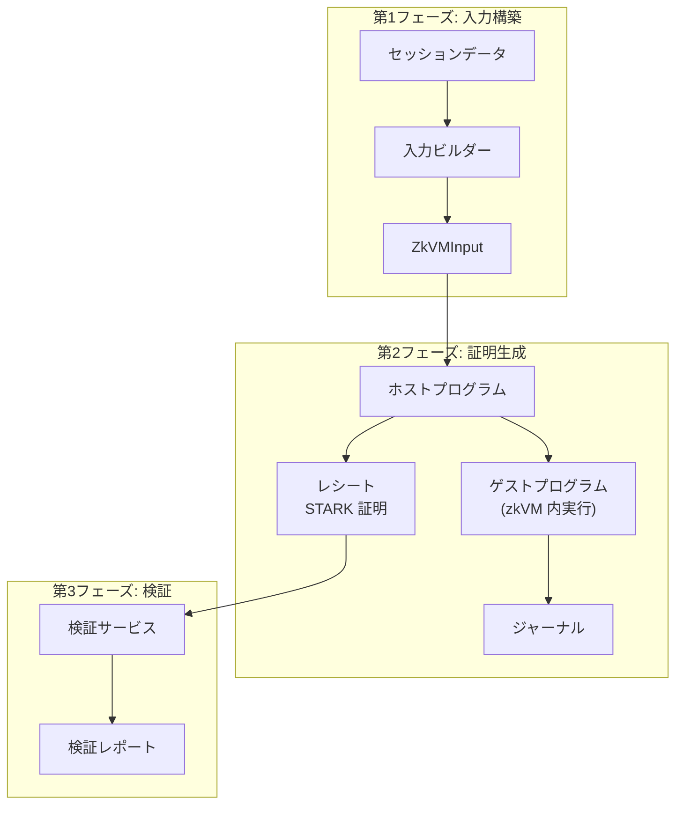
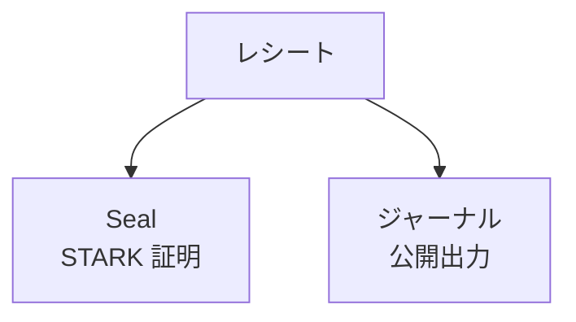
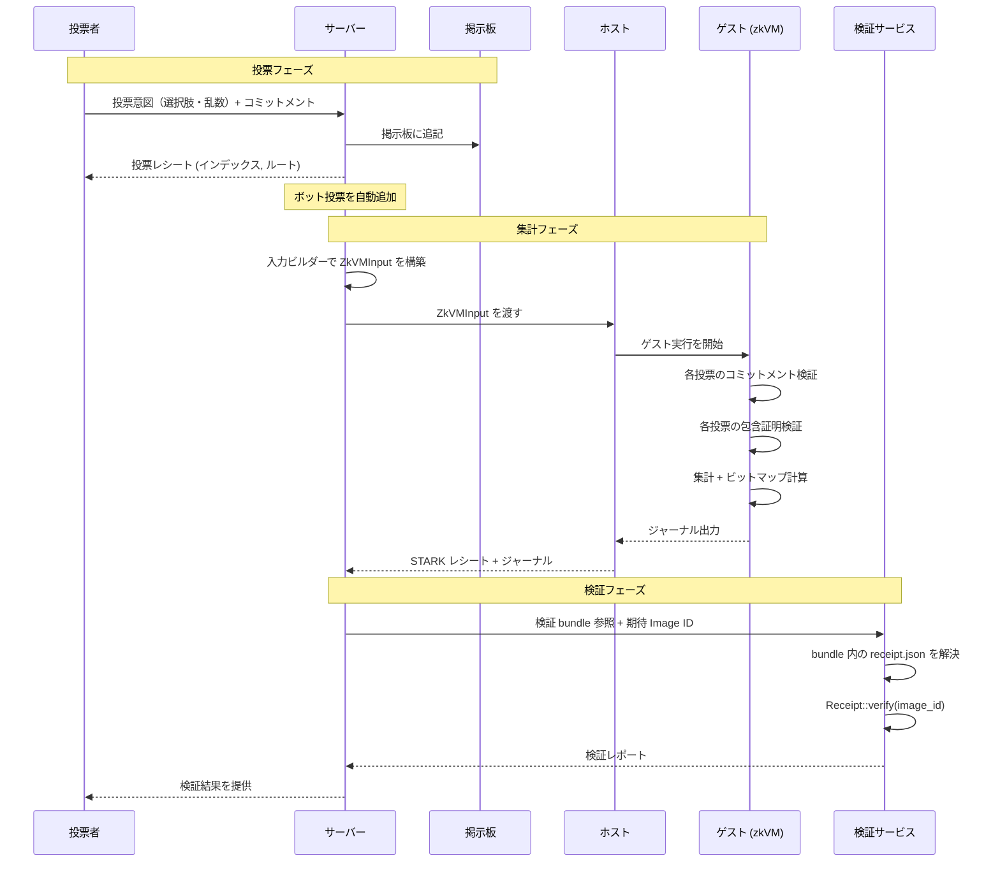

# zkVM の基礎

RISC Zero zkVM を採用した理由、データフロー、暗号学的保証の境界を整理する章です。

## なぜ RISC Zero か

- Trusted setup 不要で扱いやすい。
- RISC-V 上で通常の Rust コードを使えるため、実装と監査の往復がしやすい。
- Image ID による実行バイナリ照合と組み合わせやすい。

## アーキテクチャ概要

zkVM パイプラインは 3 つのコンポーネントで構成されます。

| コンポーネント   | 言語 | 責務                                                                  |
| ---------------- | ---- | --------------------------------------------------------------------- |
| ゲストプログラム | Rust | zkVM 内で投票を検証・集計し、結果をジャーナルにコミットする           |
| ホストプログラム | Rust | 入力を受け取り、zkVM を起動して STARK 証明（レシート）を生成する      |
| 検証サービス     | Rust | レシートの STARK 検証を実行し、期待される Image ID との一致を確認する |

## zkVM とは

RISC Zero zkVM は、RISC-V（RV32IM）命令列として実行されるゲストプログラムに対して、その実行が正しいことを STARK 証明で示すゼロ知識 VM です。

本システムでは「投票検証と集計」をゲストとして実行し、ホストがレシート（`seal` + `journal`）を生成します。第三者は `Receipt::verify(image_id)` により、指定したゲストバイナリ（Image ID）で実行された結果であることを検証できます。

### 30 秒で要点

| 観点                 | 要点                                                               |
| -------------------- | ------------------------------------------------------------------ |
| 何を証明するか       | 「このゲストコードをこの入力で実行した結果がジャーナルである」こと |
| 何を公開するか       | ジャーナル（公開出力）とレシート（証明本体）                       |
| どこが信頼アンカーか | Image ID（どのゲストを検証対象にするか）                           |
| この PoC での意味    | 集計値・除外件数・入力整合性を暗号学的に検証可能にする             |

ジャーナルは証明に束縛される公開出力です。配布対象ファイル（`bundle.zip` 等）との違いは [バンドル構造](../verification/bundle-structure.md) を参照してください。

### RISC Zero zkVM 実装の要点（簡潔版）

RISC Zero 公式ドキュメントに基づく実装上の要点:

1. **実行モデル**: ゲストは RV32IM として決定論的に実行され、外部との境界は syscall (`ecall`) で扱う
2. **証明の分割**: 長い実行はセグメント証明に分割される（大規模実行を扱うため）
3. **再帰合成と圧縮**: SDK はセグメント証明の再帰合成や `succinct` / `Groth16` などへの圧縮をサポートする。ただし本 PoC の現行ホストは production proof でも `Composite` receipt のままで、圧縮済み receipt は配布対象アーカイブには含めない
4. **検証 API**: `Receipt::verify(image_id)` が、証明本体と Image ID の束縛を同時に検証する
5. **公開出力の束縛**: `journal` は証明に束縛されるため、検証成功後に改ざんできない

### ジャーナルとレシート

- **ジャーナル**: ゲストが公開出力としてコミットするデータ（検証済み集計、除外情報、入力コミットメントなど）
- **レシート**: ジャーナルと STARK 証明（seal）のペア。検証成功時、ジャーナルは正しいゲスト実行結果として受理できる

各項目の意味と、対応する検証チェック:

| ジャーナル項目         | 代表フィールド                                                                 | 主な確認ポイント                                                           |
| ---------------------- | ------------------------------------------------------------------------------ | -------------------------------------------------------------------------- |
| 検証済み集計           | `verifiedTally`                                                                | `counted_tally_consistent`                                                 |
| 除外/欠落/却下情報     | `missingSlots` / `invalidPresentedSlots` / `excludedSlots` / `rejectedRecords` | `counted_missing_indices_zero`                                             |
| 入力整合性             | `inputCommitment`                                                              | `counted_input_commitment_match`                                           |
| STH 束縛               | `sthDigest`                                                                    | `counted_close_statement_consistent`, `recorded_sth_third_party`（設定時） |
| 個票包含証明の根       | `includedBitmapRoot`                                                           | `counted_my_vote_included`                                                 |
| 提示状態ビットマップ根 | `seenBitmapRoot`                                                               | 除外理由の切り分けに使用                                                   |

ジャーナルのフィールド名（`missingSlots` 等）と一部チェック名（`counted_missing_indices_zero` 等）の後方互換、および `excludedSlots` と `rejectedRecords` の使い分けは [ゲストプログラム > スロット / レコード分離モデル](guest-program.md#スロット--レコード分離モデル) を参照してください。

### 数学ミニ補足（読み飛ばし可）

STARK の直感的理解に必要な最小限の説明だけを記します。

#### 1. 巡回ドメイン（cyclic domain）

有限体 `F` の乗法群の部分群 `H = {1, w, w^2, ..., w^(n-1)}` を評価点集合（ドメイン）として使います。RISC Zero はこれを cyclic domain と呼びます。実行トレース（レジスタ値や遷移）は、この `H` 上で評価される多項式として扱われます。

#### 2. 有限体上の多項式除算

制約違反の有無は、概念的には次の形で整理できます。

- 制約多項式を `C(x)` とする
- 評価領域 `H` の零化多項式を `Z_H(x)` とする（典型例: `Z_H(x) = x^n - 1`）
- すべての点で制約を満たすなら `C(h)=0`（`h in H`）となり、`C(x)` は `Z_H(x)` で割り切れる
- したがって `Q(x) = C(x) / Z_H(x)` が多項式として成立するかを検査すれば、制約満足性をチェックできる

実際の STARK では、これを FRI（Fast Reed-Solomon IOP）と Merkle コミットメントを組み合わせて効率的に検証します。

### この PoC での保証境界

`Receipt::verify(image_id)` の成功は強い保証ですが、それ単体で「全票が提示された」ことまでは保証しません。本 PoC では以下を組み合わせて最終判定します。

1. STARK 検証成功（正しいゲスト実行）
2. `excludedSlots == 0`（除外スロットなし）
3. 追記専用性と締切 STH の必須チェック成功
4. 必須チェックが `not_run` / `pending` / `running` のままでは不合格

なお、第三者 STH チェックは source が設定されている場合に限り required に昇格します。

このため、Verified 表示は「証明 + 完全性チェック」がそろった場合にのみ成立します。

### 参考資料（RISC Zero 公式）

- [zkVM Technical Specification](https://dev.risczero.com/api/zkvm/zkvm-specification)
- [Recursion (proof composition)](https://dev.risczero.com/api/recursion)
- [STARK by Hand](https://dev.risczero.com/proof-system/stark-by-hand)

## データフロー

投票セッションの開始からレシート検証までの全体的なデータフローを示します。

<!-- source: zkvm/, src/lib/zkvm/, verifier-service/ -->
