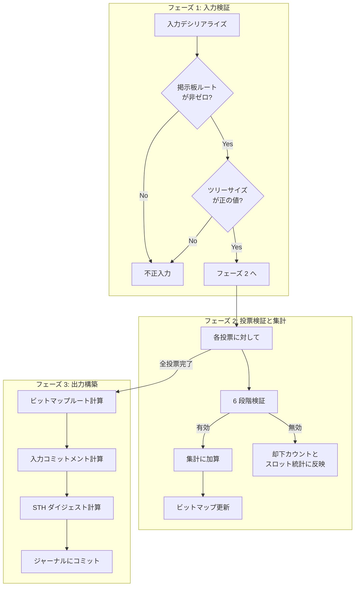
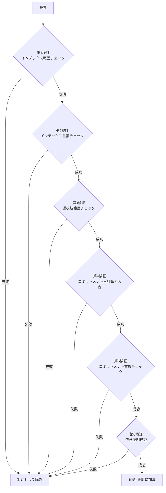
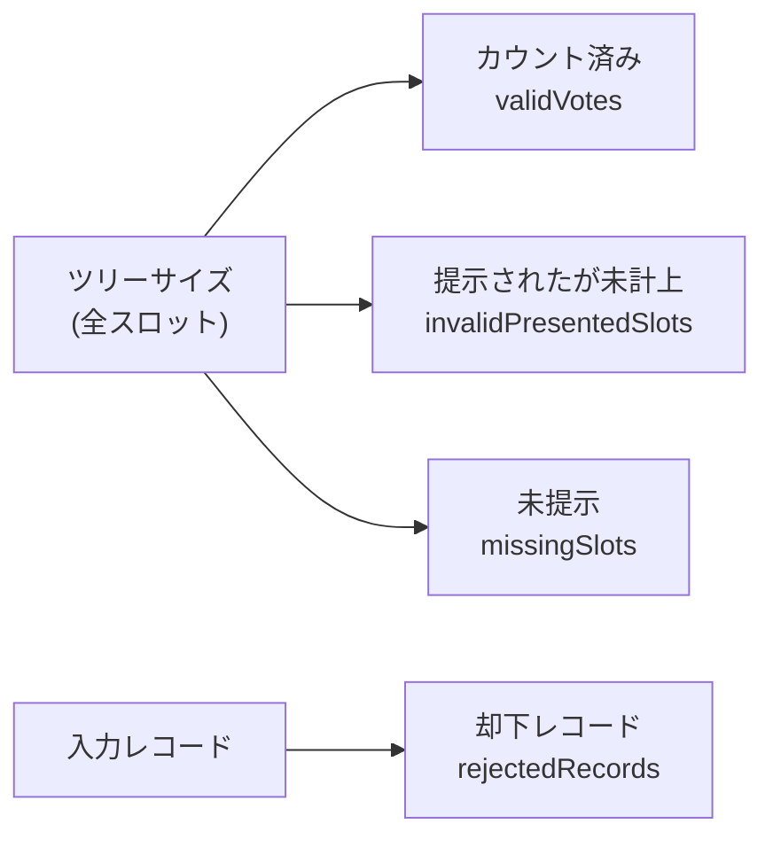

# ゲストプログラム

zkVM 内のゲストが、入力検証から集計・ビットマップ計算までをどう構成するかを扱う章です。

ゲストプログラムは、投票コミットメントの再計算、RFC 6962 包含証明の検証、集計の実行、ビットマップルートの計算を行い、結果をジャーナルにコミットします。

契約上重要なヘルパー（コミットメント計算、正準エンコーディング、RFC 6962 包含証明、ビットマップルートなど）は `zkvm/contract-core/` に集約されており、ゲストとホストが同じ実装を参照します。

## 概要

ゲストプログラムは RISC Zero zkVM 上で動作する Rust プログラムです。ホストから投票データ（選択肢・乱数・コミットメント・Merkle パスと選挙メタデータ）を受け取り、以下の処理を行います:

1. 各投票の正当性検証（コミットメント再計算 + 包含証明）
2. 有効投票の集計
3. カウント状態と提示状態のビットマップ計算
4. 入力コミットメントと STH ダイジェストの計算
5. 結果のジャーナルへのコミット

ゲスト内の処理はすべて STARK 証明に含まれるため、出力（ジャーナル）の正しさが暗号学的に保証されます。

## 入力構造

ゲストプログラムが受け取る入力（`AggregatorInput`）の構造を示します。

| フィールド           | 型               | 説明                                                                  |
| -------------------- | ---------------- | --------------------------------------------------------------------- |
| election_id          | 16 バイト        | 選挙の UUID v4 バイナリ表現                                           |
| bulletin_root        | 32 バイト        | 掲示板 Merkle ツリーの最終ルート                                      |
| tree_size            | u32              | 掲示板のリーフ数（= 投票スロット数）                                  |
| log_id               | 32 バイト        | 掲示板のログ識別子                                                    |
| timestamp            | u64              | 入力構築時に採用された最新 STH スナップショットの Unix タイムスタンプ |
| total_expected       | u32              | 想定される総投票数                                                    |
| election_config_hash | 32 バイト        | 選挙設定のハッシュ値                                                  |
| votes                | VoteWithProof[ ] | 投票データと Merkle パスの配列                                        |

各 `VoteWithProof` は以下のフィールドを持ちます:

| フィールド  | 型           | 説明                                        |
| ----------- | ------------ | ------------------------------------------- |
| index       | u32          | 掲示板上のインデックス                      |
| choice      | u8           | 選択肢（0 = A, 1 = B, 2 = C, 3 = D, 4 = E） |
| random      | 32 バイト    | コミットメント計算に使用した乱数            |
| commitment  | 32 バイト    | 投票コミットメント値                        |
| merkle_path | 32 バイト[ ] | RFC 6962 Merkle 包含証明のパスノード        |

## 処理パイプライン

ゲストプログラムの処理は、入力検証、投票検証・集計、出力構築の 3 フェーズで構成されます。



> **Note:** 即時 reject は `bulletin_root` がゼロ値、または `tree_size` が 0 の 2 ケースだけです。`votes.length > tree_size` のような入力も事前 reject されず、重複や範囲外は record 単位で `rejectedRecords` に反映されます。

## 投票の 6 段階検証

各投票に対して、以下の 6 つの検証が順に実行されます。いずれかが失敗した投票は即座に「無効」として除外され、以降の検証はスキップされます。



### 1. インデックス範囲チェック

投票のインデックスが `0` 以上 `tree_size` 未満であることを確認します。範囲外のインデックスは掲示板上に存在し得ないため、不正入力として検出されます。

### 2. インデックス重複チェック

同一インデックスの投票が既に処理されていないことを確認します。重複するインデックスは二重カウント攻撃を意味するため、2 番目以降の同一インデックスは除外されます。

### 3. 選択肢範囲チェック

選択肢の値が 0 から 4（A から E）の範囲内であることを確認します。

### 4. コミットメント再計算と照合

ゲスト内で投票者の（選択肢, 乱数, 選挙 ID）からコミットメントを再計算し、入力として渡されたコミットメント値と照合します。

この検証により、投票者が主張する選択肢が掲示板上のコミットメントと一致することが保証されます。コミットメントの計算規則は [コミットメントスキーム](../protocol/commitment.md) を参照してください。

### 5. コミットメント重複チェック

同一コミットメントが既に処理されていないことを確認します。コミットメント値が重複した場合は、入力の異常または二重投入の兆候として無効化されます。

### 6. RFC 6962 包含証明検証

投票のコミットメントが掲示板 Merkle ツリーに含まれることを、RFC 6962 PATH 関数ベースの CT スタイル包含証明で検証します。投票のインデックスと Merkle パスから掲示板ルートを再計算し、入力の `bulletin_root` と一致するかを確認します。

ハッシュ規則は [CT Merkle ツリー](../protocol/ct-merkle.md) の RFC 6962 参照規則に合わせます:

- リーフ: `SHA-256(0x00 || "stark-ballot:leaf|v1" || data)`
- ノード: `SHA-256(0x01 || left || right)`

## 集計ロジック

6 段階検証をすべて通過した投票は「有効」として集計に加算されます。

- 集計は選択肢ごとの配列（5 要素）で管理
- 有効投票のインデックスに対応する `includedBitmap` のビットを `true` に設定
- 無効投票はカウントされず、`includedBitmap` のビットは `false` のまま
- 範囲内かつ初出として提示された無効票は `seenBitmap` では `true` になり、提示済みだが未計上のスロットとして扱われる

## スロット / レコード分離モデル

現行のゲストプログラムは、掲示板スロットに対する完全性と、入力レコードの異常を別々に記録します。



| 指標                    | 条件                                                             | 意味                                                                     |
| ----------------------- | ---------------------------------------------------------------- | ------------------------------------------------------------------------ |
| `validVotes`            | 6 段階検証をすべて通過した範囲内かつ初出の投票                   | 集計に含まれたスロット数                                                 |
| `invalidPresentedSlots` | 範囲内かつ初出のスロットが提示されたが、最終的に計上されなかった | 提示はされたがカウントに失敗したスロット数                               |
| `missingSlots`          | 範囲内スロットが一度も提示されなかった                           | サーバーが prover に提示しなかったスロット数                             |
| `rejectedRecords`       | 検証に失敗したレコード全体                                       | 重複 index、範囲外 index、重複 commitment なども含むレコード単位の却下数 |

スロット単位の 3 分類は、現行実装では常に次の関係を満たします:

```text
validVotes + invalidPresentedSlots + missingSlots = treeSize
```

fail-closed 判定に使われる除外数は、スロット単位の `excludedSlots` です:

```text
excludedSlots = missingSlots + invalidPresentedSlots
```

`excludedSlots > 0` は検証失敗の決定的な指標です。1 スロットでも未提示または未計上であれば、集計結果の完全性が損なわれていることを意味します。

一方で `rejectedRecords` はレコード単位の補助指標です。たとえば次のようなケースでは `rejectedRecords` は増えても `excludedSlots` は増えません。

- 既に正しくカウント済みのスロットに対する重複インデックスレコード
- `tree_size` の外側を指す範囲外レコード

旧 public contract の互換名は現行ゲストの正規出力にも、finalize / status / verify などの公開レスポンスにも現れません。旧名と現行 journal フィールドの 1 対 1 対応は次のとおりです。

| 旧名 (compatibility mirror) | 現行 journal フィールド |
| --------------------------- | ----------------------- |
| `missingIndices`            | `missingSlots`          |
| `invalidIndices`            | `invalidPresentedSlots` |
| `countedIndices`            | `validVotes`            |
| `excludedCount`             | `excludedSlots`         |

`rejectedRecords` は旧名のミラーではなく、現行で新設された **record 単位の補助カウント**です。特に `invalidIndices` のミラーではない点に注意してください（`invalidIndices` のミラーは `invalidPresentedSlots` であり、こちらはスロット単位）。

## ジャーナル出力

ゲストプログラムがジャーナルにコミットする出力構造（`VerificationOutput`）を示します。

| フィールド            | 型        | 説明                                                                                              |
| --------------------- | --------- | ------------------------------------------------------------------------------------------------- |
| electionId            | UUID      | 対象選挙 ID（入力の `election_id` をエコー）                                                      |
| electionConfigHash    | 32 バイト | 選挙設定ハッシュ（入力の `election_config_hash` をエコー）                                        |
| bulletinRoot          | 32 バイト | 掲示板ルート（入力の `bulletin_root` をエコー）                                                   |
| treeSize              | u32       | 掲示板のツリーサイズ（入力をエコー）                                                              |
| totalExpected         | u32       | 想定総投票数（入力をエコー）                                                                      |
| sthDigest             | 32 バイト | [STH ダイジェスト](../protocol/sth-digest.md)                                                     |
| verifiedTally         | u32[5]    | 選択肢 A〜E ごとの得票数                                                                          |
| totalVotes            | u32       | zkVM が受け取った投票レコード数                                                                   |
| validVotes            | u32       | 検証に成功した投票数                                                                              |
| invalidVotes          | u32       | 検証に失敗した投票数                                                                              |
| seenIndicesCount      | u32       | 範囲内かつ初出のインデックスとして処理した件数                                                    |
| missingSlots          | u32       | 一度も提示されなかった掲示板スロット数                                                            |
| invalidPresentedSlots | u32       | 提示はされたが計上されなかった範囲内スロット数                                                    |
| rejectedRecords       | u32       | 却下されたレコード数（重複・範囲外・各種検証失敗を含む）                                          |
| seenBitmapRoot        | 32 バイト | prover に提示されたインデックス集合の [ビットマップ Merkle](../protocol/bitmap-merkle.md) ルート  |
| includedBitmapRoot    | 32 バイト | 実際にカウントされたインデックス集合の [ビットマップ Merkle](../protocol/bitmap-merkle.md) ルート |
| excludedSlots         | u32       | 除外されたスロットの総数（= missingSlots + invalidPresentedSlots）                                |
| inputCommitment       | 32 バイト | [入力コミットメント](../protocol/input-commitment.md)                                             |
| methodVersion         | u32       | ゲストプログラムのバージョン（現行 = `12` / v1.2）                                                |

### ジャーナルの信頼モデル

ジャーナルの各フィールドは、対応する STARK 証明により「ゲストプログラムが正しく計算した結果」であることが保証されます。

| ジャーナル項目       | STARK 証明で保証される内容                                                  | 補足                                                                                    |
| -------------------- | --------------------------------------------------------------------------- | --------------------------------------------------------------------------------------- |
| `verifiedTally`      | 有効投票のみを正しく集計した結果である                                      | `validVotes` / `invalidVotes` との整合もジャーナル上で確認可能                          |
| `excludedSlots`      | 未提示または未計上のスロット数がゲストの計算結果と一致する                  | `excludedSlots > 0` は完全性違反の重要シグナル                                          |
| `rejectedRecords`    | 却下されたレコード数がゲストの計算結果と一致する                            | 重複・範囲外・検証失敗の説明に使う補助情報で、スロット単位の判定とは分離される          |
| `inputCommitment`    | ゲストが処理した入力データを正準エンコードで束縛した値である                | 公開入力側から再計算して照合できる                                                      |
| `seenBitmapRoot`     | prover に提示された範囲内かつ初出のインデックス集合から計算したルートである | `includedBitmapRoot` と併用すると未提示 / 提示されたが未計上 / カウント済みを区別できる |
| `includedBitmapRoot` | 実際にカウントされたインデックス集合から計算したルートである                | 自票包含の証明（bitmap proof）の検証基準になる                                          |
| `sthDigest`          | その実行で参照した掲示板状態から計算した値である                            | 第三者 STH 合意そのものは別チェックで確認する                                           |

第三者はレシートの STARK 検証を行うだけで、上記の保証を取得できます。ゲストプログラムのロジックを信頼する必要はありますが、ホストやサーバーの正直性を信頼する必要はありません。

## ビットマップルートの計算

ゲストプログラムは投票検証と並行して、2 種類のビットマップを構築します。

1. `seenBitmap` と `includedBitmap` の 2 つのブール配列を初期化（全 `false`）
2. 範囲内かつ一意インデックスとして処理された票のインデックスに対応する `seenBitmap` のビットを `true` に設定
3. 6 段階検証を通過した票のインデックスに対応する `includedBitmap` のビットを `true` に設定
4. 各ビットマップを LSB-first でバイト列にパッキング
5. パック後の長さが 32 バイト以下なら、ゼロ埋めした 1 リーフとして CT スタイルの leaf hash を計算
6. 33 バイト以上なら 32 バイトチャンクに分割し、それぞれを leaf とする CT スタイルの Merkle ツリーを構築
7. 2 つのルート値（`seenBitmapRoot` と `includedBitmapRoot`）をジャーナルにコミット

この 2 つのルートを使うことで、公開検証側は「prover に提示されたが無効化された票」と「そもそも prover に提示されなかった票」を区別できます。

ビットマップの詳細な構造とハッシュ規則は [ビットマップ Merkle](../protocol/bitmap-merkle.md) を参照してください。

## 入力コミットメントと STH ダイジェスト

ゲストプログラムは投票処理の後、2 つの追加ハッシュ値を計算してジャーナルにコミットします。

### 入力コミットメント

ゲストに渡された入力のうち、公開フィールドを正準エンコーディングで連結し SHA-256 で圧縮します。現行実装では固定のドメインタグと format version を先頭に付与した上で、`electionId`・`bulletinRoot`・`treeSize`・`totalExpected`・`votesCount` と各投票の `index`・コミットメント値・Merkle パスを束縛します。投票列はハッシュ前に `index` 昇順で正規化されます（異常入力時の tie-break 補助ルールは [入力コミットメント > ソート規則](../protocol/input-commitment.md#ソート規則) を参照）。

第三者は `public-input.json` などの公開検証用レコードから同じ値を再計算し、ジャーナルの値と照合することで、zkVM が処理した入力の同一性を検証できます。

詳細は [入力コミットメント](../protocol/input-commitment.md) を参照してください。

### STH ダイジェスト

掲示板のログ ID、ツリーサイズ、タイムスタンプ、ルートハッシュを結合して SHA-256 で圧縮します。このダイジェストは第三者の STH ソースとの照合に使用され、サーバーが異なる投票者に異なる掲示板ビューを提示する分割ビュー攻撃を緩和します。

詳細は [STH ダイジェスト](../protocol/sth-digest.md) を参照してください。

## ゲストプログラムのバージョニング

ゲストプログラムにはバージョン番号が割り当てられ、ジャーナルの `methodVersion` フィールドに記録されます。現行のジャーナル契約は 12（v1.2）です。

バージョン番号は [Image ID](image-id.md) の管理と連動しており、ゲストプログラムの変更は新しい Image ID の生成を伴います。検証時には、期待 Image ID との一致が確認されます。

<!-- source: zkvm/methods/guest/src/main.rs, zkvm/methods/guest/src/sth.rs, zkvm/contract-core/src/sha256.rs, zkvm/contract-core/src/inclusion_proof.rs, zkvm/contract-core/src/bitmap.rs, zkvm/contract-core/src/encoding.rs, zkvm/contract-core/src/types.rs -->
