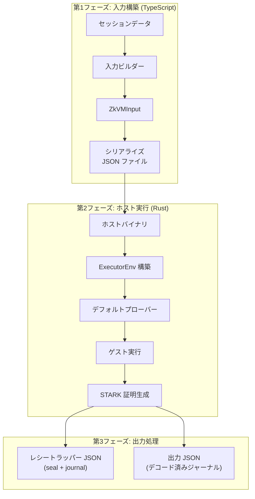
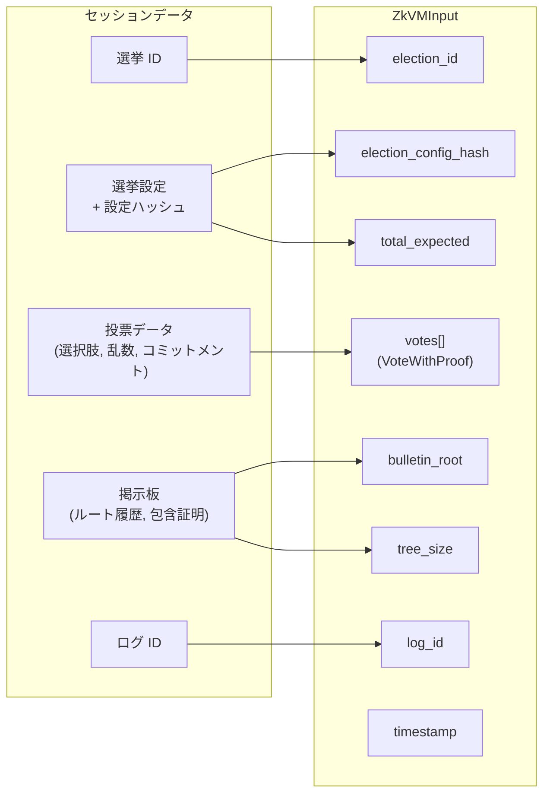
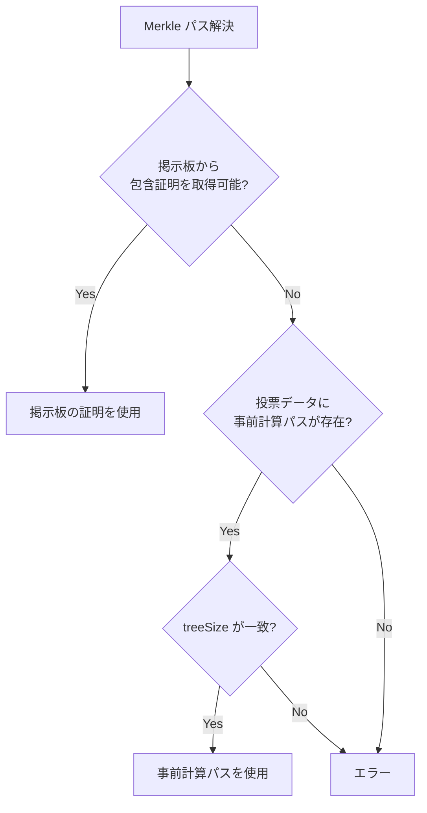
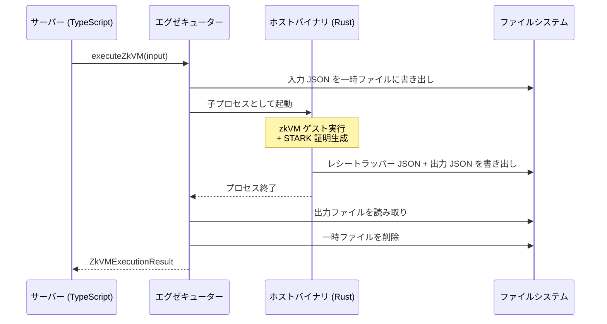
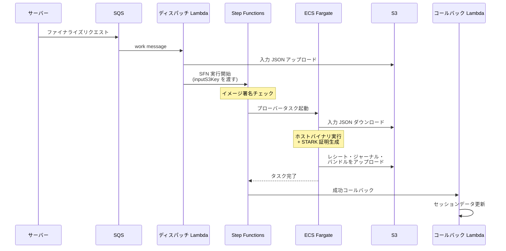

# ホストと証明生成

ホストプログラムが zkVM 入力を組み立て、同期 / 非同期で STARK 証明を生成する流れを扱う章です。

同期モード（ローカルプロセス起動）と非同期モード（ECS Fargate タスク）の 2 つの証明パスがあり、どちらも同一のホストバイナリを使用します。入力構築からレシート出力までのフローを、両モードの差異とともに説明します。

## パイプライン全体像

証明生成パイプラインは、入力構築、ホスト実行、出力処理の 3 フェーズで構成されます。

## 入力構築

### セッションデータからの抽出

入力ビルダーは、投票セッションに蓄積されたデータから zkVM 入力を構築します。

入力構築で行われる主要な処理:

1. **掲示板の最新 STH スナップショット取得**: ルートハッシュ、ツリーサイズ、タイムスタンプを取得
2. **選挙設定の整合性確認**: `electionConfig` と `electionConfigHash` が一致することを確認
3. **投票データの変換**: 各投票の選択肢を整数に変換（A=0, B=1, C=2, D=3, E=4）
4. **Merkle パスの解決**: 各投票について、掲示板から最新の包含証明を取得
5. **総投票数の設定**: 選挙設定の `totalExpected`（本 PoC ではボット 63 票 + ユーザー 1 票 = 64）

通常のセッション入力では、投票インデックスは 0 から連続する canonical CT index であることを要求します。教育的な除外シナリオでは、元の掲示板インデックスを保つために sparse index を許可します。これによりゲスト側で `missingSlots` として観測できるようになります。

### Merkle パスの解決戦略

各投票の Merkle パスは、以下の優先順位で解決されます:

## ホストプログラムの実行

### ホストバイナリの役割

ホストバイナリは Rust で記述された CLI プログラムです。証明モードでは以下の処理を行います:

1. JSON 形式の入力ファイルを読み込み
2. JSON のバイト配列表現を Rust の固定長配列型へ変換（`Vec<u8>` → `[u8; 16/32]`）
3. `ExecutorEnv` に入力をシリアライズして設定
4. デフォルトプローバーを使用して zkVM ゲストを実行
5. レシート（STARK 証明 + ジャーナル）を取得
6. ジャーナルをデコードし、出力ファイルに書き出し

入力 JSON は TypeScript 側のエグゼキューターが事前に正規化して生成します（UUID/ハッシュ文字列をバイト配列へ変換）。

ImageID の確認だけを行う場合は `host --print-image-id [--json]` を使います。このモードでは入力ファイルを読まず、証明生成やアーティファクト出力も行いません。`--json` 付きでは `imageId` と `methodVersion` を含む JSON を stdout に出力します。

境界に違反する入力が渡された場合、host run は fail-closed で停止し、receipt / journal を出力しません。境界条件の詳細は [処理パイプライン](guest-program.md#処理パイプライン) を参照してください。

非同期モードで S3 に置かれる work input には、host CLI の証明入力に加えて `contractGeneration` と `election_config` も含まれます（コンテナ entrypoint 側で `public-input.json` / `election-manifest.json` を生成・検査するために使う）。

### 出力ファイル

証明モードのホストバイナリは 2 つの JSON ファイルを出力し、ビットマップ整合性検査を通過した場合は private bitmap artifact も追加で出力します。

| ファイル              | 内容                                                           |
| --------------------- | -------------------------------------------------------------- |
| レシートラッパー JSON | `{ "receipt": ..., "image_id": "0x..." }` 形式のラッパー JSON  |
| 出力 JSON             | デコード済みのジャーナル（集計結果、除外情報、各種ハッシュ値） |

レシートラッパー JSON には top-level `image_id` フィールドも含まれます。検証サービスでの使われ方は [検証サービス](verifier-service.md#検証フロー) を参照してください。

また、ホストはビットマップの整合性を確認し、一致した場合のみ以下の非公開アーティファクトを出力します。

| ファイル             | 内容                                                          |
| -------------------- | ------------------------------------------------------------- |
| `*-bitmap.json`      | counted bitmap の厳密 artifact（`includedBitmapRoot` と対応） |
| `*-seen-bitmap.json` | presented bitmap の厳密 artifact（`seenBitmapRoot` と対応）   |

非同期モードでは、これらの host 生出力は `included-bitmap.json` / `seen-bitmap.json` として `bundle.zip` の隣に配置されます。どちらも非公開アーティファクトであり、配布対象アーカイブ `bundle.zip` には含めません。

## 同期モード

同期モードでは、TypeScript のサーバーサイドプロセスからホストバイナリを直接起動します。

### 同期モードの特性

| 項目         | 値                                                                                                  |
| ------------ | --------------------------------------------------------------------------------------------------- |
| 起動方式     | Node.js `child_process.exec`                                                                        |
| タイムアウト | 10 分（600 秒）                                                                                     |
| 一時ファイル | リポジトリ直下の `.zkvm-temp/` 配下                                                                 |
| 環境変数     | Node.js の `process.env` を引き継ぐ（特に `RISC0_DEV_MODE` と `RUST_LOG` が証明モード・ログに影響） |
| エラー処理   | 終了コード非ゼロ、タイムアウト、ファイル不在で失敗                                                  |

### 結果の変換

エグゼキューターは出力 JSON のフィールドを TypeScript の命名規則へ正規化し、文字列だけでなくバイト配列形式の値も受理します。ハッシュ系フィールドは `0x` 付き 16 進文字列に、`election_id` は UUID 文字列に変換して `ZkVMExecutionResult` を構築します。

## 非同期モード

AWS 環境では、証明生成を ECS Fargate タスクとして非同期に実行します。STARK 証明の生成に数分を要するため、Lambda のタイムアウト制限を回避し、専用のコンピューティングリソースを割り当てます。

### イメージ署名チェック

Step Functions はプローバータスク起動前にコンテナイメージの署名を検証し、承認されたイメージ以外の実行を拒否します。署名と digest pin の運用は [イメージ署名](../aws/image-signing.md) を参照してください。

### 配布対象アーカイブの構築

非同期モードでは、ホストバイナリの出力のうち秘密データを含まないファイルだけを `bundle.zip` に同梱し、`input.json` などの秘密入力は含めません。同梱対象の一覧、整合性検査ルール、取得経路は [バンドル構造](../verification/bundle-structure.md) を参照してください。`public-input.json` の項目と `inputCommitment` の関係は [入力コミットメント](../protocol/input-commitment.md)。

async Docker entrypoint は methodVersion 14 の host output を受け付け、`journal.json` / `public-input.json` / `election-manifest.json` / `close-statement.json` を生成する際に methodVersion と `inputCommitment` の整合性を検査します。methodVersion 14 契約と一致しない host artifact は fail-closed で停止します。

### 非同期モードの特性

| 項目           | 値                                                          |
| -------------- | ----------------------------------------------------------- |
| タイムアウト   | 15 分（デフォルト、環境変数で変更可能）                     |
| リトライ       | S3 アップロードは指数バックオフで 3 回リトライ              |
| エラー処理     | Step Functions がタスク失敗を検出し、失敗コールバックを実行 |
| ステータス確認 | クライアントは `/api/sessions/:id/status` でポーリング      |

## 開発モードの動作

`RISC0_DEV_MODE=1` を設定すると、RISC Zero は STARK 証明を生成せず、フェイクレシートを返します。

| 項目         | 開発モード (`RISC0_DEV_MODE=1`) | 本番モード               |
| ------------ | ------------------------------- | ------------------------ |
| 証明の種類   | フェイクレシート                | 本物の STARK 証明        |
| 実行時間     | 約 100 ミリ秒                   | 約 370 秒（64 票の場合） |
| 安全性       | なし（検証を省略）              | 暗号学的に完全           |
| 検証サービス | Fake として検出                 | 完全な STARK 検証を実行  |

開発モードのレシートは内部的には `InnerReceipt::Fake` 型で、[検証サービス](verifier-service.md) では通常 `dev_mode` 扱い（`image_id` 不一致などの事前条件違反時のみ `Failed`）になります。**`dev_mode` は診断ステータスであり、本番モードの成功検証としては採用されません。**

開発モードは以下の用途に限定されます:

- host CLI や verifier 連携を含むローカルの高速フィードバック
- TypeScript と Rust の契約を短時間で確認する smoke test
- dev-mode receipt 分岐を明示的に通す CLI / E2E 検証

UI 開発などで使う `USE_MOCK_ZKVM=true` は、TypeScript の mock executor を選ぶ別経路です。この経路はホストバイナリも RISC Zero SDK も呼ばず、TypeScript 内で完結します。

<!-- source: src/lib/zkvm/input-builder.ts, src/lib/zkvm/executor.ts, zkvm/host/src/main.rs, docker/entrypoint.sh -->
