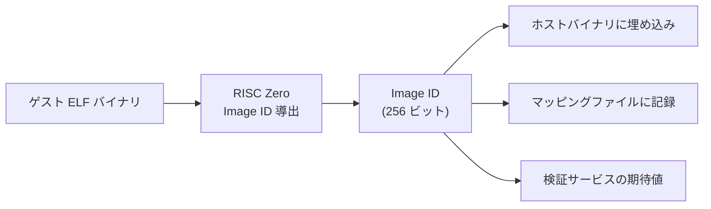
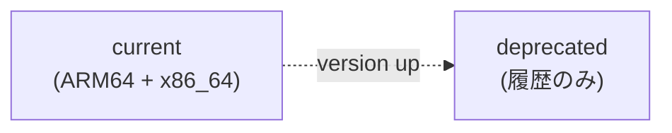
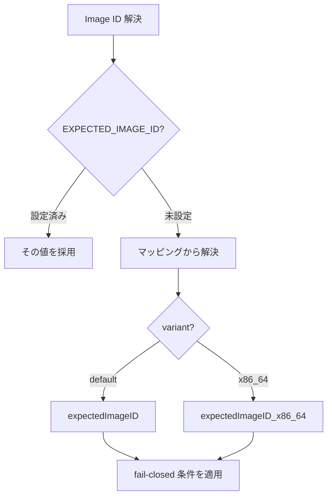

# Image ID

ゲストバイナリを一意に識別する Image ID をどう発行し、どう検証で照合するかを扱う章です。

Image ID はゲストプログラムの ELF バイナリから決定的に導出される 256 ビットのハッシュ値です。レシート検証時に期待値との一致を確認することで、正しいプログラムの実行結果であることを保証します。

## 概要

RISC Zero zkVM では、ゲストプログラムの ELF バイナリが Image ID と呼ばれる 256 ビットの識別子に変換されます。この変換は決定的であり、同一のバイナリからは常に同一の Image ID が生成されます。

`Receipt::verify(image_id)` はレシートが指定した Image ID のゲスト実行結果であることを暗号学的に検証します。期待する Image ID と一致しないレシートは拒否されます。ラッパーメタデータとの照合手順は [検証サービス](verifier-service.md#検証フロー) を参照してください。

## Image ID の導出

Image ID は RISC Zero のビルドシステムによってコンパイル時に自動生成されます。

### 決定論的導出

同一のゲストソースコードであっても、以下の要因により異なる Image ID が生成され得ます:

| 要因                     | 影響                                             |
| ------------------------ | ------------------------------------------------ |
| ゲストコードの変更       | ロジックの変更は異なるバイナリを生成             |
| コンパイラバージョン     | Rust ツールチェインのバージョン差異              |
| ターゲットアーキテクチャ | 同一コードでも x86_64 と ARM64 で異なる Image ID |
| RISC Zero SDK バージョン | SDK の変更がゲストバイナリの構造に影響           |

### アーキテクチャによる差異

本システムでは、同一バージョンのゲストに対して既定 variant 用 (`expectedImageID`) と x86_64 用 (`expectedImageID_x86_64`) の 2 つの Image ID をマッピング上で管理できます。`expectedImageID` は通常、昇格済みの ARM64/ECS 用 Image ID として扱います。

| アーキテクチャ | 用途                                    |
| -------------- | --------------------------------------- |
| ARM64          | ECS Fargate (Graviton) での本番証明生成 |
| x86_64         | ローカル開発、CI/CD 環境での証明生成    |

現行実装では、実行環境の自動判定で x86_64 を選びません。未指定時は `default` variant として `expectedImageID` を使い、x86_64 用の値を使うには `EXPECTED_IMAGE_ID_VARIANT=x86_64` または呼び出し側の明示 variant で選択します。variant 選択と `EXPECTED_IMAGE_ID` オーバーライドの優先順位は下の [Image ID の解決](#image-id-の解決) を参照してください。

## Image ID マッピング

期待される Image ID は、バージョンごとにマッピングファイルで管理されます。

### マッピングの構造

マッピングファイルには、各バージョンの Image ID、説明、ビルド情報、機能リストが記録されます。

| フィールド             | 説明                                      |
| ---------------------- | ----------------------------------------- |
| methodVersion          | ゲストプログラムのバージョン番号          |
| expectedImageID        | ARM64 環境での Image ID                   |
| expectedImageID_x86_64 | x86_64 環境での Image ID                  |
| description            | バージョンの説明                          |
| compiledAt             | Image ID を取得したビルド時刻             |
| rustVersion            | ビルドに使用した Rust バージョン          |
| risc0Version           | ビルドに使用した RISC Zero SDK バージョン |
| guestToolchain         | ゲストビルド用ツールチェイン              |
| features               | このバージョンで実装された機能リスト      |
| current                | 現在有効なバージョン番号                  |
| deprecated             | 非推奨バージョンの一覧                    |
| metadata               | マッピングファイル全体の管理メタデータ    |

### バージョン履歴の管理

マッピングファイルはバージョンの履歴を保持します。`current` フィールドが現在有効なバージョンを指し、`deprecated` フィールドが過去のバージョンを列挙します。`current` バージョンは既定 variant と x86_64 の 2 系統の Image ID を持ちます。

現行実装では `current` は `14` で、`v8`〜`v13` が `deprecated` 側にあります。v14 の mapping は、ECS Fargate で使う正式な既定 variant (`expectedImageID`) と、ローカル / CI の x86_64 検証で使う `expectedImageID_x86_64` を保持します。

## Image ID の解決

検証時に使用する期待 Image ID は、`EXPECTED_IMAGE_ID` が設定されているか、`methodVersion` と variant を使ってマッピングから解決するかで挙動が分かれます。

解決ルールの要点:

- `EXPECTED_IMAGE_ID` 環境変数は最優先のオーバーライドです。
- `resolveExpectedImageId()` / `/api/verification/run` の version 選択:
  - 省略時: マッピングの `current` を使用
  - 明示時: `CURRENT_METHOD_VERSION` と一致する場合のみ受理。`deprecated` 側は拒否
- 低レベルのマッピング読み取り API は `deprecated` も含めて明示 version を解決できる（この検証実行経路では使わない）。
- variant は `EXPECTED_IMAGE_ID_VARIANT`（`default` または `x86_64`）または呼び出し側の明示 option で選択し、未指定時は `default`。それ以外の値は受け付けません。
- 未対応 `methodVersion`、マッピング読み込み失敗、選択した variant の値が空、いずれも暗黙のフォールバックを行わず [fail-closed](../appendix/glossary.md#fail-closed) でエラーになります。
- 現行の検証実行フローでは、正規化済みのジャーナルから `methodVersion` を取得して `resolveExpectedImageId(methodVersion)` を呼びます（`public-input.json` フォールバックは現行未使用）。

## 検証パイプラインにおける役割

Image ID は 4 段階検証モデルの STARK 検証段階で使用されます。

### Image ID 関連チェック

現行実装では、STARK 検証段階で次の 2 つの必須チェックが Image ID に関与します。

- `stark_image_id_match`: `receipt.json` ラッパーの `image_id` と期待値を照合する
- `stark_receipt_verify`: 同じ期待 Image ID を使って `Receipt::verify(expectedImageID)` を実行する

詳細は [検証サービス](verifier-service.md#検証フロー) を参照してください。

Image ID が不一致の場合、以下のいずれかの状況を意味します:

| 原因                           | 対処                                       |
| ------------------------------ | ------------------------------------------ |
| マッピングが古い               | ゲストの再ビルド後にマッピングを更新する   |
| 異なるゲストで証明が生成された | レシートの出所を調査する                   |
| アーキテクチャの不一致         | 正しいアーキテクチャの Image ID で照合する |

## Image ID の更新手順

ゲストプログラムを変更した場合、Image ID を更新する必要があります。

1. ゲストコードを変更する
2. zkVM ゲストをビルドし、`host --print-image-id [--json]` で新しい Image ID を取得する
3. `public/imageId-mapping.json` を更新する（必要に応じて `expectedImageID_x86_64` も更新）
4. 関連コードに残る定数参照も必要に応じて更新する（現行実装では `src/lib/verification/expected-image-id.ts` の `DEFAULT_POC_IMAGE_ID` がテストなどで参照される）
5. プローバーイメージとマッピングを同時にデプロイする

`--json` を付けると `{"imageId":"0x...","methodVersion":14}` の形で出力されます。CodeBuild は ARM64 prover image のビルド後にこの JSON を取得し、`imageId` と `methodVersion` を image metadata として記録します。

### 更新の同期要件

プローバーイメージと `imageId-mapping.json` は同一リリースで切り替えます。片方だけが新しい場合は検証時に Image ID 不一致で失敗します。

- 通常の `/api/verification/run` フローでは、現行の journal contract のみ受け付ける
- 旧成果物は Image ID 照合に進む前に、未対応の journal contract として失敗し得る
- `DEFAULT_POC_IMAGE_ID` はテスト用定数で、期待 Image ID の解決経路には現れない（マッピングが source of truth）

## セキュリティ上の位置づけ

Image ID は、zkVM の信頼モデルにおける重要な信頼アンカーです。

- **Image ID を知っている検証者は、ゲストプログラムのロジックを信頼できる**: レシートが有効であれば、そのロジックが正しく実行されたことが保証される
- **Image ID の管理が破綻すると、検証の信頼性が失われる**: 攻撃者が独自のゲストプログラムで有効なレシートを生成し、その Image ID がマッピングに混入すると、不正な集計が「検証済み」として受理される

マッピングファイルは公開リポジトリにコミットされ、変更履歴が追跡可能です。AWS 構成では、イメージ署名検証と組み合わせることで、承認されたプローバーイメージのみが使用されることを保証しています。イメージ署名の詳細は [イメージ署名](../aws/image-signing.md) を参照してください。

<!-- source: public/imageId-mapping.json, src/lib/verification/expected-image-id.ts, src/server/api/handlers/verificationRun.ts, src/lib/zkvm/journal-guards.ts, verifier-service/src/lib.rs -->
