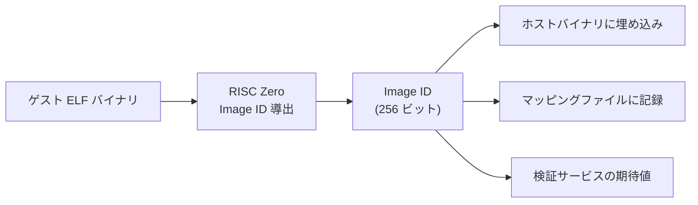
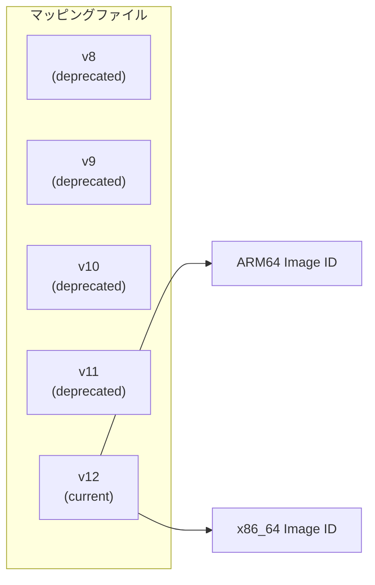
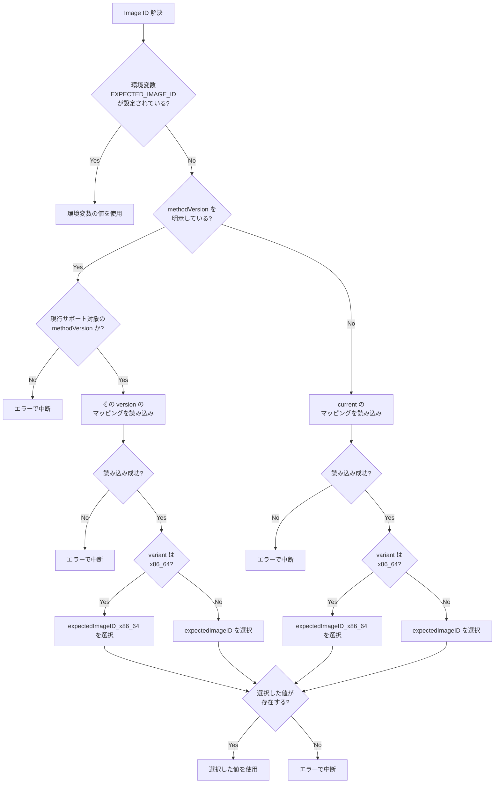

# Image ID

ゲストバイナリを一意に識別する Image ID をどう発行し、どう検証で照合するかを扱う章です。

Image ID はゲストプログラムの ELF バイナリから決定的に導出される 256 ビットのハッシュ値です。レシート検証時に期待値との一致を確認することで、正しいプログラムの実行結果であることを保証します。

## 概要

RISC Zero zkVM では、ゲストプログラムの ELF バイナリが Image ID と呼ばれる 256 ビットの識別子に変換されます。この変換は決定的であり、同一のバイナリからは常に同一の Image ID が生成されます。

`Receipt::verify(image_id)` はレシートが指定した Image ID のゲスト実行結果であることを暗号学的に検証します。期待する Image ID と一致しないレシートは拒否されます。ラッパーメタデータとの照合手順は [検証サービス](verifier-service.md#検証フロー) を参照してください。

## Image ID の導出

Image ID は RISC Zero のビルドシステムによってコンパイル時に自動生成されます。

### 決定論的導出

同一のゲストソースコードであっても、以下の要因により異なる Image ID が生成され得ます:

| 要因                     | 影響                                             |
| ------------------------ | ------------------------------------------------ |
| ゲストコードの変更       | ロジックの変更は異なるバイナリを生成             |
| コンパイラバージョン     | Rust ツールチェインのバージョン差異              |
| ターゲットアーキテクチャ | 同一コードでも x86_64 と ARM64 で異なる Image ID |
| RISC Zero SDK バージョン | SDK の変更がゲストバイナリの構造に影響           |

### アーキテクチャによる差異

本システムでは、同一バージョンのゲストに対して ARM64 用 (`expectedImageID`) と x86_64 用 (`expectedImageID_x86_64`) の 2 つの Image ID をマッピング上で管理できます。

| アーキテクチャ | 用途                                    |
| -------------- | --------------------------------------- |
| ARM64          | ECS Fargate (Graviton) での本番証明生成 |
| x86_64         | ローカル開発、CI/CD 環境での証明生成    |

現行実装では、実行環境の自動判定で x86_64 を選びません。未指定時は `default` variant として `expectedImageID` を使い、x86_64 用の値を使うには `EXPECTED_IMAGE_ID_VARIANT=x86_64` または呼び出し側の明示 variant で選択します。variant 選択と `EXPECTED_IMAGE_ID` オーバーライドの優先順位は下の [Image ID の解決](#image-id-の解決) を参照してください。

## Image ID マッピング

期待される Image ID は、バージョンごとにマッピングファイルで管理されます。

### マッピングの構造

マッピングファイルには、各バージョンの Image ID、説明、ビルド情報、機能リストが記録されます。

| フィールド             | 説明                                      |
| ---------------------- | ----------------------------------------- |
| methodVersion          | ゲストプログラムのバージョン番号          |
| expectedImageID        | ARM64 環境での Image ID                   |
| expectedImageID_x86_64 | x86_64 環境での Image ID                  |
| description            | バージョンの説明                          |
| compiledAt             | Image ID を取得したビルド時刻             |
| rustVersion            | ビルドに使用した Rust バージョン          |
| risc0Version           | ビルドに使用した RISC Zero SDK バージョン |
| guestToolchain         | ゲストビルド用ツールチェイン              |
| features               | このバージョンで実装された機能リスト      |
| current                | 現在有効なバージョン番号                  |
| deprecated             | 非推奨バージョンの一覧                    |
| metadata               | マッピングファイル全体の管理メタデータ    |

### バージョン履歴の管理

マッピングファイルはバージョンの履歴を保持します。`current` フィールドが現在有効なバージョンを指し、`deprecated` フィールドが過去のバージョンを列挙します。

現行実装では `current` は `12` で、`11` までが `deprecated` 側へ移っています。

## Image ID の解決

検証時に使用する期待 Image ID は、`EXPECTED_IMAGE_ID` が設定されているか、`methodVersion` と variant を使ってマッピングから解決するかで挙動が分かれます。現行の検証実行フローでは、正規化済みのジャーナルから `methodVersion` を取得して `resolveExpectedImageId(methodVersion)` を呼びます。`public-input.json` へのフォールバックは現行実装では使っていません。

要点は次のとおりです。

- `EXPECTED_IMAGE_ID` 環境変数は、どちらの解決経路よりも優先される明示オーバーライドです。
- variant は `EXPECTED_IMAGE_ID_VARIANT`（`default` または `x86_64`）か呼び出し側の明示 option で選択し、未指定時は `default` です。
- 未対応の `methodVersion`、マッピング読み込み失敗、未定義 variant は暗黙の既定値へフォールバックせず、すべて fail-closed でエラーになります。

## 検証パイプラインにおける役割

Image ID は 4 段階検証モデルの STARK 検証段階で使用されます。

### Image ID 関連チェック

現行実装では、STARK 検証段階で次の 2 つの必須チェックが Image ID に関与します。

- `stark_image_id_match`: `receipt.json` ラッパーの `image_id` と期待値を照合する
- `stark_receipt_verify`: 同じ期待 Image ID を使って `Receipt::verify(expectedImageID)` を実行する

詳細は [検証サービス](verifier-service.md#検証フロー) を参照してください。

Image ID が不一致の場合、以下のいずれかの状況を意味します:

| 原因                           | 対処                                       |
| ------------------------------ | ------------------------------------------ |
| マッピングが古い               | ゲストの再ビルド後にマッピングを更新する   |
| 異なるゲストで証明が生成された | レシートの出所を調査する                   |
| アーキテクチャの不一致         | 正しいアーキテクチャの Image ID で照合する |

## Image ID の更新手順

ゲストプログラムを変更した場合、Image ID を更新する必要があります。

1. ゲストコードを変更する
2. zkVM ゲストをビルドし、新しい Image ID を取得する
3. `public/imageId-mapping.json` を更新する（必要に応じて `expectedImageID_x86_64` も更新）
4. 関連コードに残る定数参照も必要に応じて更新する（現行実装では `src/lib/verification/expected-image-id.ts` の `DEFAULT_POC_IMAGE_ID` がテストなどで参照される）
5. プローバーイメージとマッピングを同時にデプロイする

### 更新の同期要件

Image ID の更新は、プローバーイメージのデプロイとマッピングファイルの更新を同時に行う必要があります。

| 不整合の状態                | 結果                           |
| --------------------------- | ------------------------------ |
| 新プローバー + 旧マッピング | 検証時に Image ID 不一致で失敗 |
| 旧プローバー + 新マッピング | 検証時に Image ID 不一致で失敗 |
| 新プローバー + 新マッピング | 正常動作                       |

`DEFAULT_POC_IMAGE_ID` はテスト用の定数で、期待 Image ID の解決経路には現れません（マッピングが source of truth）。

本リポジトリの現行運用では、Image ID 更新時に旧バージョンとの検証互換は維持しません。

- プローバーイメージと `imageId-mapping.json` は同一リリースで切り替える
- 通常の `/api/verification/run` フローでは、現行の journal contract のみ受け付ける
- 旧成果物は Image ID 照合に進む前に、未対応の journal contract として失敗し得る

## セキュリティ上の位置づけ

Image ID は、zkVM の信頼モデルにおける重要な信頼アンカーです。

- **Image ID を知っている検証者は、ゲストプログラムのロジックを信頼できる**: レシートが有効であれば、そのロジックが正しく実行されたことが保証される
- **Image ID の管理が破綻すると、検証の信頼性が失われる**: 攻撃者が独自のゲストプログラムで有効なレシートを生成し、その Image ID がマッピングに混入すると、不正な集計が「検証済み」として受理される

マッピングファイルは公開リポジトリにコミットされ、変更履歴が追跡可能です。AWS 構成では、イメージ署名検証と組み合わせることで、承認されたプローバーイメージのみが使用されることを保証しています。イメージ署名の詳細は [イメージ署名](../aws/image-signing.md) を参照してください。

<!-- source: public/imageId-mapping.json, src/lib/verification/expected-image-id.ts, src/server/api/handlers/verificationRun.ts, src/lib/zkvm/journal-guards.ts, verifier-service/src/lib.rs -->
