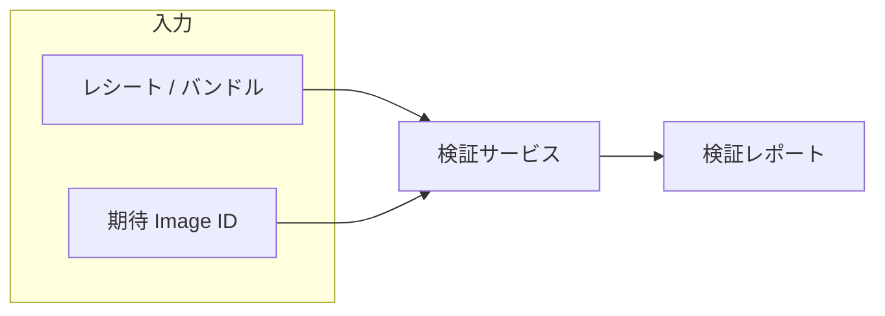
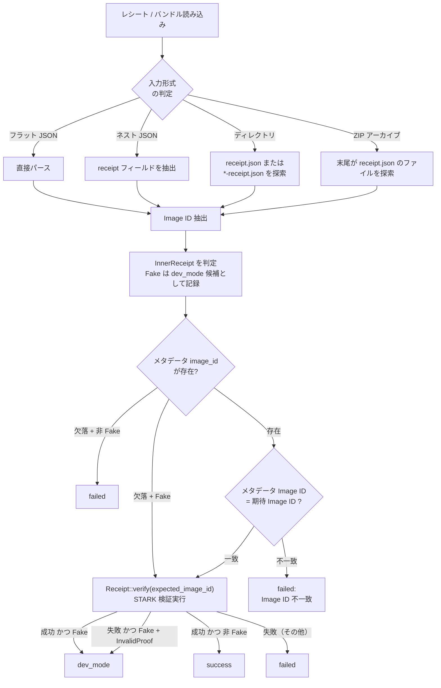
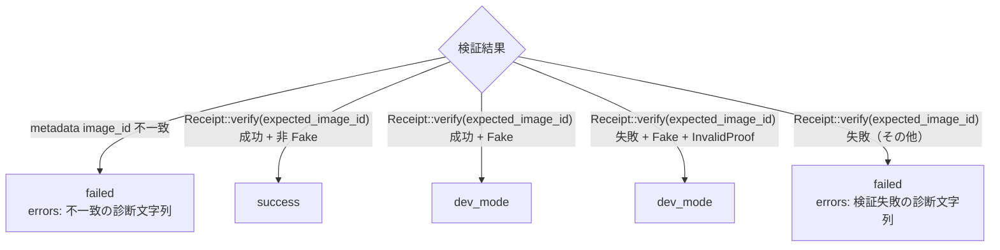
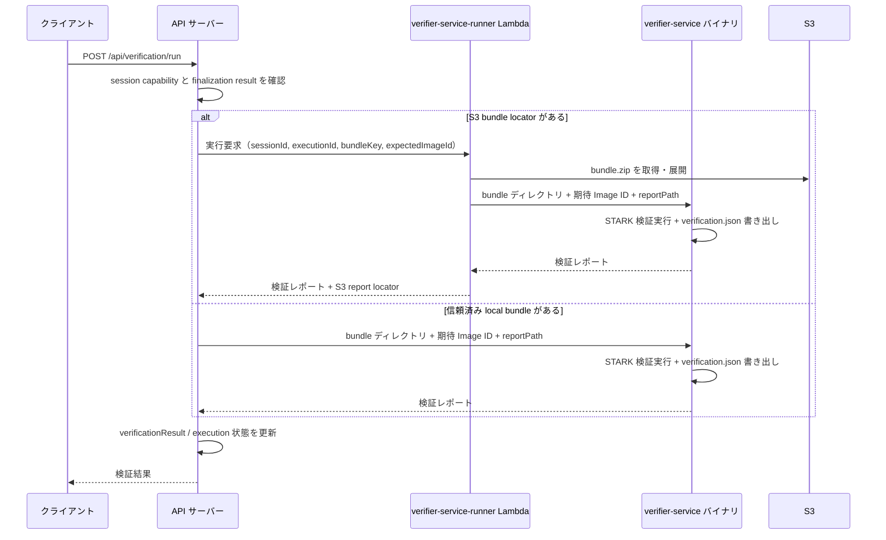

# 検証サービス

STARK レシートを検証する Rust サービスの構造と、ローカル / Lambda 双方での使い方を扱う章です。

レシートの STARK 検証をサーバー側で行い、結果をレポートとしてクライアントに提供する Rust コンポーネントです。

## 概要

STARK 証明の検証は計算コストが証明生成に比べて低いものの、ブラウザ上で RISC Zero の検証ロジックを実行することは現時点では実用的ではありません。そのため、本システムではサーバー側で検証を行い、その結果をレポートとしてクライアントに提供する設計を採用しています。

## 検証フロー

検証サービスは以下の手順でレシートを検証します。

### 1. レシートの読み込みとパース

検証サービスは単一のレシートファイル（フラット JSON またはレシートラッパー JSON）だけでなく、レシートを含むバンドルディレクトリや ZIP にも対応しています。

| 形式           | 説明                                                           |
| -------------- | -------------------------------------------------------------- |
| フラット JSON  | レシートオブジェクトが直接 JSON のトップレベルにある           |
| ネスト JSON    | `{ "receipt": {...}, "image_id": "0x..." }` 構造               |
| ディレクトリ   | `receipt.json` または `*-receipt.json` を探索して読み込む      |
| ZIP アーカイブ | エントリ名の末尾が `receipt.json` のファイルを探索して読み込む |

`image_id` はラッパーの top-level フィールドであり、レシート本体の内部フィールドではありません。

同期ファイナライズ経路では、proof bundle ディレクトリ全体を verifier-service に渡し、その中の `receipt.json` を解決させる実装になっています。

### 2. 開発モードの検出

レシートの内部構造（`InnerReceipt`）が `Fake` 型の場合、開発モードで生成されたレシートです。ただし即 `dev_mode` にはならず、Image ID 照合を経て最終ステータスが決まります。分岐の詳細は上のフローチャートを参照してください。

### 3. Image ID の照合

ラッパーの `image_id` を期待値と照合し、不一致なら `failed` として即時拒否します。Image ID の管理については [Image ID](image-id.md) を参照してください。

### 4. STARK 検証の実行

Image ID の照合に成功した後、RISC Zero SDK の `Receipt::verify(expected_image_id)` メソッドを使用して STARK 証明の暗号学的検証を行います。

この検証は以下のことを証明します:

- レシートに含まれる seal（証明データ）が有効である
- ジャーナルの内容が、指定された Image ID のゲストプログラムの正当な実行結果である
- 証明の生成時にデータの改ざんが行われていない

## 検証レポート

検証サービスは、検証が最後まで到達した試行について JSON レポートを出力します。exit code とレポート出力の関係は次のとおりです。

| 状況                      | exit code | JSON レポート            |
| ------------------------- | --------- | ------------------------ |
| `success`                 | `0`       | stdout または `--output` |
| 引数不正・bundle 不在など | `1`       | 出力しない               |
| `dev_mode`                | `2`       | stdout または `--output` |
| `failed`                  | `3`       | stdout または `--output` |

呼び出し側は exit code とレポートの両方を見ます。`--quiet` を指定すると stdout 出力は抑制されるので、その場合は `--output` も併せて指定してレポートを保存します。

| フィールド        | 型       | 説明                                             |
| ----------------- | -------- | ------------------------------------------------ |
| status            | 列挙型   | `success` / `failed` / `dev_mode`                |
| verifier_version  | 文字列   | `verifier-service` のバージョン                  |
| verified_at       | 文字列   | RFC 3339 形式の検証完了時刻                      |
| duration_ms       | 数値     | 検証処理時間（ミリ秒）                           |
| expected_image_id | 文字列   | 検証に使用した期待 Image ID                      |
| receipt_image_id  | 文字列?  | 入力 JSON の top-level `image_id` から抽出した値 |
| bundle_path       | 文字列   | 入力 bundle パスの basename のみ                 |
| receipt_path      | 文字列   | 解決されたレシートファイル名の basename のみ     |
| dev_mode_receipt  | 真偽値   | フェイクレシートであるか                         |
| errors            | 文字列[] | 診断文字列の配列。空の場合は省略される           |

### ステータスの判定基準

`errors` は固定のエラーコード一覧ではなく、実装が積む自由形式の診断文字列です。

| ステータス | 意味                                 | UI への影響               |
| ---------- | ------------------------------------ | ------------------------- |
| `success`  | STARK 検証が成功し、Image ID も一致  | STARK Verified を表示可能 |
| `failed`   | Image ID 不一致または STARK 検証失敗 | 検証失敗として表示        |
| `dev_mode` | 開発モードのフェイクレシート         | 開発モード警告を表示      |

## デプロイメントモデル

検証サービス（Rust バイナリ `verifier-service`）は、呼び出し経路ごとに実行場所が異なります。詳細は下の「呼び出しパターン」を参照してください。

### 呼び出しパターン

検証サービスの呼び出しには主に 3 つのパターンがあります。明示的検証はいずれも、サーバー側で保持している finalization result に紐付いた **権威ある bundle locator** だけを使い、クライアントが任意の S3 キーや local パスを指定して検証させることはできません。

| パターン          | トリガー                                  | 説明                                                                                             |
| ----------------- | ----------------------------------------- | ------------------------------------------------------------------------------------------------ |
| 同期実行          | 同期ファイナライズ (`POST /api/finalize`) | real executor 時のみ実行。mock executor 時は verifier-service を呼ばず `dev_mode` 扱いとして帰る |
| 明示的 S3 実行    | クライアントが検証を要求                  | `POST /api/verification/run` が verifier-service-runner Lambda に S3 bundle locator を渡す       |
| 明示的 local 実行 | クライアントが検証を要求                  | `POST /api/verification/run` が信頼済み local bundle を API サーバープロセス内で直接検証する     |

非同期ファイナライズのコールバック Lambda は、結果の復元と保存を担当します。STARK 検証は自動実行されず、`POST /api/verification/run` で実行します。

`verificationResult.status` が `success` / `failed` / `dev_mode` のような終端状態にある場合、`POST /api/verification/run` は再検証せず idempotent な応答を返します。`running` の場合も実行中として idempotent に扱い、status 未設定または `not_run` のときだけ verifier-service の実行に進みます。

## 検証パイプラインにおける役割

検証サービスは、4 段階検証モデルの最終段階である STARK 検証を担当します。

| チェック ID            | 検証内容                                           |
| ---------------------- | -------------------------------------------------- |
| `stark_image_id_match` | レシートに記録された Image ID が期待値と一致するか |
| `stark_receipt_verify` | STARK 証明が暗号学的に有効であるか                 |

`stark_image_id_match` は verifier report の `expected_image_id` と `receipt_image_id` の一致を主に検証します。検証フロー側では、これに加えて claimed / comparison 側の Image ID との整合も確認します。

これらのチェックが両方成功した場合に限り、「STARK Verified」のステータスが付与されます。詳細は [4 段階検証モデル](../verification/four-stage-model.md) を参照してください。

## セキュリティ上の考慮事項

### サーバー側検証の信頼境界

検証サービスはサーバー側で実行されるため、クライアントはサーバーの検証結果を信頼する必要があります。この PoC における信頼モデルは以下の通りです:

- **STARK 証明自体は秘密データを含まない検証データ**: レシートと Image ID があれば、第三者が独立に検証可能
- **検証サービスは利便性のための委任**: ブラウザでの STARK 検証が実用的になれば、クライアント側のみで完結させることも理論上は可能
- **配布対象アーカイブ**: レシートと `public-input.json` は [ZIP ローカル検証（Ubuntu）](../reproducibility/audit-bundle.md) の手順で独立検証できる

### verification.json の非公開性

`verification.json` は配布対象アーカイブ `bundle.zip` には含まれません。必要に応じてレポート用の capability 保護エンドポイント経由で配布されますが、第三者検証ではレシートファイルを直接使った独立検証が推奨されます。

<!-- source: verifier-service/src/main.rs, verifier-service/src/lib.rs, amplify/functions/verifier-service-runner/ -->
